# Design 100: Consistent Hashing

---

## Tools & Prerequisites

To design and debug consistent hashing systems:

### Consistent Hashing Tools

| Tool | Purpose | Quick Usage |
|------|---------|-------------|
| **hashicorp/consistent** | Go consistent hashing lib | `consistent.New()` |
| **hashring** | Python hashring lib | `hashring.ConsistentHash(nodes)` |
| **chash** | Redis Cluster hash slot | `CLUSTER KEYSLOT key` |
| **memcached** | Uses consistent hashing | `memcached -vv` (view distribution) |
| **nginx consistent_hash** | Load balancing | `hash $request_uri consistent;` |

### Key Algorithms

```go
// Basic consistent hash with binary search
type HashRing struct {
    nodes []uint32  // sorted hash positions
    addrs []string  // node addresses
}

func (h *HashRing) Add(addr string) {
    hash := crc32.ChecksumIEEE([]byte(addr))
    // Insert in sorted position
    // Use binary search for lookup
}

func (h *HashRing) Get(key string) string {
    hash := crc32.ChecksumIEEE([]byte(key))
    // Find first node >= hash (clockwise)
    idx := sort.Search(len(h.nodes), func(i int) bool {
        return h.nodes[i] >= hash
    })
    return h.addrs[idx % len(h.addrs)]  // wrap around
}
```

### Key Concepts

**Consistent Hashing**: Hashing scheme where adding/removing nodes affects only K/N keys.

**Hash Ring**: Circular address space; both nodes and keys map to positions on ring.

**Virtual Nodes (VNodes)**: Multiple hash positions per physical node; improves load balancing.

**Clockwise Assignment**: Key assigned to first node encountered when moving clockwise.

**Monotonicity**: Adding node only moves keys TO that node (never from).

**Spread**: Measure of how many nodes hold same key (should be 1).

**Load**: Number of keys assigned to each node (should be balanced).

**Replication**: Storing key on next N nodes clockwise for redundancy.

---

## Visual: Consistent Hashing

### Modulo Hashing vs Consistent Hashing

```mermaid
flowchart TB
    subgraph Modulo ["🔴 Modulo Hashing"]
        M1["hash(key) % N"]
        M2["Add node: N changes"]
        M3["ALL keys remap!"]
        M4["Cache miss everywhere"]

        M1 --> M2 --> M3 --> M4
    end

    subgraph Consistent ["✅ Consistent Hashing"]
        C1["Hash ring 0-2^32"]
        C2["Add node: insert position"]
        C3["Only keys in range move"]
        C4["Other keys unchanged"]

        C1 --> C2 --> C3 --> C4
    end

    style Modulo fill:#ffcdd2
    style Consistent fill:#c8e6c9
```



### Hash Ring Visualization

```mermaid
flowchart TB
    subgraph Ring ["Hash Ring (0 to 2^32)"]
        A["Server A<br/>hash: 100"]
        K1["key1.jpg<br/>hash: 150"]
        B["Server B<br/>hash: 200"]
        K2["key2.jpg<br/>hash: 250"]
        C["Server C<br/>hash: 300"]
        K3["key3.jpg<br/>hash: 50"]

        A -->|"150→200"| B
        B -->|"250→300"| C
        C -->|"wrap→100"| A

        K1 -.->|"assigned to"| B
        K2 -.->|"assigned to"| C
        K3 -.->|"assigned to"| A
    end

    style A fill:#64b5f6
    style B fill:#64b5f6
    style C fill:#64b5f6
    style K1 fill:#81c784
    style K2 fill:#81c784
    style K3 fill:#81c784
```



### Adding a Server


### Virtual Nodes for Even Distribution


### Key Movement on Topology Change

**Keys Moved When Adding Server (N=10)**

| Hashing Method | % Keys Moved |
|----------------|--------------|
| Modulo Hash | 100% |
| Consistent Hash | 10% |

### Replication on Hash Ring


### Server Failure Handling

```mermaid
sequenceDiagram
    autonumber
    participant Client
    participant Ring as Hash Ring
    participant A as Server A
    participant B as Server B
    participant C as Server C

    Client->>Ring: GET key.jpg
    Ring->>Ring: Hash maps to Server A

    Server A->>Ring: ❌ FAILURE!

    Ring->>Ring: Find next clockwise: Server B
    Ring->>B: Forward request
    B-->>Client: Response

    Note over Client,C: Requests for A's keys<br/>automatically failover to B
```



### Consistent Hashing Properties

```mermaid
graph TB
    subgraph Properties ["Desirable Properties"]
        P1["✅ Monotonicity<br/>Key moves only TO new node"]
        P2["✅ Spread<br/>Each key on minimal nodes"]
        P3["✅ Load<br/>Even distribution"]
        P4["✅ Smoothness<br/>Minimal movement on change"]
        P5["✅ Decentralization<br/>No central coordinator"]
    end

    style Properties fill:#e8f5e9
```



### Hot Spot Mitigation


---

## The Requirement

Design a distributed cache cluster where:

1. **Data is partitioned across N servers**
2. **Servers can be added/removed dynamically**
3. **Minimal data movement when topology changes**
4. **Even distribution of keys**

**Use case:** Content Delivery Network (CDN) caching

---

## Why Not Modulo Hashing?

```go
server := hash(key) % N  // N = number of servers
```

**Problem:** Adding/removing server changes ALL mappings.

**Example:**
```
N = 5: hash("image.jpg") % 5 = 3 → Server 3
N = 6: hash("image.jpg") % 6 = 1 → Server 1

Adding one server: 100% of keys move!
```

---

## What is Consistent Hashing?

Imagine a circle (hash ring). Both servers and keys hash to positions on the circle.

**Key assignment:** Key is assigned to the first server encountered **clockwise** from key's position.

```
        Server A
       /     \
      /       \
    Key 1    Server B
      \       /
       \     /
        Server C
```

**When adding server:** Only keys between new server and next server move.

**When removing server:** Only keys on that server move to next server.

---

## Requirements

1. **Monotonicity:** Adding server only moves keys to new server
2. **Spread:** Keys distributed evenly
3. **Load:** Even request distribution
4. **Smoothness:** Minimal key movement on topology change

---

## Questions

1. **How do you handle uneven server capacities?**

2. **What if a server fails?**

3. **How do you implement virtual nodes for better distribution?**

4. **What's the algorithm for finding the responsible server?**

5. **As a Principal Engineer, how do you design for hot spots and skewed key distribution?**

---

## Learning Path

```
step-01.md → The Problem with Modulo Hashing
step-02.md → The Hash Ring Concept
step-03.md → Virtual Nodes for Even Distribution
step-04.md → Replication for Redundancy
step-05.md → Production Concerns
solution.md → Complete Solution
```

---

**When you have a design, read `step-01.md`**
