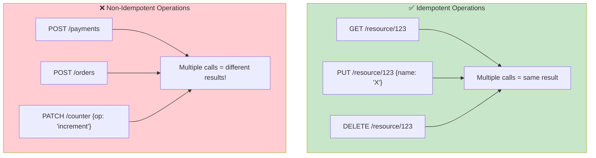
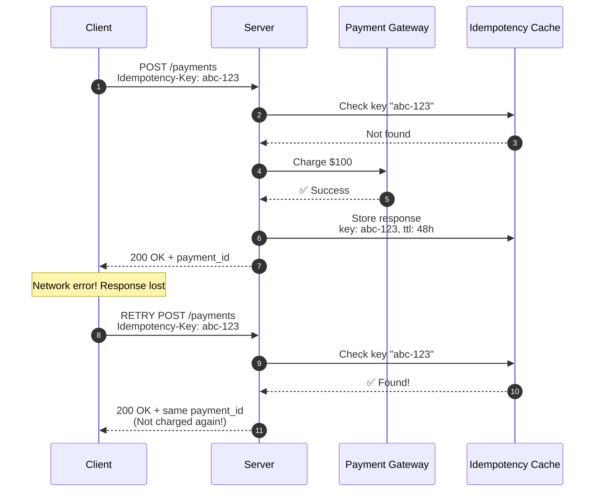
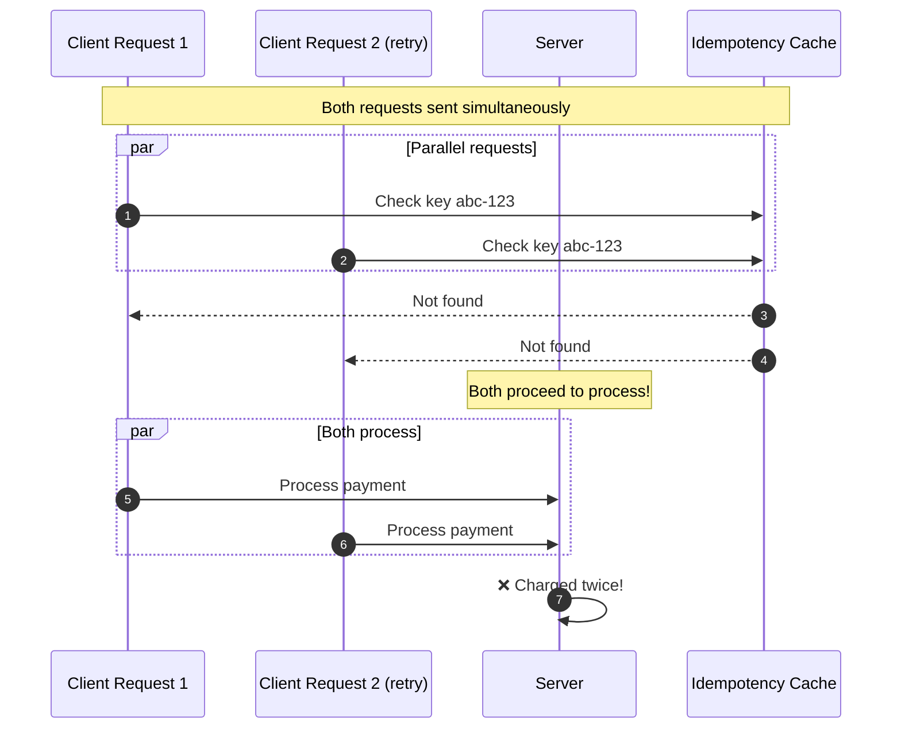
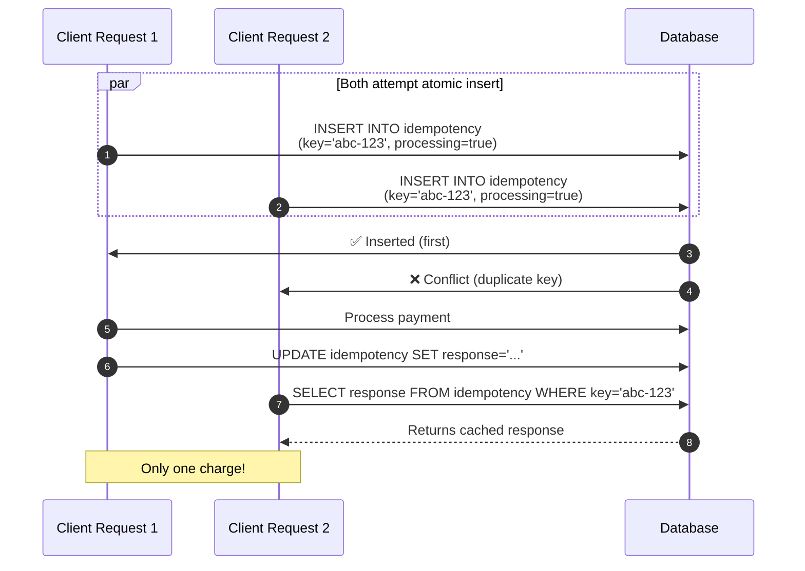
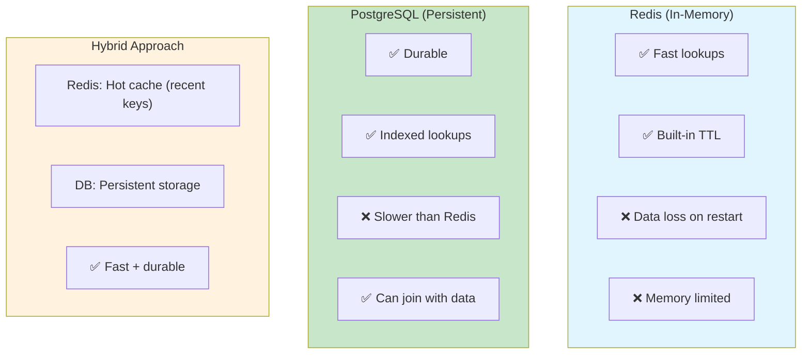
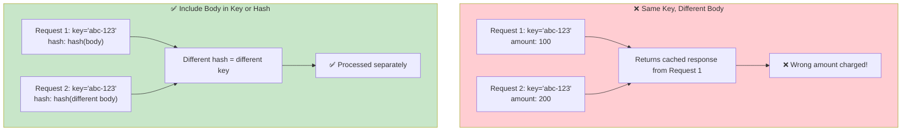
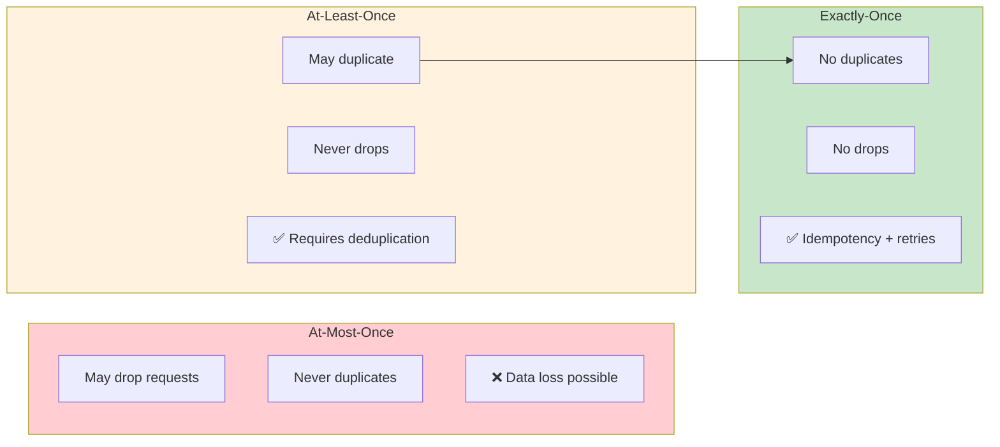
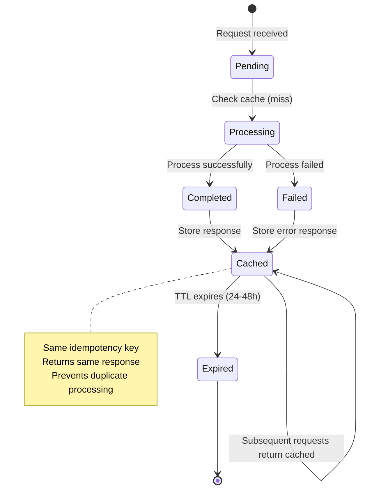
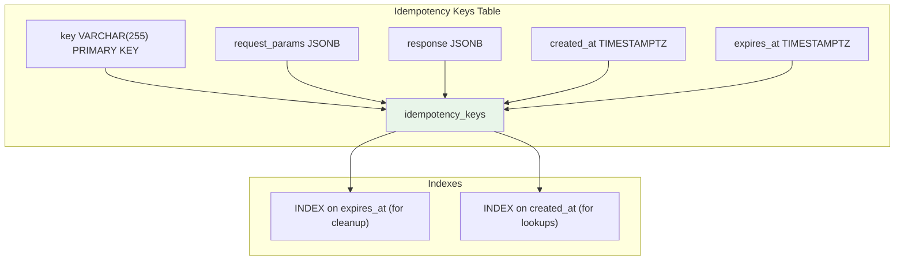

# Design 101: Idempotency Keys

---

## Tools & Prerequisites

To design and debug idempotency systems:

### Idempotency Storage Tools

| Tool | Purpose | Quick Usage |
|------|---------|-------------|
| **Redis** | Key-value store with TTL | `SET idem:uuid response_json EX 3600` |
| **Memcached** | Cached key-value | `set idem:uuid 0 3600 <bytes>` |
| **PostgreSQL** | Persistent storage | `INSERT INTO idempotency_keys (key, params, response) VALUES (...)` |
| **etcd** | Distributed KV store | `etcdctl put idem:uuid response --ttl 3600` |
| **DynamoDB** | NoSQL with TTL | `PutItem with TTL attribute` |

### Key Patterns

```python
# Redis-based idempotency check
def process_request(idempotency_key, request_data):
    # Check if key exists
    cached = redis.get(f"idem:{idempotency_key}")
    if cached:
        return json.loads(cached)  # Return cached response

    # Process request
    result = process_payment(request_data)

    # Store with TTL (24-48 hours)
    redis.setex(
        f"idem:{idempotency_key}",
        48 * 3600,  # 48 hours
        json.dumps(result)
    )

    return result

# Database-based with atomic check
def process_request_atomic(idempotency_key, request_data):
    # INSERT with ON CONFLICT (PostgreSQL)
    result = db.execute("""
        INSERT INTO idempotency_keys (key, request_hash, response)
        VALUES (%s, %s, %s)
        ON CONFLICT (key) DO UPDATE
        SET response = EXCLUDED.response
        RETURNING response
    """, (idempotency_key, hash_request(request_data), None))

    if result.response:
        return result.response  # Cached from previous

    # Process and update
    response = process_payment(request_data)
    db.execute("UPDATE idempotency_keys SET response = %s WHERE key = %s",
               (response, idempotency_key))
    return response
```

### Key Concepts

**Idempotency**: Property where operation can be applied multiple times with same result.

**Idempotency Key**: Unique client-generated identifier for request deduplication.

**Exactly-Once**: Processing guarantee that each request is handled exactly once.

**At-Least-Once**: Processing guarantee where each request is handled at least once (may retry).

**At-Most-Once**: Processing guarantee where each request is handled at most once (may drop).

**Request Hashing**: Hash of request parameters to detect parameter changes.

**TTL (Time To Live)**: Expiration time for idempotency key storage.

**Race Condition**: Two identical requests arriving simultaneously; both miss cache.

**Compare-And-Set**: Atomic operation preventing duplicate processing.

---

## Visual: Idempotency

### Idempotent vs Non-Idempotent



### Request Retry Flow



### Race Condition Problem



### Atomic Check-and-Set Solution



### Idempotency Key Storage Options



### Parameter Change Handling



### Processing Guarantees



### Idempotency Key Lifecycle



### Storage Schema Design



---

## The Requirement

Design an idempotency system for payment APIs:

**Requirements:**
1. Client can retry requests safely
2. Same request processed only once
3. Client receives same response for retries
4. Idempotency keys expire after 24-48 hours

**Example:**
```http
POST /payments
Idempotency-Key: uuid-v4
Authorization: Bearer secret_key

{ "amount": 1000, "currency": "usd" }
```

---

## What is Idempotency?

**Idempotent operation:** Can be applied multiple times with same result.

**Mathematical definition:** f(f(x)) = f(x)

**Examples:**
- **Idempotent:** GET request, SET x=5, DELETE /resource/123
- **Not idempotent:** POST creating resource, POST charging payment, x++

**In APIs:** Retrying same request should not charge twice, create duplicate records, etc.

---

## The Challenge

```
Client sends payment request with key "abc-123"
→ Server processes, charges card, returns response
→ Network error, client doesn't receive response
→ Client retries with same key "abc-123"
→ Server should NOT charge again!
→ Should return cached response from first attempt
```

---

## Questions

1. **Where do you store idempotency keys?** (Memory, Redis, Database - trade-offs)

2. **How do you handle race conditions?** (Atomic check-and-set, database constraints)

3. **How do you expire old keys?** (TTL, cleanup job)

4. **What if request parameters change?** (Include in hash or reject)

5. **As a Principal Engineer, how do you design for correctness at scale?**

---

## Learning Path

```
step-01.md → The Idempotency Problem
step-02.md → Storage Options and Basic Design
step-03.md → Atomic Check-and-Set
step-04.md → Handling Parameter Changes
step-05.md → Production Concerns
solution.md → Complete Solution
```

---

**When you have a design, read `step-01.md`**
