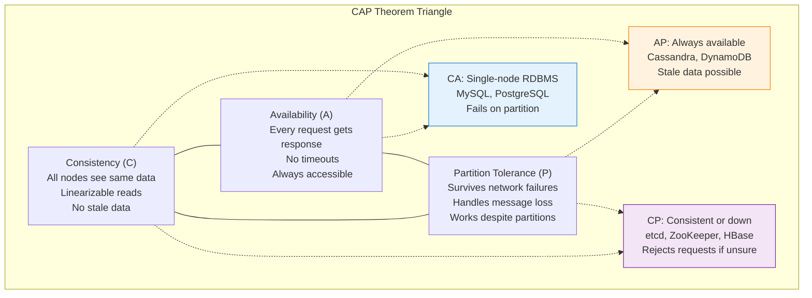
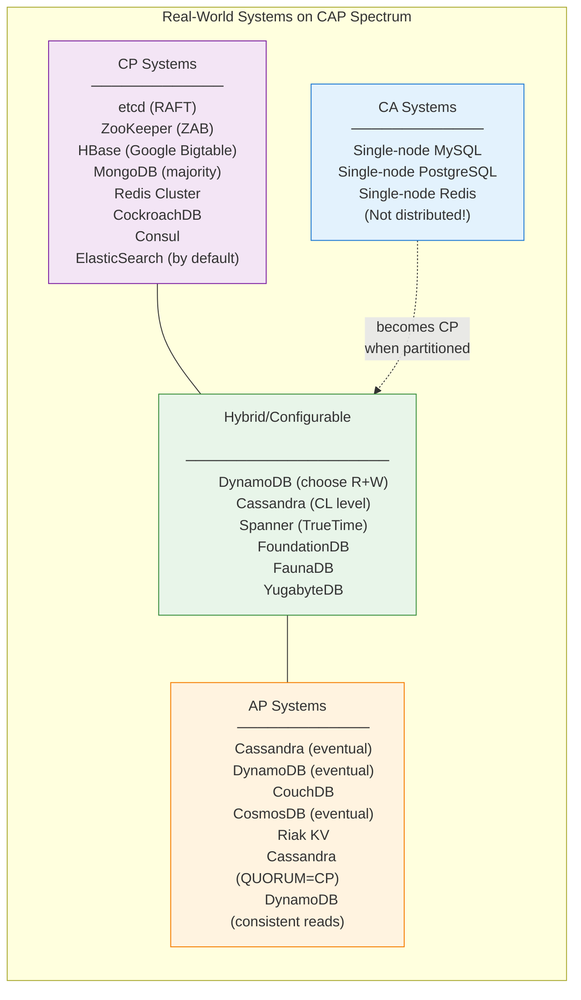
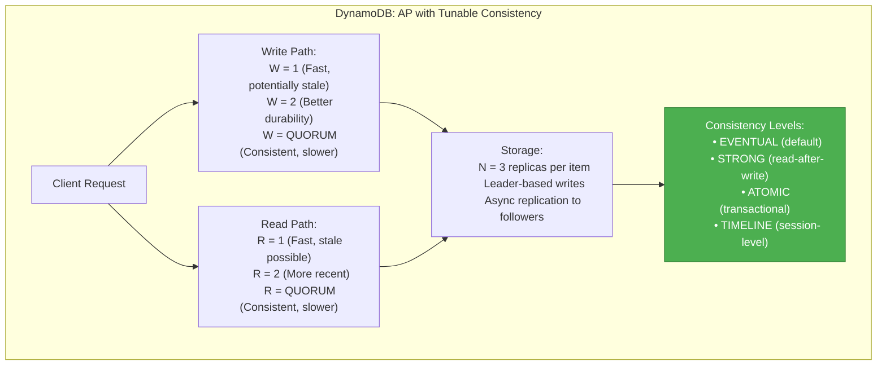
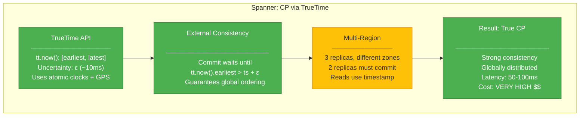
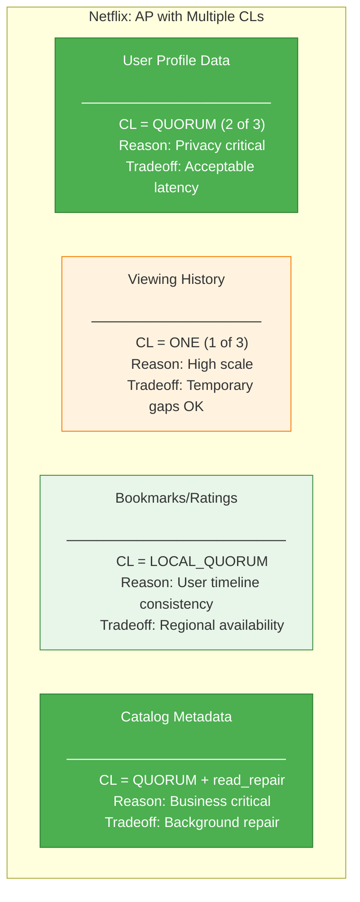
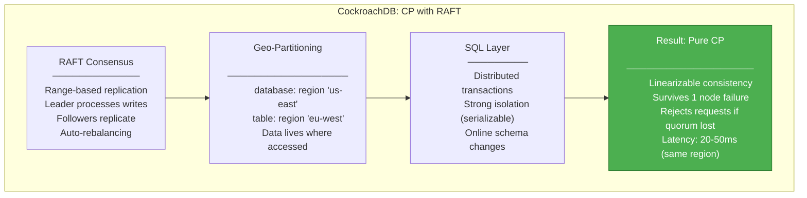
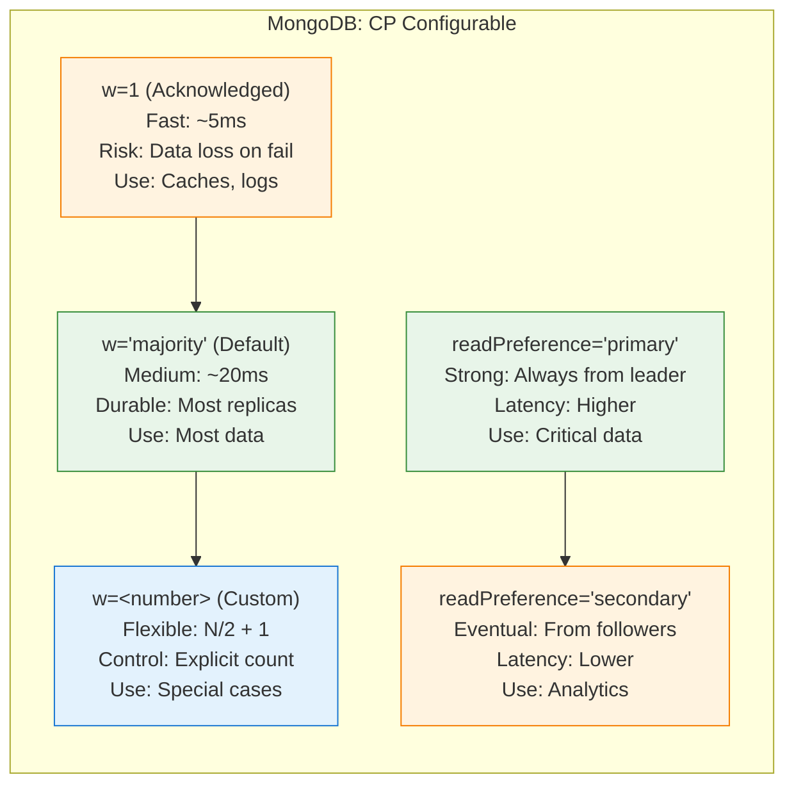
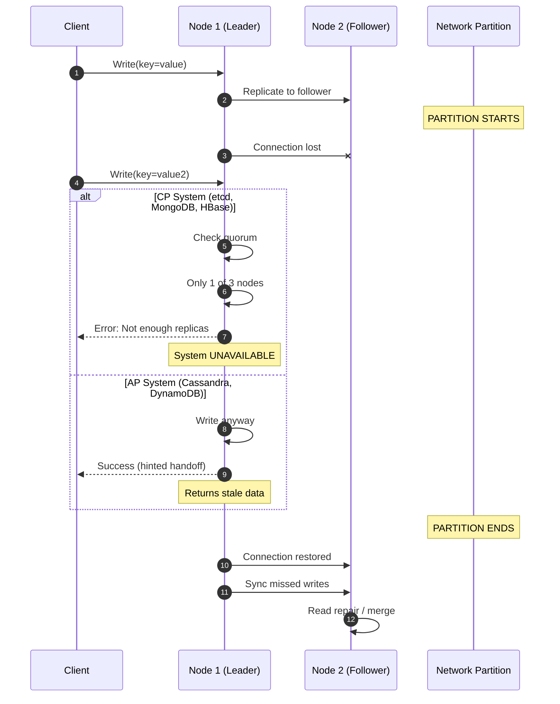
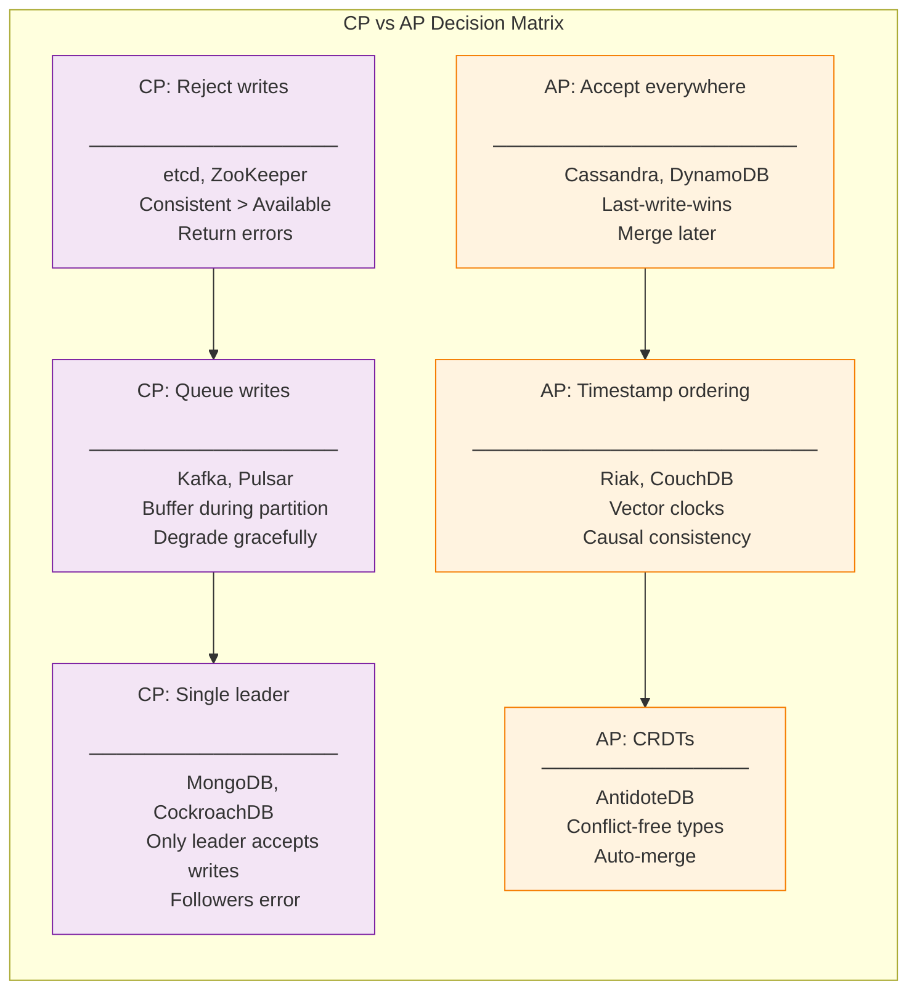
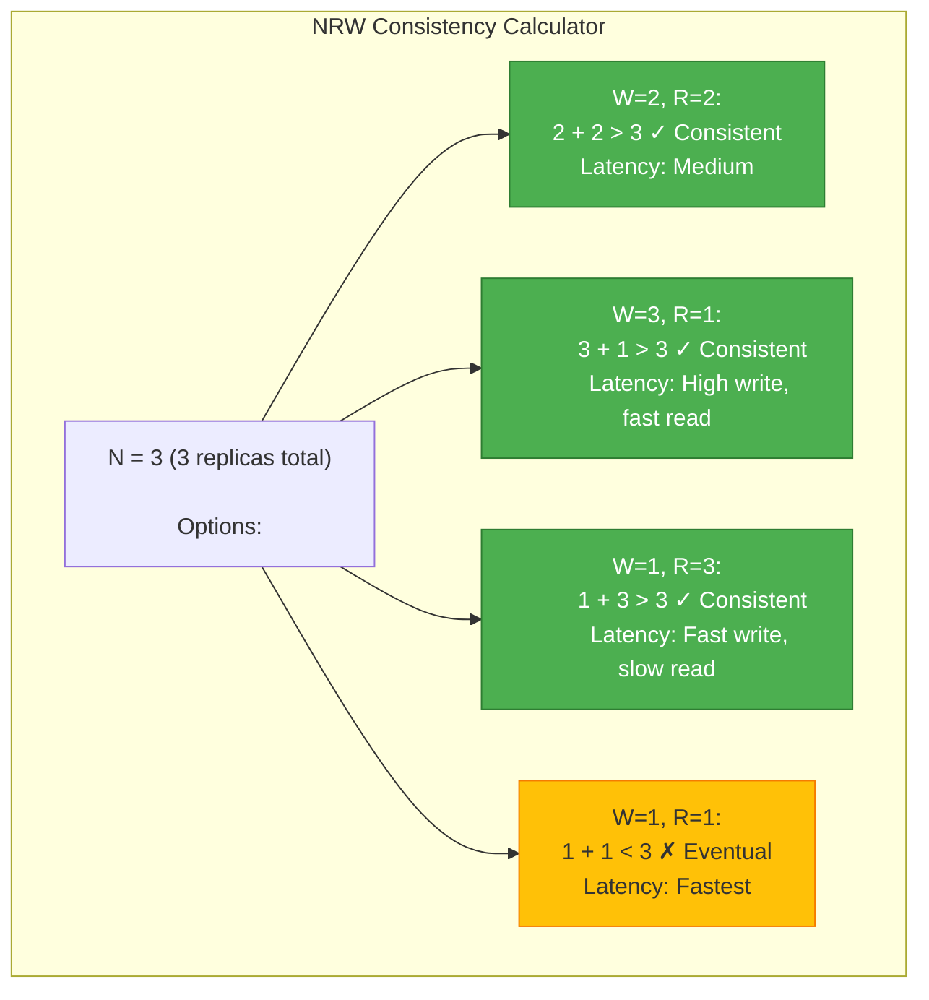

# Design 102: CAP Theorem Tradeoffs in Real Systems

---

## Tools & Prerequisites

To analyze CAP theorem tradeoffs:

### Distributed System Analysis Tools

| Tool | Purpose | Quick Usage |
|------|---------|-------------|
| **Jepsen** | Distributed system testing | `lein run test --nemesis generic |
| **Chaos Mesh** | Chaos engineering in K8s | `chaosctl apply chaos.yaml` |
| **Ping/latency tests** | Network partition simulation | `ping -i 0.1 -c 100 host` |
| **etcdctl** | Check quorum status | `etcdctl endpoint status --write-out=table` |
| **consul kv get** | Check consistency | `consul kv get -consistent key` |
| **redis-cli --latency** | Measure latency | `redis-cli --latency-history` |
| **cassandra-stress** | Test Cassandra consistency | `cassandra-stress write n=100000` |

### Key Commands

```bash
# Check Cassandra consistency level
nodetool describecluster
cqlsh -e "SELECT CONSISTENCY;"

# Monitor etcd health and quorum
etcdctl endpoint health --cluster
etcdctl member list

# Test Redis Sentinel failover
redis-cli -p 26379 sentinel masters
redis-cli -p 26379 sentinels mymaster

# Check ZooKeeper quorum
echo "stat" | nc localhost 2181
zkCli.sh -server localhost:2181 get /zookeeper/config

# Simulate network partition with iptables
iptables -A INPUT -s <peer_ip> -j DROP
iptables -A OUTPUT -d <peer_ip> -j DROP

# Check DynamoDB table status
aws dynamodb describe-table --table-name mytable

# Test CockroachDB range splits
cockroach sql --insecure -e "SHOW REGIONS FROM TABLE mytable;"

# Monitor MongoDB replica set
rs.status()
rs.isMaster()

# Check Consul consistency
consul info -raft
curl http://localhost:8500/v1/status/leader

# Test MongoDB write concern
mongo --eval "db.myCollection.insert({data: 'test'}, {writeConcern: {w: 'majority'}})"
```

### Key Concepts

**CAP Theorem**: In a distributed system, you can only have 2 of 3 properties: Consistency, Availability, Partition Tolerance.

**Consistency (C)**: All nodes see same data simultaneously; linearizable reads.

**Availability (A)**: Every request receives response (success/failure), without guarantee of most recent data.

**Partition Tolerance (P)**: System continues operating despite network partitions between nodes.

**CA System**: RDBMS with single node (MySQL, PostgreSQL); fails on partition.

**CP System**: Prioritizes consistency over availability (HBase, MongoDB, Redis Cluster, etcd, ZooKeeper).

**AP System**: Prioritizes availability over consistency (Cassandra, DynamoDB, CouchDB, CosmosDB).

**Network Partition**: Communication failure between nodes; P is mandatory in distributed systems.

**Quorum**: Minimum nodes required for operation (majority: N/2 + 1).

**Write Concern**: How many nodes must acknowledge write (w=1, w=quorum, w=all).

**Read Concern**: How many nodes queried for read (r=1, r=quorum, r=all).

**Eventual Consistency**: System guarantees convergence to consistent state eventually.

**Strong Consistency**: Linearizable; reads return most recent write.

**Timeline Consistency**: Users see their own writes; others may see stale data.

**Read Repair**: Background process reconciling divergent replicas.

**Hinted Handoff**: Temporary storage for writes during node failure.

**Vector Clock**: Logical clock for tracking causal relationships in AP systems.

**Gossip Protocol**: Peer-to-peer communication for state dissemination.

**Last-Write-Wins**: Conflict resolution using timestamps (LWW).

**RAFT**: Consensus algorithm for CP systems (etcd, CockroachDB, Consul).

**Paxos**: Classic consensus algorithm (Google Spanner).

**NRW**: Replication factor N, reads R, writes W; R + W > N for consistency.

---

## The Situation

You're a Principal Architect at a rapidly growing startup. You need to choose databases for three different workloads, each with different CAP requirements:

```
Workload 1: Payment Processing
- Requirement: No double-spending, must be accurate
- Scale: 10,000 transactions/second
- Tolerance: Downtime acceptable, data errors NOT acceptable

Workload 2: Social Media Feed
- Requirement: Always fast, occasional duplicates OK
- Scale: 1M requests/second
- Tolerance: Stale data acceptable, downtime NOT acceptable

Workload 3: Shopping Cart
- Requirement: User sees their own changes
- Scale: 100,000 carts/second
- Tolerance: Temporary inconsistency acceptable
```

---

## The Challenge

**Your team is debating:**

```
Option A: Use DynamoDB for everything (AP + configurable consistency)
Option B: Use PostgreSQL with replication (CA, becomes CP when partitioned)
Option C: Mix: PostgreSQL for payments, DynamoDB for feed, Redis for carts
Option D: Build on CockroachDB (CP, scales globally)
```

**Business constraints:**
- Engineering team knows PostgreSQL
- Need to deploy in 3 regions (US, EU, Asia)
- Must survive single-region failure
- Compliance requires audit trails for payments

---

## Visual: CAP Theorem Triangle

### The CAP Triangle



### Real Systems CAP Positioning



---

## Real-World Case Studies

### Case 1: Amazon DynamoDB - AP with Configurable Consistency

**Based on:** Amazon's internal Dynamo paper, later productized as DynamoDB



**Amazon's Choice:** AP with configurable consistency
- Default: Eventual consistency for low latency
- Option: Strong reads when needed (payment operations)
- Tradeoff: 50ms latency difference between eventual/strong reads

---

### Case 2: Google Spanner - "False" CP with TrueTime

**Based on:** Google Spanner, the database behind Google Ads and Gmail



**Google's Choice:** CP with TrueTime
- Sacrifices some latency for consistency
- Can serve reads without round-trip to leader
- Uses atomic clocks + GPS for global time synchronization

---

### Case 3: Cassandra at Netflix - AP with Tunable CL

**Based on:** Netflix's migration from Oracle to Cassandra (2010-2013)



**Netflix's Choice:** AP with per-operation CL
- Different consistency per use case
- Tunable tradeoff per query
- Global distribution for streaming

---

### Case 4: CockroachDB - CP with Geo-Partitioning

**Based on:** CockroachDB, inspired by Google Spanner



---

### Case 5: MongoDB - CP with Configurable Write Concern



---

## Partition Scenarios

### What Happens During Network Partition?



### Consistency vs Availability Matrix



---

## The NRW Formula

**For consistency: R + W > N**

Where:
- **N** = Replication factor (total replicas)
- **R** = Number of nodes read
- **W** = Number of nodes written



---

## Questions

1. **For the payment processing workload, which CAP choice and why?**

2. **For the social media feed, is AP the right choice? What are the tradeoffs?**

3. **How does DynamoDB achieve both AP and CP-like behavior?**

4. **Why is Google Spanner considered CP despite global distribution?**

5. **As a Principal Engineer, design a multi-database architecture for all three workloads with clear CAP justifications.**

---

**When you've thought about it, read `step-01.md`**
