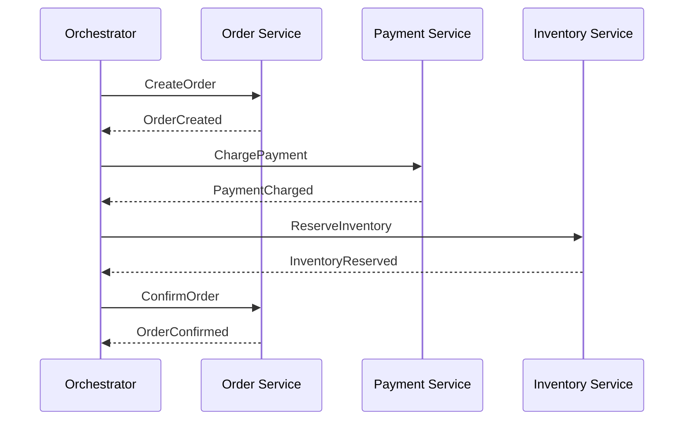
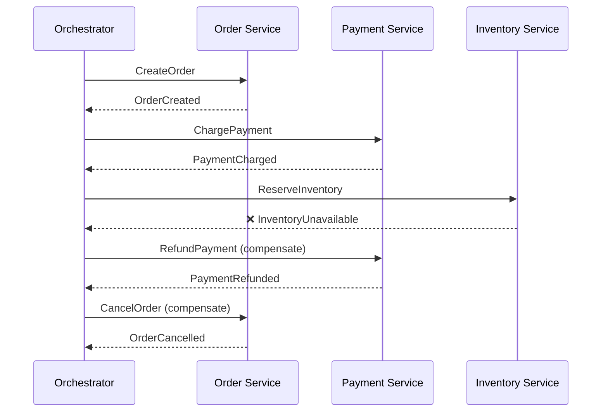
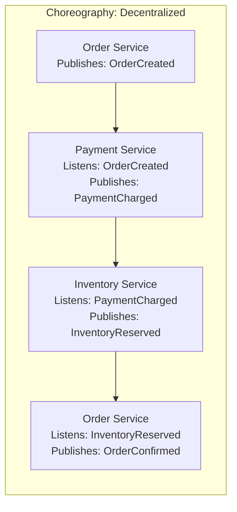
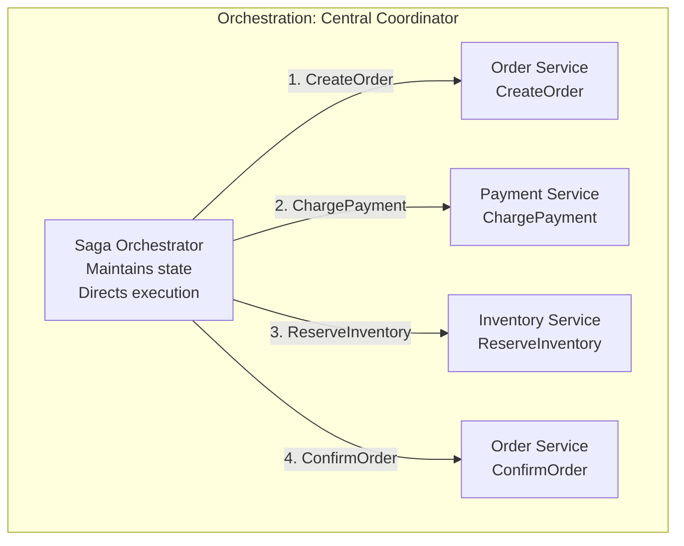

# Design 102: Saga Pattern for Distributed Transactions

## The Situation

You're building an e-commerce platform with microservices:

```
┌─────────────┐     ┌─────────────┐     ┌─────────────┐
│   Order     │     │  Payment    │     │  Inventory  │
│  Service    │────▶│  Service    │────▶│  Service    │
└─────────────┘     └─────────────┘     └─────────────┘
```

**The Challenge:** A customer places an order. You need to:
1. Create the order
2. Charge their credit card
3. Reserve inventory
4. Confirm the order

If any step fails, you need to **roll back** the entire transaction. But you can't use traditional ACID transactions across different databases!

---

## The Problem

**Traditional ACID transactions** don't work across microservices:
- Each service has its own database
- No distributed transaction coordinator
- Network failures are inevitable
- 2-phase commit has poor performance and availability

---

## Your Task

1. **How do you ensure consistency across services without distributed transactions?**

2. **What happens if the payment succeeds but inventory reservation fails?**

3. **How do you handle compensation if a step fails partway through?**

4. **What are the differences between Choreography and Orchestration sagas?**

5. **As a Principal Engineer, design a saga-based order flow with proper compensation.**

---

## Key Concepts

**Saga:** A sequence of local transactions where each transaction updates data within a single service. If one step fails, compensating transactions undo the changes made by preceding transactions.

**Compensating Transaction:** A transaction that undoes the effect of a previous transaction (e.g., refund payment vs. charge payment).

**Choreography:** Decentralized coordination where services emit events and react to events from other services. No central coordinator.

**Orchestration:** Central coordinator (orchestrator) that tells each service what local transaction to execute. The orchestrator maintains the saga state.

**Transactional Outbox:** Pattern where service writes both the domain change and an event message to the same local database transaction, ensuring they commit atomically.

**Correlation ID:** Unique identifier that links all events and messages within a single saga.

**Saga Log:** Persistent record of saga progress, used for recovery and to know which compensating transactions to execute.

---

## Visual: Saga Execution Flow

### Successful Saga



### Failed Saga with Compensation



---

## Choreography vs Orchestration

### Choreography (Event-Driven)



**Pros:** No single point of failure, services are loosely coupled
**Cons:** Complex workflow logic spread across services, hard to debug

### Orchestration (Central Coordinator)



**Pros:** Clear workflow logic, easier to debug and monitor
**Cons:** Orchestrator is single point of failure (can be mitigated)

---

## Real-World Examples

**Netflix:** Uses choreography-based sagas for their streaming platform. Services emit events to Kafka, other services consume and react.

**Amazon:** Uses orchestration-based sagas for order fulfillment. A central orchestrator manages the state machine.

**Uber:** Uses saga pattern for ride booking flows across multiple services.

---

## Questions to Consider

1. **What happens if the orchestrator crashes mid-saga?**
   - How do you recover saga state?
   - Do you retry or compensate?

2. **How do you handle duplicate events?**
   - Network retries can cause duplicate messages
   - Services need idempotency

3. **What if a compensating transaction also fails?**
   - How do you ensure eventual consistency?
   - Do you need human intervention?

4. **How do you monitor saga progress?**
   - Distributed tracing across services
   - Correlation IDs for request tracking

---

## Learning Path

This problem has **7 progressive steps** that will guide you through:

1. **Step 01** - What is a Saga? (The Problem with Distributed Transactions)
2. **Step 02** - Compensation in Reverse
3. **Step 03** - Choreography: Event-Driven Sagas
4. **Step 04** - Orchestration: Central Coordinator Sagas
5. **Step 05** - Choosing Between Choreography and Orchestration
6. **Step 06** - Failure Scenarios and Recovery
7. **Step 07** - Production Concerns (Idempotency, Outbox, Correlation)

Each step builds on the previous one. Work through them in order.

---

**When you've thought about it, read `step-01.md`**
