# Design 103: Coordination Service

## The Situation

You're building a distributed system with multiple services that need to coordinate:

```
┌─────────────┐     ┌─────────────┐     ┌─────────────┐
│  Service A  │     │  Service B  │     │  Service C  │
│  (Primary)  │     │  (Worker)   │     │  (Scheduler) │
└──────┬──────┘     └──────┬──────┘     └──────┬──────┘
       │                   │                   │
       └───────────────────┼───────────────────┘
                           │
                  ┌────────▼────────┐
                  │ Coordination    │
                  │ Service         │
                  │ (etcd, ZooKeeper)│
                  └─────────────────┘
```

**The services need to:**
1. **Elect a leader** - Only one service should be the primary
2. **Distributed lock** - Prevent multiple services from processing same item
3. **Store configuration** - All services need access to shared config
4. **Service discovery** - Services need to find each other
5. **Detect failures** - Know when a service goes down

---

## The Challenge

Without coordination, bad things happen:

```
❌ No leader election:
- Service A thinks it's primary
- Service B also thinks it's primary
- Both process same payment → double charge!

❌ No distributed lock:
- Worker 1 and Worker 2 both grab task #123
- Both process it → duplicate work

❌ No config sharing:
- Service A uses timeout=5s
- Service B uses timeout=10s
- Inconsistent behavior!

❌ No service discovery:
- Service A can't find Service B
- Requests fail with "host not found"
```

---

## Your Task

1. **What coordination service would you choose?** (etcd, ZooKeeper, Consul, or something else?)

2. **How do you implement leader election?** What happens when the leader crashes?

3. **How do you implement a distributed lock that doesn't cause deadlock if the lock holder crashes?

4. **How do you ensure high availability of the coordination service itself?**

5. **As a Principal Engineer, design a coordination layer for 10 microservices.**

---

## Key Concepts

**Coordination Service:** A distributed service that provides primitives like leader election, distributed locking, configuration management, and service discovery.

**etcd:** Distributed key-value store inspired by ZooKeeper but faster and simpler. Uses Raft consensus algorithm. Used by Kubernetes.

**ZooKeeper:** Centralized service for maintaining configuration information, naming, providing distributed synchronization, and providing group services. Uses Zab protocol.

**Consul:** Service discovery and configuration tool with DNS interface and health checking. Uses Raft.

**Leader Election:** Process of selecting a single leader from a group of candidates. Only the leader performs certain operations.

**Distributed Lock:** Mutual exclusion mechanism across distributed systems. Prevents multiple processes from accessing a resource simultaneously.

**Lease:** Time-bounded lock. If the holder doesn't renew within TTL, the lock expires automatically.

**Ephemeral Node:** Temporary node in the coordination service that exists only while the creating session is alive.

**Watch/Notification:** Mechanism to be notified when data in the coordination service changes.

**Quorum:** Majority of nodes required for decisions (N/2 + 1).

**Consensus:** Agreement on a value among distributed nodes. Algorithms: Raft, Paxos, Zab.

---

## Visual: Leader Election

### Without Coordination (Split Brain)


### With Coordination (Single Leader)


---

## Visual: Distributed Lock

### Lock Acquisition


### Lock Holder Crash (Auto-Expiry)

```mermaid
sequenceDiagram
    participant S1 as Service 1 (crashes)
    participant S2 as Service 2
    participant CS as Coordination Service

    S1->>CS: Acquire lock (TTL=30s)
    CS-->>S1: Acquired

    Note over S1: 💥 CRASH! Cannot renew

    S2->>CS: Try acquire (t=5s)
    CS-->>S2: Denied (still held)

    Note over CS: TTL expires at t=30s

    S2->>CS: Try acquire (t=31s)
    CS-->>S2: ✅ Acquired (auto-expired)
```



---

## Coordination Services Comparison

| Feature | etcd | ZooKeeper | Consul |
|---------|------|-----------|--------|
| **Algorithm** | Raft | Zab | Raft |
| **Interface** | gRPC/HTTP | Client (Java/C) | HTTP/DNS |
| **Watch** | Yes | Yes | Yes |
| **Multi-DC** | Yes (complex) | No | Yes |
| **Performance** | Fast (~10ms writes) | Slower (~50ms) | Fast (~20ms) |
| **Complexity** | Simple | Complex | Medium |
| **Kubernetes** | Default | Alternative | Alternative |
| **Language Support** | All (via gRPC) | Java-first | All (via HTTP) |

---

## Common Use Cases

### 1. Leader Election

```python
# Using etcd
import etcd3

etcd = etcd3.client()

# Campaign for leadership
election = etcd.election('/leadership/service-a')

for event in election.events():
    if event.is_elected:
        print("I became the leader!")
        # Start doing leader things
    elif event.is_removed:
        print("I'm no longer leader")
        # Stop doing leader things
```

### 2. Distributed Lock

```python
# Using etcd with TTL (lease)
lease = etcd.lease('lock-order-123', ttl=30)

try:
    # Try to acquire lock
    lease.grant()

    # Do work while renewing lease
    while doing_work:
        lease.refresh()
        time.sleep(10)

finally:
    lease.revoke()  # Explicitly release
```

### 3. Configuration Watch

```python
# Watch for config changes
watch_index = etcd.watch('/config/payment')
for event in watch_index.events:
    if event.is_put:
        new_config = json.loads(event.value)
        apply_config(new_config)
```

---

## Questions to Consider

1. **What happens if the coordination service itself loses quorum?**
   - Can your system function without it?
   - Do you cache the last-known state?

2. **How do you handle "zombie" leaders?**
   - A leader that thinks it's still leader but was actually removed
   - Use fencing tokens!

3. **How do you prevent thundering herd when a lock expires?**
   - All services waiting for lock try to grab it simultaneously
   - Use random jitter or queue

4. **What's your strategy for multi-region deployment?**
   - Single coordination service in one region?
   - Federated coordination services per region?

---

---

## Learning Path

This problem has **8 progressive steps** that will guide you through:

1. **Step 01** - Choosing a Coordination Service (etcd vs ZooKeeper vs Consul)
2. **Step 02** - Leader Election Basics
3. **Step 03** - Leader Election with Crash Recovery
4. **Step 04** - Distributed Locks with Auto-Expiry
5. **Step 05** - High Availability (Quorum, Multi-Region)
6. **Step 06** - Handling Coordination Service Failures
7. **Step 07** - Fencing Tokens (Preventing Split-Brain)
8. **Step 08** - Service Discovery and Configuration

Each step builds on the previous one. Work through them in order.

---

**When you've thought about it, read `step-01.md`**
