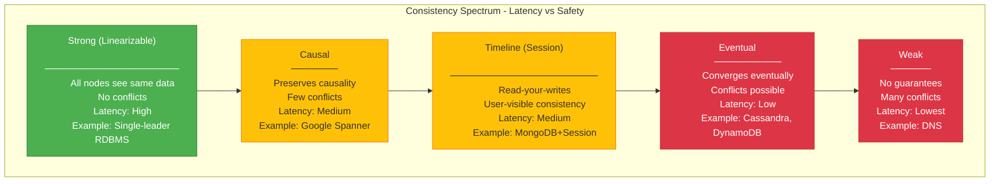
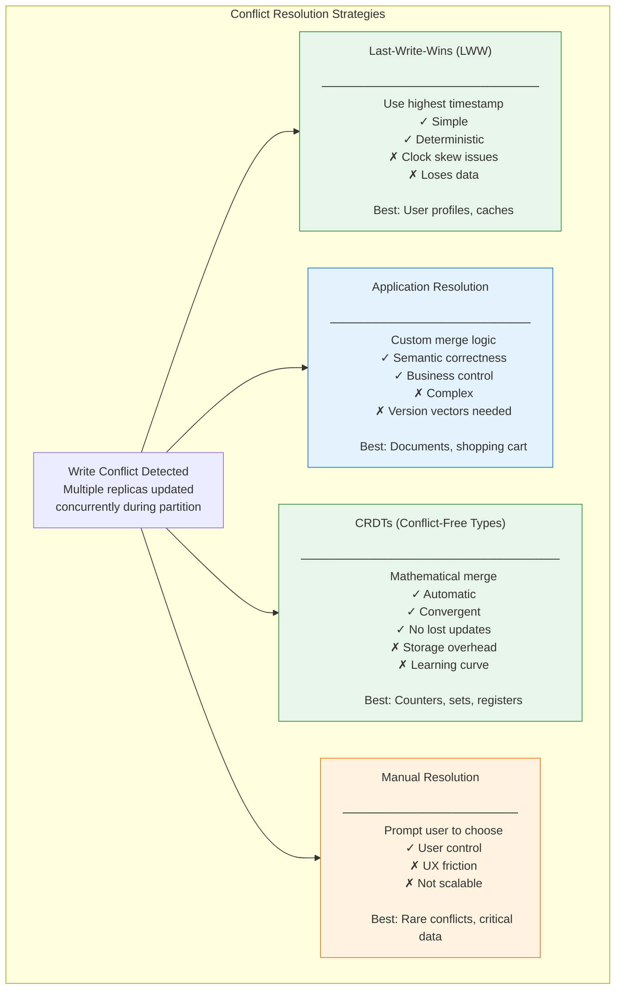
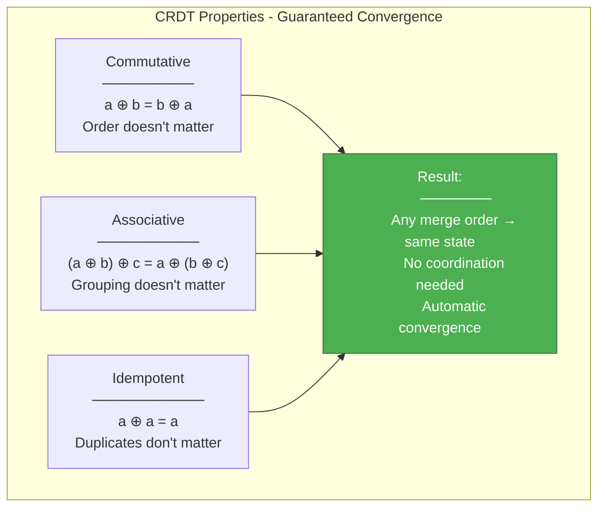
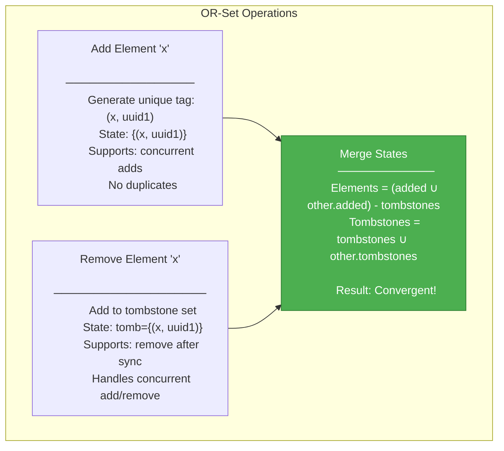
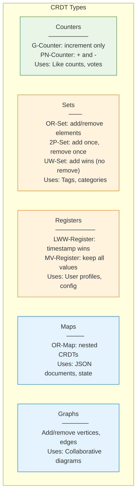
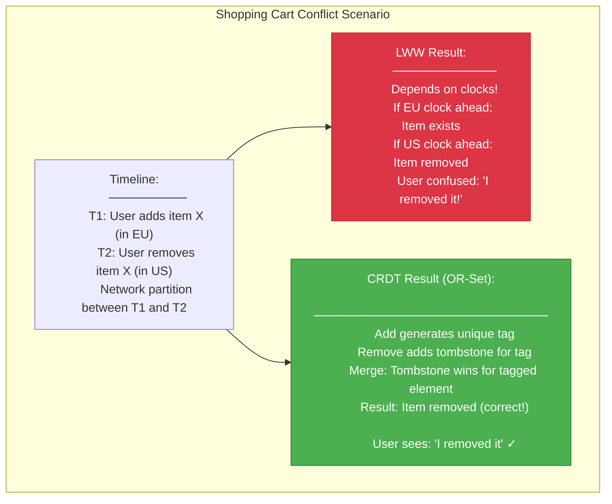
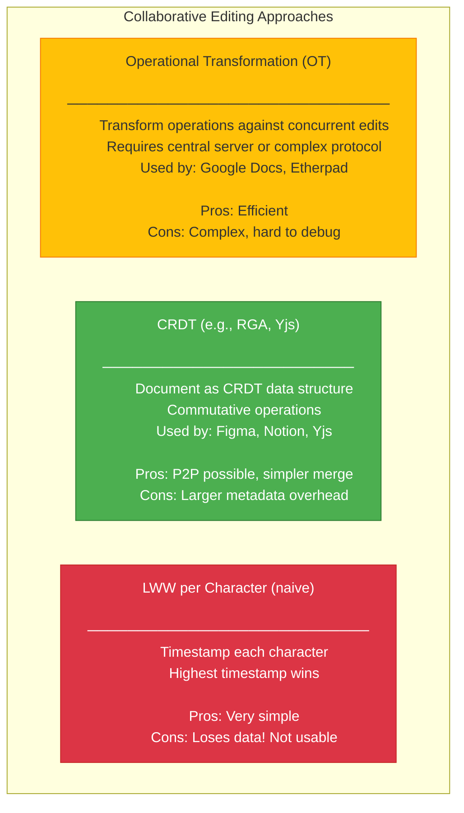
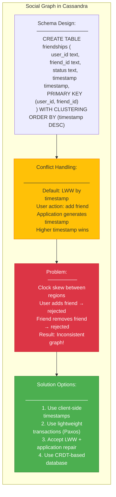
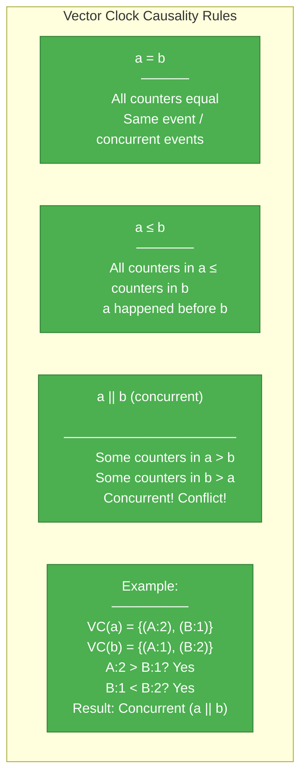

# Design 103: Eventual Consistency & Conflict Resolution

---

## Tools & Prerequisites

To design and debug eventual consistency systems:

### Conflict Resolution Tools

| Tool | Purpose | Quick Usage |
|------|---------|-------------|
| **Riak KV** | Test vector clocks | `riak-admin bucket-type activate` |
| **AntidoteDB** | CRDT testing | `antidote transaction` |
| **etcdctl** | Compare strong vs eventual | `etcdctl get --consistency=s` |
| **Redis CRDTs** | Test OR-sets | `redis-cli EVAL crdt.lua 1 key` |
| **Jepsen** | Verify safety properties | `lein run test --workload cron-store |
| **cassandra-stress** | Test LWW conflicts | `cassandra-stress write cl=ONE` |
| **cockroach sql** | Test serializable isolation | `cockroach sql --experimental-serializable` |

### Key Commands

```bash
# Cassandra: Test write timestamps
cqlsh -e "INSERT INTO t (k, v) VALUES (1, 'a') USING TIMESTAMP 1000;"
cqlsh -e "INSERT INTO t (k, v) VALUES (1, 'b') USING TIMESTAMP 999;"
cqlsh -e "SELECT * FROM t WHERE k = 1;"
# Result: 'a' wins (higher timestamp)

# Riak: Inspect vector clock
curl http://localhost:8098/buckets/test/keys/mykey
# Look for "vclock" in response

# Test causal consistency
# Write with causal context
curl -XPUT -H "X-Riak-Causal-Context: <context>" \
  -d "value" http://localhost:8098/buckets/b/keys/k

# CockroachDB: Check write skew
BEGIN;
-- Run concurrent transactions to test
SELECT * FROM t WHERE id = 1;
UPDATE t SET val = val + 1 WHERE id = 1;
COMMIT;

# Monitor replication lag
nodetool netstats
grep "Replication lag" /var/log/cassandra/system.log

# Test read repair
cqlsh -e "SELECT * FROM t WHERE k = 1;"
# Run on each node, compare results

# Manual repair
nodetool repair -pr

# Check for hinted handoffs
nodetool statshints

# View gossip state
nodetool gossipinfo

# Test idempotency keys
# In DynamoDB
aws dynamodb put-item \
  --table-name table \
  --item '{"id": {"S": "1"}, "value": {"S": "a"}}' \
  --condition-expression attribute_not_exists(id)

# CRDT merge test
# In a CRDT library (e.g., rsidm)
def merge(a: GCounter, b: GCounter) -> GCounter:
    return {k: max(a.get(k, 0), b.get(k, 0)) for k in set(a) | set(b)}
```

### Key Concepts

**Eventual Consistency**: If no new updates, all replicas eventually converge to same state.

**Strong Consistency**: Reads always return most recent write (linearizability).

**Causal Consistency**: Operations that are causally related are seen by all nodes in same order.

**Timeline Consistency**: Session consistency; user sees their own writes.

**Read Your Writes**: Client sees effects of its writes.

**Monotonic Reads**: Sequential reads don't go back in time.

**Monotonic Writes**: Writes from a client are seen in order.

**Writes Follow Reads**: After writing X, client sees X in subsequent reads.

**Vector Clock**: Logical clock tracking causality; map of node → counter.

**Lamport Clock**: Scalar logical clock; partial ordering of events.

**Last-Write-Wins (LWW)**: Conflict resolution using timestamps; highest timestamp wins.

**Logical Timestamp**: Version number incremented per update; order matters.

**Physical Timestamp**: Wall-clock time; can drift between nodes.

**CRDT**: Conflict-Free Replicated Data Type; mathematically guaranteed convergence.

**G-Counter**: Grow-only counter; only increments, merges by taking max.

**PN-Counter**: Positive-Negative Counter; supports increments and decrements.

**OR-Set**: Observed-Remove Set; supports add and remove operations.

**LWW-Register**: Last-Write-Wins Register; single value, timestamp-based.

**MV-Register**: Multi-Value Register; keeps conflicting values, requires application resolution.

**RWT (Read-Write-Time)**: Interval capturing read and write times for consistency verification.

**Quorum Read**: Read from majority of replicas; R + W > N.

**Repair**: Process of synchronizing divergent replicas (read repair, anti-entropy).

**Anti-Entropy**: Full synchronization between replicas; compares entire dataset.

**Gossip Protocol**: Peer-to-peer state dissemination; eventual convergence.

**Merkle Tree**: Hash tree for efficient difference detection; used in repair.

**Version Vector**: Vector clock variant; per-object causality tracking.

**Conflict-Free Merge Operation**: Commutative, associative, idempotent function for CRDT merge.

**Tombstone**: Marker for deleted data in append-only systems.

**Read Repair**: On-demand repair triggered by read operation.

**Full Repair**: Manual synchronization (nodetool repair, Cassandra).

---

## The Situation

You're building a global collaboration platform (think Google Docs or Figma):

```
Requirements:
1. Users in US, EU, Asia must see updates in <100ms
2. System must work offline, sync when reconnecting
3. Multiple users can edit same document simultaneously
4. No data loss, ever
5. Conflicting changes must be resolved automatically
6. Users should see their own changes immediately (timeline consistency)

Scale:
- 10M documents
- 100K concurrent editors
- 3 regions (US-East, EU-West, AP-Southeast)
- 99.99% uptime required
```

**Competitors' approaches:**
```
Google Docs: Operational transformation (OT)
Figma: CRDTs
Notion: Centralized with conflict detection
Dropbox Paper: Last-write-wins
```

---

## The Challenge

**Your team is debating the consistency model:**

```
Option A: Strong Consistency (CP)
- Single region for writes, global reads
- Conflicts impossible
- Latency: 200-300ms for cross-region writes
- Risk: Single point of failure

Option B: Eventual Consistency (AP)
- Multi-master, writes in any region
- Conflicts resolved by merge
- Latency: <50ms for all writes
- Risk: Complex conflict resolution

Option C: Hybrid (Timeline + Causal)
- Per-document region assignment
- User follows "home" region for their documents
- Conflicts rare but possible
- Complexity: High
```

---

## Visual: Consistency Models

### Consistency Spectrum



### Conflict Resolution Strategies



---

## CRDTs Explained

### CRDT Properties



### G-Counter (Grow-Only Counter)

```mermaid
sequenceDiagram
    autonumber
    participant A as Node A
    participant B as Node B
    participant C as Node C

    Note over A: Initial state: {}

    A->>A: increment() → {A: 1}
    B->>B: increment() → {B: 1}
    B->>B: increment() → {B: 2}

    A->>B: sync({A: 1})
    B->>B: merge({A: 1}, {B: 2})
    Note over B: max(A:1, B:0), max(A:0, B:2)
    Note over B: Result: {A: 1, B: 2}

    C->>A: sync({C: 5})
    A->>A: merge({A: 1}, {C: 5})
    Note over A: Result: {A: 1, C: 5}

    Note over A,B,C: Final states converge to sum
    Note over A,B,C: value() = sum of all counters
```

### OR-Set (Observed-Remove Set)



### CRDT Types Comparison



---

## Real-World Examples

### Example 1: Shopping Cart (LWW vs CRDT)



### Example 2: Collaborative Editing (OT vs CRDT)



### Example 3: Social Graph (Cassandra)



---

## Vector Clocks

### Vector Clock Example

```mermaid
sequenceDiagram
    autonumber
    participant A as Node A
    participant B as Node B
    participant C as Node C

    Note over A: Clock: {(A:0)}

    A->>A: Event: A1
    Note over A: Clock: {(A:1)}

    A->>B: Send message
    Note over A: Clock: {(A:1)}
    Note over B: Clock: {(A:1), (B:0)}

    B->>B: Event: B1
    Note over B: Clock: {(A:1), (B:1)}

    B->>C: Send message
    Note over B: Clock: {(A:1), (B:1)}
    Note over C: Clock: {(A:1), (B:1), (C:0)}

    C->>C: Event: C1
    Note over C: Clock: {(A:1), (B:1), (C:1)}

    Note over A,B,C: Concurrent events detected
    Note over A,B,C: Causality tracking possible
```

### Vector Clock Causality



---

## Implementation: CRDT Shopping Cart

```python
# PN-Counter (Positive-Negative Counter) Implementation
class PNCounter:
    def __init__(self, node_id):
        self.node_id = node_id
        self.p = {node_id: 0}  # Positive counters
        self.n = {node_id: 0}  # Negative counters

    def increment(self, value=1):
        self.p[self.node_id] += value

    def decrement(self, value=1):
        self.n[self.node_id] += value

    def value(self):
        return sum(self.p.values()) - sum(self.n.values())

    def merge(self, other):
        for node, count in other.p.items():
            self.p[node] = max(self.p.get(node, 0), count)
        for node, count in other.n.items():
            self.n[node] = max(self.n.get(node, 0), count)

# OR-Set (Observed-Remove Set) Implementation
import uuid
from collections import defaultdict

class ORSet:
    def __init__(self):
        self.elements = {}  # element → set of unique tags
        self.tombstones = set()  # removed tags

    def add(self, element):
        tag = (element, uuid.uuid4())
        if element not in self.elements:
            self.elements[element] = set()
        self.elements[element].add(tag)
        return tag

    def remove(self, element):
        if element in self.elements:
            # Add all tags to tombstones
            self.tombstones.update(self.elements[element])
            del self.elements[element]

    def contains(self, element):
        if element not in self.elements:
            return False
        # Check if any tag is not tombstoned
        return any(tag not in self.tombstones for tag in self.elements[element])

    def merge(self, other):
        # Merge elements
        for element, tags in other.elements.items():
            if element not in self.elements:
                self.elements[element] = tags.copy()
            else:
                self.elements[element].update(tags)

        # Merge tombstones
        self.tombstones.update(other.tombstones)

        # Clean up tombstoned elements
        for element in list(self.elements.keys()):
            self.elements[element] = {t for t in self.elements[element]
                                      if t not in self.tombstones}
            if not self.elements[element]:
                del self.elements[element]

# Shopping Cart using CRDTs
class ShoppingCart:
    def __init__(self, cart_id, node_id):
        self.cart_id = cart_id
        self.node_id = node_id
        self.items = ORSet()  # Set of items
        self.quantities = {}  # item_id → PNCounter

    def add_item(self, item_id, quantity=1):
        tag = self.items.add(item_id)
        if item_id not in self.quantities:
            self.quantities[item_id] = PNCounter(self.node_id)
        self.quantities[item_id].increment(quantity)

    def remove_item(self, item_id):
        self.items.remove(item_id)

    def update_quantity(self, item_id, delta):
        if item_id in self.quantities:
            if delta > 0:
                self.quantities[item_id].increment(delta)
            else:
                self.quantities[item_id].decrement(abs(delta))

    def get_items(self):
        result = {}
        for item_id in self.items.elements:
            if item_id in self.quantities:
                qty = self.quantities[item_id].value()
                if qty > 0:
                    result[item_id] = qty
        return result

    def merge(self, other_cart):
        self.items.merge(other_cart.items)
        for item_id, counter in other_cart.quantities.items():
            if item_id not in self.quantities:
                self.quantities[item_id] = counter
            else:
                self.quantities[item_id].merge(counter)
```

---

## Questions

1. **When should you choose CRDTs over LWW conflict resolution?**

2. **What's the storage overhead of CRDTs compared to LWW? Is it worth it?**

3. **How do you handle "remove" operations in a collaborative editor without losing concurrent edits?**

4. **What happens to vector clocks when nodes join/leave the cluster?**

5. **As a Principal Engineer, design a global collaboration platform. Choose your consistency model, conflict resolution strategy, and justify your decisions.**

---

**When you've thought about it, read `step-01.md`**
