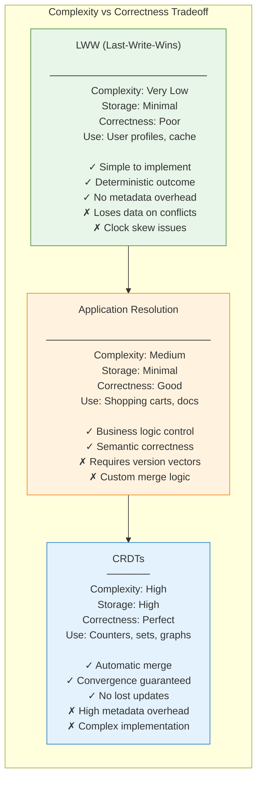
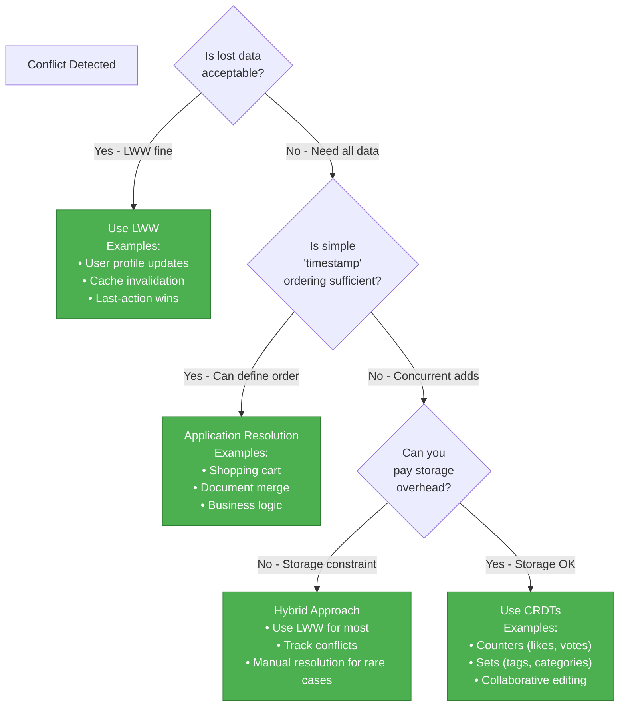
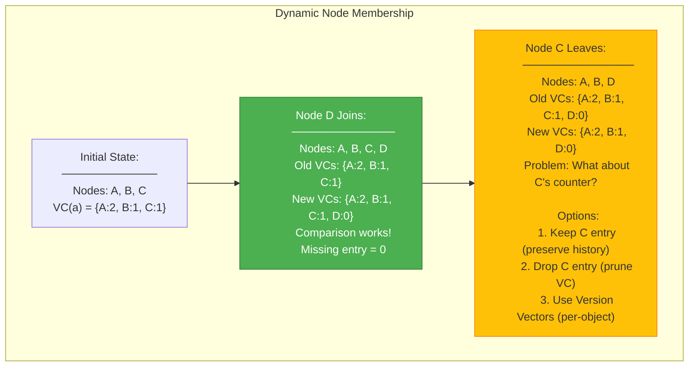
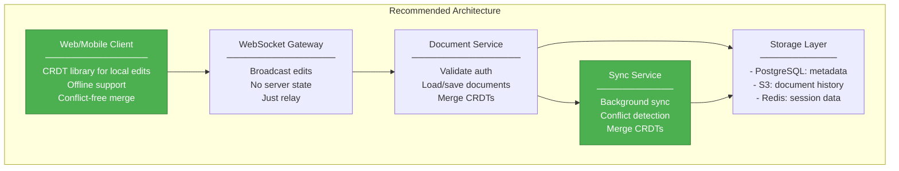

# Step 1: CRDTs vs LWW for Conflict Resolution

Let's understand when to use CRDTs vs simpler approaches.

---

## The Spectrum of Conflict Resolution



---

## Question 1: When to Choose CRDTs over LWW?

**Decision tree:**



**Examples:**

| Scenario | Choice | Why |
|----------|--------|-----|
| User display name | LWW | Latest update wins; no critical data |
| Like counter | CRDT (G-Counter) | Must count every like; no loss |
| Shopping cart | App/Crdt | Remove must win over concurrent add |
| Document edit | CRDT/OT | Must preserve all edits |
| Cache entry | LWW | Stale data is fine to lose |

---

## Question 2: Storage Overhead of CRDTs

**Let's compare:**

**Storage Overhead Comparison (per item)**

| Approach | Size | Notes |
|----------|------|-------|
| LWW: value (100B) + timestamp (8B) | 108 bytes | Minimal overhead |
| App: value (100B) + version (8B) | 108 bytes | Same as LWW |
| G-Counter: value + node_id map (10 nodes) | 180 bytes | 10 nodes = ~72 bytes overhead |
| OR-Set: value + unique tags (10 replicas) | 500 bytes | 10 replicas = ~400 bytes overhead |
| MV-Register: value + all versions (5 conflicts) | 600 bytes | 5 versions = ~500 bytes overhead |

**Real numbers:**

```
LWW Counter:
  - Value: 8 bytes (int64)
  - Timestamp: 8 bytes
  - Total: 16 bytes

G-Counter:
  - Value per node: 8 bytes
  - Node ID metadata: ~16 bytes
  - For 10 nodes: 10 × (8 + 16) = 240 bytes
  - Overhead: 15x vs LWW

OR-Set:
  - Element: 100 bytes (string)
  - Unique tag: 36 bytes (UUID)
  - Tags per element: ~10 (for 10 replicas)
  - Total: 100 + (10 × 36) = 460 bytes
  - Overhead: 4.6x vs single value

Is it worth it?
- For counters: YES if accuracy matters
- For large values: Maybe LWW + manual repair
- For collaborative editing: YES, no alternative
```

---

## Question 3: Handling "Remove" in Collaborative Editing

**The problem:** If user A removes line 5 while user B edits line 5, what happens?

**Wrong approach (LWW):**
```python
# LWW document
class LWWDocument:
    def __init__(self):
        self.lines = {}  # line_number -> (content, timestamp)

    def update_line(self, line_num, content, timestamp):
        self.lines[line_num] = (content, timestamp)

    def remove_line(self, line_num, timestamp):
        if line_num in self.lines:
            if timestamp > self.lines[line_num][1]:
                del self.lines[line_num]

# Problem: User B's edit after A's delete might win!
# Lost data!
```

**Correct approach (RGA - Replicated Growable Array):**
```python
from dataclasses import dataclass
from typing import Optional
import uuid

@dataclass
class RGANode:
    id: str  # Unique ID
    content: str
    timestamp: float
    next_id: Optional[str] = None
    tombstone: bool = False

class RGADocument:
    """Replicated Growable Array - CRDT for sequences"""
    def __init__(self):
        self.nodes = {}  # id -> RGANode
        self.head = None

    def insert_after(self, ref_id: str, content: str, author: str):
        """Insert content after ref_id"""
        node_id = f"{author}:{uuid.uuid4()}"
        timestamp = time.time()

        new_node = RGANode(id=node_id, content=content, timestamp=timestamp)

        if ref_id is None:  # Insert at beginning
            new_node.next_id = self.head
            self.head = node_id
        else:
            ref_node = self.nodes[ref_id]
            new_node.next_id = ref_node.next_id
            ref_node.next_id = node_id

        self.nodes[node_id] = new_node
        return node_id

    def delete(self, node_id: str):
        """Mark node as deleted (tombstone)"""
        if node_id in self.nodes:
            self.nodes[node_id].tombstone = True

    def get_content(self) -> str:
        """Get document content (excluding tombstones)"""
        result = []
        current_id = self.head
        while current_id:
            node = self.nodes[current_id]
            if not node.tombstone:
                result.append(node.content)
            current_id = node.next_id
        return '\n'.join(result)

    def merge(self, other: 'RGADocument'):
        """Merge another RGA document"""
        # Add all nodes from other
        for node_id, node in other.nodes.items():
            if node_id not in self.nodes:
                self.nodes[node_id] = node
            else:
                # Merge tombstones (if either deleted, it's deleted)
                self.nodes[node_id].tombstone = (
                    self.nodes[node_id].tombstone or node.tombstone
                )

        # Merge head (use earliest timestamp)
        if other.head and (
            not self.head or
            other.nodes[other.head].timestamp < self.nodes[self.head].timestamp
        ):
            self.head = other.head
```

**Why RGA works:**
- Each node has unique ID (author + UUID)
- Deletions are tombstones (not removal)
- Concurrent edits create separate nodes
- Merge preserves all non-tombstoned nodes
- No lost data!

---

## Question 4: Vector Clocks with Dynamic Nodes

**Problem:** What happens when nodes join/leave?



**Best practice: Version Vectors**

```python
class VersionVector:
    """Per-object version tracking (not per-node)"""
    def __init__(self):
        # Map: object_id -> {node_id -> version}
        self.versions = {}

    def increment(self, object_id: str, node_id: str):
        if object_id not in self.versions:
            self.versions[object_id] = {}
        self.versions[object_id][node_id] = \
            self.versions[object_id].get(node_id, 0) + 1

    def compare(self, other: 'VersionVector', object_id: str) -> str:
        """Compare version vectors for an object
        Returns: 'before', 'after', 'concurrent'"""
        my_versions = self.versions.get(object_id, {})
        other_versions = other.versions.get(object_id, {})

        all_nodes = set(my_versions) | set(other_versions)

        my_gt = False
        other_gt = False

        for node in all_nodes:
            my_v = my_versions.get(node, 0)
            other_v = other_versions.get(node, 0)

            if my_v > other_v:
                my_gt = True
            elif other_v > my_v:
                other_gt = True

        if my_gt and not other_gt:
            return 'after'
        elif other_gt and not my_gt:
            return 'before'
        elif my_gt or other_gt:
            return 'concurrent'
        else:
            return 'equal'

# When a node leaves, its version entries persist
# But we can prune old entries after some time
class PruningVersionVector(VersionVector):
    def prune(self, object_id: str, keep_nodes: set):
        """Prune versions for nodes that have left"""
        if object_id in self.versions:
            self.versions[object_id] = {
                k: v for k, v in self.versions[object_id].items()
                if k in keep_nodes
            }
```

---

## Question 5: Designing Global Collaboration Platform



**Data model:**

```python
# Document metadata in PostgreSQL
CREATE TABLE documents (
    id UUID PRIMARY KEY,
    creator_id UUID NOT NULL,
    title TEXT NOT NULL,
    created_at TIMESTAMPTZ NOW(),
    updated_at TIMESTAMPTZ NOW(),
    version INT DEFAULT 1,
    region TEXT NOT NULL,  -- 'us', 'eu', 'asia'
    UNIQUE(region, id)  -- Local uniqueness per region
);

# Document content in S3 (CRDT state)
# s3://documents/{region}/{doc_id}/crdt_state.json

{
    "type": "rga-document",
    "nodes": {
        "user1:uuid1": {"content": "Hello", "next": "user2:uuid2", "tombstone": false},
        "user2:uuid2": {"content": "World", "next": null, "tombstone": false}
    },
    "head": "user1:uuid1",
    "version_vector": {
        "user1": 5,
        "user2": 3
    }
}
```

**Merge logic:**

```python
class DocumentService:
    def __init__(self, region: str):
        self.region = region
        self.pg = PostgreSQLClient()
        self.s3 = S3Client()
        self.sync_queue = KafkaProducer('document-sync')

    def apply_edit(self, doc_id: str, user_id: str, edit: EditOp):
        """Apply edit from client"""
        # Load current CRDT state
        state = self.s3.get(f"documents/{self.region}/{doc_id}/crdt_state.json")

        # Convert to RGA
        doc = RGADocument.from_state(state)

        # Apply edit
        if edit.type == 'insert':
            doc.insert_after(edit.ref_id, edit.content, user_id)
        elif edit.type == 'delete':
            doc.delete(edit.node_id)

        # Save state
        new_state = doc.to_state()
        self.s3.put(f"documents/{self.region}/{doc_id}/crdt_state.json", new_state)

        # Broadcast to other regions
        self.sync_queue.produce({
            'doc_id': doc_id,
            'region': self.region,
            'edit': edit,
            'version_vector': new_state['version_vector']
        })

    def merge_remote_edit(self, event: dict):
        """Merge edit from another region"""
        doc_id = event['doc_id']
        remote_region = event['region']
        edit = event['edit']

        # Load local state
        local_state = self.s3.get(f"documents/{self.region}/{doc_id}/crdt_state.json")
        local_doc = RGADocument.from_state(local_state)

        # Load remote state
        remote_state = self.s3.get(f"documents/{remote_region}/{doc_id}/crdt_state.json")
        remote_doc = RGADocument.from_state(remote_state)

        # Merge CRDTs
        local_doc.merge(remote_doc)

        # Save merged state
        self.s3.put(f"documents/{self.region}/{doc_id}/crdt_state.json", local_doc.to_state())

    def get_document(self, doc_id: str):
        """Get document for client"""
        state = self.s3.get(f"documents/{self.region}/{doc_id}/crdt_state.json")
        doc = RGADocument.from_state(state)
        return {
            'content': doc.get_content(),
            'version_vector': state['version_vector']
        }
```

---

## Summary: Choosing the Right Tool

| Use Case | Recommendation | Justification |
|----------|---------------|---------------|
| Simple counters | G-Counter CRDT | Automatic merge, no coordination |
| Voting/liking | PN-Counter CRDT | Supports increment and decrement |
| Tags/categories | OR-Set CRDT | Add/remove semantics, convergent |
| User profile | LWW | Simplicity, last update wins |
| Shopping cart | OR-Set or App merge | Remove must be preserved |
| Document editor | RGA CRDT or OT | Preserves all edits, concurrent |
| Configuration | LWW or CP store | Simplicity over edge cases |
| Leaderboard | LWW with timestamps | Timeliness over accuracy |

**Rule of thumb:** Start with LWW. Add CRDTs when you have proven conflicts that matter.

---

**Proceed to `step-02.md`**

---

## Quick Check

Before moving on, make sure you understand:

1. When should you choose CRDTs over LWW? (CRDTs when data loss is unacceptable)
2. What's the storage overhead of CRDTs? (15x for counters, 4.6x for OR-sets)
3. How do you handle removes in collaborative editing? (Use tombstones, not actual removal)
4. What happens to vector clocks when nodes leave? (Keep entries or prune with version vectors)
5. What's the recommended approach for global collaboration? (CRDTs with automatic merge)
