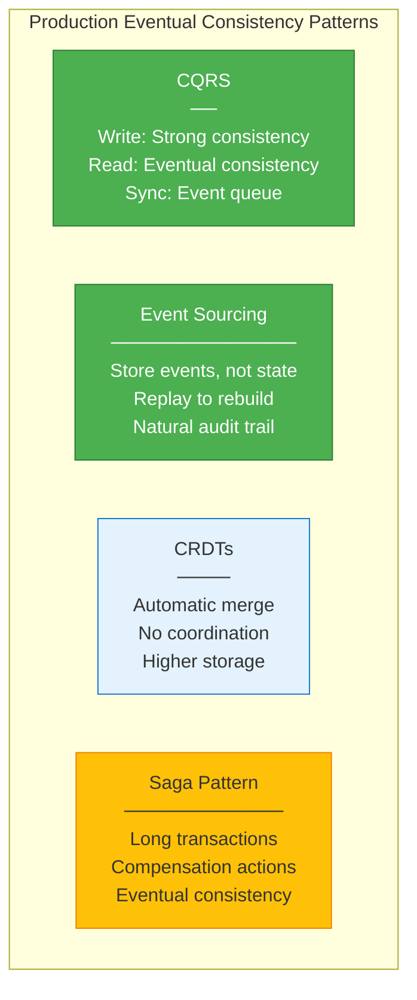

# Step 2: Implementing Eventual Consistency in Production

Let's look at how to build and operate eventually consistent systems at scale.

---

## Production Patterns for Eventual Consistency



---

## Pattern 1: CQRS Implementation

```python
from abc import ABC, abstractmethod
from dataclasses import dataclass
from typing import Any
import time

class Command(ABC):
    """Base class for commands (write side)"""
    pass

class Event(ABC):
    """Base class for events (read side updates)"""
    timestamp: float

    @abstractmethod
    def get_aggregate_id(self) -> str:
        pass

@dataclass
class CreateOrderCommand(Command):
    user_id: str
    items: list[dict]

@dataclass
class OrderCreatedEvent(Event):
    order_id: str
    user_id: str
    items: list[dict]
    timestamp: float = time.time

    def get_aggregate_id(self) -> str:
        return self.order_id

class WriteRepository:
    """Write side: Strong consistency, source of truth"""

    def __init__(self, db_client):
        self.db = db_client
        self.event_bus = EventBus()

    def handle_create_order(self, command: CreateOrderCommand) -> str:
        """Handle command, persist, publish event"""
        with self.db.transaction():
            # Generate order ID
            order_id = generate_uuid()

            # Persist to database (strong consistency)
            self.db.execute(
                "INSERT INTO orders (id, user_id, status, created_at) VALUES (?, ?, 'PENDING', NOW())",
                order_id, command.user_id
            )

            # Persist items
            for item in command['items']:
                self.db.execute(
                    "INSERT INTO order_items (order_id, product_id, quantity, price) VALUES (?, ?, ?, ?)",
                    order_id, item['product_id'], item['quantity'], item['price']
                )

        # Publish event (async, best-effort)
        event = OrderCreatedEvent(
            order_id=order_id,
            user_id=command.user_id,
            items=command.items
        )
        self.event_bus.publish(event)

        return order_id

class ReadRepository:
    """Read side: Eventual consistency, optimized for queries"""

    def __init__(self, cache_client, event_bus):
        self.cache = cache_client
        self.event_bus = event_bus
        self.event_bus.subscribe(OrderCreatedEvent, self.on_order_created)

    def on_order_created(self, event: OrderCreatedEvent):
        """Handle event, update read model"""
        # Update denormalized read model
        order_data = {
            'order_id': event.order_id,
            'user_id': event.user_id,
            'items': event.items,
            'status': 'PENDING',
            'total': sum(item['price'] * item['quantity'] for item in event.items)
        }

        # Write to cache (eventual consistency)
        key = f"order:{event.order_id}"
        self.cache.set(key, order_data, ttl=3600)

        # Update user's orders list
        user_orders_key = f"user_orders:{event.user_id}"
        self.cache.lpush(user_orders_key, event.order_id)
        self.cache.expire(user_orders_key, ttl=3600)

    def get_order(self, order_id: str) -> dict | None:
        """Get order from read model"""
        key = f"order:{order_id}"
        return self.cache.get(key)

    def get_user_orders(self, user_id: str) -> list[dict]:
        """Get all orders for user"""
        user_orders_key = f"user_orders:{user_id}"
        order_ids = self.cache.lrange(user_orders_key, 0, 100)

        orders = []
        for order_id in order_ids:
            order = self.get_order(order_id)
            if order:
                orders.append(order)

        return orders

class FallbackReadRepository(ReadRepository):
    """Read repository with fallback to write side"""

    def __init__(self, cache_client, event_bus, write_db):
        super().__init__(cache_client, event_bus)
        self.write_db = write_db

    def get_order(self, order_id: str) -> dict | None:
        """Try cache first, fallback to DB"""
        # Try cache
        key = f"order:{order_id}"
        order = self.cache.get(key)

        if order:
            return order

        # Fallback to write DB
        log.info(f"Cache miss for {order_id}, falling back to DB")

        # Query from write DB
        result = self.write_db.query(
            f"SELECT * FROM orders WHERE id = {order_id}"
        )

        if result:
            # Update cache (write-through)
            self.cache.set(key, result, ttl=3600)
            return result

        return None
```

---

## Pattern 2: Event Sourcing with Snapshots

```python
from dataclasses import dataclass, field
from typing import Type
import json
import gzip

class EventStore:
    """Append-only event store"""

    def __init__(self, storage_backend):
        self.storage = storage_backend

    def append_events(self, aggregate_id: str, events: list[Event], expected_version: int):
        """Append events to aggregate's event stream"""
        # Optimistic concurrency check
        current_version = self.get_version(aggregate_id)
        if current_version != expected_version:
            raise ConcurrentModificationError(
                f"Expected version {expected_version}, got {current_version}"
            )

        # Append events (atomic append)
        for event in events:
            self.storage.append(
                stream=f"aggregate:{aggregate_id}",
                data=event.to_json(),
                version=current_version + 1
            )
            current_version += 1

    def get_events(self, aggregate_id: str, from_version: int = 0) -> list[Event]:
        """Load all events for an aggregate"""
        return self.storage.read(
            stream=f"aggregate:{aggregate_id}",
            from_version=from_version
        )

    def get_version(self, aggregate_id: str) -> int:
        """Get current version of aggregate"""
        return self.storage.get_version(f"aggregate:{aggregate_id}")

class SnapshotStore:
    """Periodic snapshots to avoid replaying all events"""

    def __init__(self, storage_backend):
        self.storage = storage_backend

    def save_snapshot(self, aggregate_id: str, version: int, state: dict):
        """Save aggregate state snapshot"""
        snapshot_data = {
            'aggregate_id': aggregate_id,
            'version': version,
            'state': state,
            'timestamp': time.time()
        }

        # Compress snapshot (they can be large)
        compressed = gzip.compress(json.dumps(snapshot_data).encode())

        self.storage.write(
            key=f"snapshot:{aggregate_id}:v{version}",
            data=compressed
        )

    def get_latest_snapshot(self, aggregate_id: str) -> tuple[int, dict] | None:
        """Get latest snapshot for aggregate"""
        # List all snapshots for this aggregate
        snapshots = self.storage.list(f"snapshot:{aggregate_id}:*")

        if not snapshots:
            return None

        # Get latest version
        latest = max(snapshots, key=lambda s: s['version'])

        # Decompress and return
        compressed = self.storage.read(latest['key'])
        data = json.loads(gzip.decompress(compressed).decode())

        return data['version'], data['state']

class Aggregate:
    """Base class for event-sourced aggregates"""

    def __init__(self):
        self._version = 0
        self._uncommitted_events: list[Event] = []

    def apply_event(self, event: Event):
        """Apply event to aggregate state"""
        self._mutate(event)
        self._uncommitted_events.append(event)
        self._version += 1

    def load_from_history(self, events: list[Event]):
        """Rebuild state from event history"""
        for event in events:
            self._mutate(event)
            self._version += 1

    @abstractmethod
    def _mutate(self, event: Event):
        """Apply event to internal state (implement in subclass)"""
        pass

    def get_uncommitted_events(self) -> list[Event]:
        """Get events to persist"""
        events = self._uncommitted_events
        self._uncommitted_events = []
        return events

class Order(Aggregate):
    """Event-sourced order aggregate"""

    def __init__(self):
        super().__init__()
        self.order_id: str | None = None
        self.user_id: str | None = None
        self.items: list[dict] = []
        self.status: str = "PENDING"
        self.total: float = 0

    def _mutate(self, event: Event):
        """Apply event to state"""
        if isinstance(event, OrderCreatedEvent):
            self.order_id = event.order_id
            self.user_id = event.user_id
            self.items = event.items
            self.status = "PENDING"
            self.total = sum(item['price'] * item['quantity'] for item in event.items)

class OrderRepository:
    """Repository combining event store + snapshots"""

    SNAPSHOT_INTERVAL = 100  # Snapshot every 100 events

    def __init__(self, event_store: EventStore, snapshot_store: SnapshotStore):
        self.event_store = event_store
        self.snapshot_store = snapshot_store

    def save(self, aggregate: Aggregate):
        """Save aggregate's uncommitted events"""
        events = aggregate.get_uncommitted_events()
        if not events:
            return

        current_version = self.event_store.get_version(aggregate.order_id)
        self.event_store.append_events(
            aggregate.order_id,
            events,
            current_version
        )

        # Check if we should snapshot
        if aggregate._version % self.SNAPSHOT_INTERVAL == 0:
            self.snapshot_store.save_snapshot(
                aggregate.order_id,
                aggregate._version,
                aggregate.__dict__
            )

    def load(self, aggregate_id: str, aggregate_class: Type[Aggregate]) -> Aggregate:
        """Load aggregate from event store"""
        # Try to load from snapshot
        snapshot = self.snapshot_store.get_latest_snapshot(aggregate_id)

        if snapshot:
            version, state = snapshot
            # Rebuild from snapshot
            aggregate = aggregate_class()
            aggregate.__dict__.update(state)
            # Load remaining events
            events = self.event_store.get_events(aggregate_id, from_version=version)
            aggregate.load_from_history(events)
        else:
            # No snapshot, load all events
            events = self.event_store.get_events(aggregate_id)
            aggregate = aggregate_class()
            aggregate.load_from_history(events)

        return aggregate
```

---

## Pattern 3: CRDT Libraries (Don't Build Your Own!)

```python
# Use existing libraries instead of building from scratch

# For Python: recommend 'crdt' or 'pycrdtloop'
from crdt import ORSet, GCounter, PNCounter, LWWRegister

# Example: Shopping cart using OR-Set
class ShoppingCART:
    def __init__(self):
        self.items = ORSet()
        self.quantities = {}  # item_id -> PNCounter

    def add_item(self, item_id: str, quantity: int = 1):
        """Add item to cart"""
        self.items.add(item_id)
        if item_id not in self.quantities:
            self.quantities[item_id] = PNCounter()
        self.quantities[item_id].increment(quantity)

    def remove_item(self, item_id: str):
        """Remove item from cart"""
        self.items.remove(item_id)

    def update_quantity(self, item_id: str, delta: int):
        """Update item quantity"""
        if item_id in self.quantities:
            if delta > 0:
                self.quantities[item_id].increment(delta)
            else:
                self.quantities[item_id].decrement(abs(delta))

    def merge(self, other: 'ShoppingCART'):
        """Merge with another cart (from another device)"""
        self.items.merge(other.items)
        for item_id, counter in other.quantities.items():
            if item_id not in self.quantities:
                self.quantities[item_id] = counter
            else:
                self.quantities[item_id].merge(counter)

    def get_items(self) -> dict[str, int]:
        """Get all items and quantities"""
        result = {}
        for item_id in self.items.elements:
            if item_id in self.quantities:
                qty = self.quantities[item_id].value()
                if qty > 0:
                    result[item_id] = qty
        return result

# For JavaScript: recommend 'Automerge' or 'Yjs'
# For Go: recommend 'share-go/pb'
# For Rust: recommend 'diamond-types' or 'rust-crdt'
```

---

## Pattern 4: Saga for Distributed Transactions

```python
from enum import Enum, auto

class SagaState(Enum):
    PENDING = auto()
    STARTED = auto()
    COMPLETED = auto()
    COMPENSATING = auto()
    COMPENSATED = auto()
    FAILED = auto()

class SagaStep:
    def __init__(self, execute, compensate):
        self.execute = execute
        self.compensate = compensate

class Saga:
    """Saga orchestrator for eventual consistency"""

    def __init__(self, saga_id: str):
        self.saga_id = saga_id
        self.steps: list[SagaStep] = []
        self.completed_steps: list[int] = []
        self.state = SagaState.PENDING

    def add_step(self, execute_fn, compensate_fn):
        """Add a step to the saga"""
        self.steps.append(SagaStep(execute_fn, compensate_fn))

    async def execute(self):
        """Execute all steps, compensate on failure"""
        self.state = SagaState.STARTED

        try:
            for i, step in enumerate(self.steps):
                # Execute step
                result = await step.execute()
                self.completed_steps.append(i)

                # Persist state (for recovery)
                await self._save_state()

            self.state = SagaState.COMPLETED
            return True

        except Exception as e:
            log.error(f"Saga step failed: {e}")
            self.state = SagaState.COMPENSATING

            # Compensate completed steps (in reverse order)
            for i in reversed(self.completed_steps):
                try:
                    await self.steps[i].compensate()
                except Exception as comp_error:
                    log.error(f"Compensation failed: {comp_error}")

            self.state = SagaState.COMPENSATED
            return False

    async def _save_state(self):
        """Save saga state for recovery"""
        state = {
            'saga_id': self.saga_id,
            'state': self.state,
            'completed_steps': self.completed_steps,
            'timestamp': time.time()
        }
        await persistence.save(f"saga:{self.saga_id}", state)

# Example: Order fulfillment saga
class OrderFulfillmentSaga(Saga):
    """Saga for order fulfillment (eventually consistent)"""

    def __init__(self, order_id: str):
        super().__init__(f"order-{order_id}")
        self.order_id = order_id

        # Step 1: Reserve inventory
        self.add_step(
            execute_fn=self._reserve_inventory,
            compensate_fn=self._release_inventory
        )

        # Step 2: Charge payment
        self.add_step(
            execute_fn=self._charge_payment,
            compensate_fn=self._refund_payment
        )

        # Step 3: Confirm order
        self.add_step(
            execute_fn=self._confirm_order,
            compensate_fn=self._cancel_order
        )

        # Step 4: Schedule shipment
        self.add_step(
            execute_fn=self._schedule_shipment,
            compensate_fn=self._cancel_shipment
        )

    async def _reserve_inventory(self):
        """Reserve inventory items"""
        return await inventory_service.reserve(self.order_id)

    async def _release_inventory(self):
        """Release inventory (compensation)"""
        return await inventory_service.release(self.order_id)

    async def _charge_payment(self):
        """Charge customer payment"""
        return await payment_service.charge(self.order_id)

    async def _refund_payment(self):
        """Refund payment (compensation)"""
        return await payment_service.refund(self.order_id)

    async def _confirm_order(self):
        """Mark order as confirmed"""
        return await order_service.confirm(self.order_id)

    async def _cancel_order(self):
        """Cancel order (compensation)"""
        return await order_service.cancel(self.order_id)

    async def _schedule_shipment(self):
        """Schedule shipment"""
        return await shipping_service.schedule(self.order_id)

    async def _cancel_shipment(self):
        """Cancel shipment (compensation)"""
        return await shipping_service.cancel(self.order_id)
```

---

## Monitoring Eventual Consistency

```python
class ConsistencyMonitor:
    """Monitor lag between write and read sides"""

    def __init__(self, write_db, read_cache):
        self.write_db = write_db
        self.read_cache = read_cache
        self.prometheus = PrometheusClient()

    async def check_consistency(self):
        """Check consistency of random orders"""
        # Sample 100 random orders
        order_ids = self.write_db.query(
            "SELECT id FROM orders TABLESAMPLE BERNOULLI(0.01) LIMIT 100"
        )

        inconsistent = 0

        for order_id in order_ids:
            # Get from write DB (source of truth)
            db_order = self.write_db.query(
                f"SELECT * FROM orders WHERE id = {order_id}"
            )

            # Get from read cache
            cache_order = self.read_cache.get(f"order:{order_id}")

            if not cache_order:
                # Cache miss - not necessarily inconsistent
                continue

            # Compare
            if db_order['status'] != cache_order['status']:
                inconsistent += 1
                log.warning(f"Inconsistent order {order_id}: DB={db_order['status']}, Cache={cache_order['status']}")

        # Report metrics
        self.prometheus.gauge('consistency_inconsistent_orders', inconsistent)
        consistency_rate = (len(order_ids) - inconsistent) / len(order_ids) if order_ids else 1.0
        self.prometheus.gauge('consistency_rate', consistency_rate * 100)

        return consistency_rate > 0.99  # Alert if < 99% consistent

    async def measure_replication_lag(self):
        """Measure replication lag"""
        # Write a marker to write DB
        marker_id = generate_uuid()
        self.write_db.execute(
            f"INSERT INTO consistency_markers (id, created_at) VALUES ({marker_id}, NOW())"
        )

        # Poll read cache until it appears
        start = time.time()
        found = False
        for _ in range(100):  # Wait up to 10 seconds
            if self.read_cache.get(f"marker:{marker_id}"):
                found = True
                break
            await asyncio.sleep(0.1)

        lag = time.time() - start if found else 10.0

        self.prometheus.gauge('replication_lag_seconds', lag)

        if lag > 5:
            log.warning(f"High replication lag: {lag}s")

        return lag
```

---

## Summary: Choosing the Right Pattern

| Use Case | Pattern | Consistency | Complexity |
|----------|---------|-------------|------------|
| Read-heavy workloads | CQRS | Eventual (reads) | Medium |
| Audit trails | Event Sourcing | Eventual | High |
| Collaborative editing | CRDTs | Strong (merge) | High |
| Multi-step workflows | Saga | Eventual | Medium |
| Caching | Cache-aside | Eventual | Low |
| Global replication | Multi-master | Eventual | High |

**Key takeaways:**
1. Start simple (cache-aside, CQRS)
2. Use existing CRDT libraries (don't build your own)
3. Monitor consistency continuously
4. Have rollback plans for when consistency breaks
5. Document tradeoffs clearly

---

**Next:** Explore more distributed systems design problems.

---

## Quick Check

Before moving on, make sure you understand:

1. What is CQRS? (Command Query Responsibility Segregation - separate read/write models)
2. What is event sourcing? (Store events, replay to rebuild state)
3. Why use existing CRDT libraries? (Complexity, proven correctness)
4. What's the saga pattern? (Distributed transactions with compensation)
5. How do you monitor eventual consistency? (Compare read vs write, measure lag)
