# Incident 100: Distributed Deadlock

---

## The Situation

Your team runs a distributed financial service using a sharded key-value store.

**Business logic:**
```go
func TransferMoney(fromAccount, toAccount string, amount float64) error {
    // Lock both accounts
    if !Lock(fromAccount) {
        return errors.New("couldn't lock source")
    }
    defer Unlock(fromAccount)

    if !Lock(toAccount) {
        return errors.New("couldn't lock destination")
    }
    defer Unlock(toAccount)

    // Check balance
    balance := GetBalance(fromAccount)
    if balance < amount {
        return errors.New("insufficient funds")
    }

    // Transfer
    SetBalance(fromAccount, balance - amount)
    SetBalance(toAccount, GetBalance(toAccount) + amount)

    return nil
}
```

**Locking is distributed using Redis:**
```go
func Lock(key string) bool {
    // SETNX = Set if Not exists (atomic)
    result, _ := redis.SetNX(ctx, "lock:"+key, "locked", 30*time.Second).Result()
    return result
}

func Unlock(key string) {
    redis.Del(ctx, "lock:"+key)
}
```

---

## The Incident Report

```
Time: Month-end processing (high transfer volume)

Issue: Transfer requests hanging indefinitely, timeouts increasing
Impact: Customers can't move money, some transfers duplicated
Severity: P0 (financial impact)

Symptoms:
- 15% of transfer requests timeout after 30 seconds
- Some transfers applied twice (deducted from source twice, credited twice)
- Redis showing many locks held > 30 seconds
```

---

## What You See

### Distributed Tracing

```
Trace 1 (successful):
  Transfer(user-A, user-B, 100)
    → Lock(user-A) acquired at 00:00:00.000
    → Lock(user-B) acquired at 00:00:00.005
    → Transfer complete at 00:00:00.050
    → Unlock(user-A) at 00:00:00.051
    → Unlock(user-B) at 00:00:00.052

Trace 2 (hanging):
  Transfer(user-B, user-A, 50)
    → Lock(user-B) acquired at 00:00:00.003
    → Lock(user-A) attempted at 00:00:00.008
    ... WAITING ...

Trace 3 (hanging):
  Transfer(user-C, user-B, 75)
    → Lock(user-C) acquired at 00:00:00.010
    → Lock(user-B) attempted at 00:00:00.015
    ... WAITING ...
```

**Pattern:** Circular wait across services!

### Redis Lock Dump

```bash
redis-cli KEYS "lock:*"
# Returns:
lock:user-A
lock:user-B
lock:user-C
lock:user-D
...

redis-cli TTL "lock:user-A"
# Returns: -1 (lock exists without expiry!)
```

**Problem:** Some locks have no expiry (will never auto-release)!

---

## What is Distributed Deadlock?

**Local deadlock:** Two processes waiting for each other on one machine

**Distributed deadlock:** Multiple processes across multiple machines waiting in a cycle

```
Service 1: Locks A, waits for B
Service 2: Locks B, waits for C
Service 3: Locks C, waits for A
    ↺ CIRCULAR WAIT ↺
```

**Harder to detect** because no single machine sees the full picture.

---

## Visual: Distributed Deadlock

### Circular Wait Pattern

```mermaid
flowchart TB
    subgraph Services ["Distributed Services"]
        S1["🔵 Service 1<br/>Locked: user-A<br/>Waiting: user-B"]
        S2["🟠 Service 2<br/>Locked: user-B<br/>Waiting: user-C"]
        S3["🟢 Service 3<br/>Locked: user-C<br/>Waiting: user-A"]
    end

    S1 -->|waits for| S2
    S2 -->|waits for| S3
    S3 -->|waits for| S1

    style S1 fill:#e3f2fd,stroke:#1976d2
    style S2 fill:#fff3e0,stroke:#f57c00
    style S3 fill:#e8f5e9,stroke:#4caf50
```



### Deadlock Timeline

```mermaid
sequenceDiagram
    autonumber
    participant S1 as 🔵 Transfer A→B
    participant S2 as 🟠 Transfer B→A
    participant Lock as 🔒 Distributed Locks

    Note over S1: Transfer 100 from A to B
    S1->>Lock: Lock(user-A) ✅
    Note over S1: Has lock on A

    Note over S2: Transfer 50 from B to A
    S2->>Lock: Lock(user-B) ✅
    Note over S2: Has lock on B

    S1->>Lock: Lock(user-B) ❌ BLOCKED
    Note over S1: Waiting for B...

    S2->>Lock: Lock(user-A) ❌ BLOCKED
    Note over S2: Waiting for A...

    Note over S1,Lock: 🔴 DEADLOCK!<br/>Neither can proceed
```



### Wait-For Graph


### Lock Ordering Solution

```mermaid
flowchart TB
    subgraph Wrong ["❌ Wrong: Arbitrary Order"]
        W1["A→B: Lock(A), Lock(B)"]
        W2["B→A: Lock(B), Lock(A)"]
        WD["🚨 DEADLOCK!"]
        W1 --> WD
        W2 --> WD
    end

    subgraph Correct ["✅ Correct: Consistent Order"]
        C1["A→B: Lock(min(A,B)), Lock(max(A,B))<br/>= Lock(A), Lock(B)"]
        C2["B→A: Lock(min(A,B)), Lock(max(A,B))<br/>= Lock(A), Lock(B)"]
        CS["✅ No Deadlock!"]
        C1 --> CS
        C2 --> CS
    end

    Wrong -.->|Always lock in sorted order| Correct

    classDef bad fill:#ffebee,stroke:#dc3545
    classDef good fill:#e8f5e9,stroke:#28a745

    class Wrong,W1,W2,WD bad
    class Correct,C1,C2,CS good
```



### Proper Distributed Lock with Lease


---

## The Compounding Problems

### Problem 1: Lock Ordering

The code locks `fromAccount` first, then `toAccount`:

```
Transfer A→B: Lock(A), then Lock(B)
Transfer B→A: Lock(B), then Lock(A)
→ Deadlock if concurrent!
```

### Problem 2: Lock Expiry Loss

Look at the Lock function:
```go
func Lock(key string) bool {
    result, _ := redis.SetNX(ctx, "lock:"+key, "locked", 30*time.Second).Result()
    return result
}
```

**What if Redis crashes before setting expiry?**
- Lock is set **without expiry**
- Lock held forever!

This happens when Redis restarts or network fails mid-command.

### Problem 3: Duplicate Transfers

When locks timeout (or crash):

```
Service 1: Locks A, starts transfer...
Service 1: Crashes!
Lock expires after 30 seconds
Service 2: Locks A, starts transfer (same transfer!)
```

The transfer idempotency key was stored in memory, lost on crash.

---

## Jargon

| Term | Definition |
|------|------------|
| **Distributed deadlock** | Deadlock across multiple machines/services; no single coordinator |
| **Circular wait** | Process A waits for B, B waits for C, ..., N waits for A |
| **Lock ordering** | Always acquiring locks in consistent order to prevent deadlock |
| **Lease** | Time-bounded lock; must be renewed or expires automatically |
| **Idempotency** | Operation can be applied multiple times with same result |
| **Distributed lock** | Lock across multiple services using shared storage (Redis, etcd, DB) |
| **Redis SETNX** | "Set if Not eXists" - atomic operation for locking |
| **Wait-for graph** | Graph showing which processes wait for which resources; used for deadlock detection |
| **Deadlock detection** | Algorithm to detect circular waits in distributed systems |
| **Two-phase commit** | Protocol for atomic transactions across distributed systems |

---

## Questions

1. **How do you prevent distributed deadlock without a coordinator?**

2. **What's the proper way to implement distributed locks with expiry?**

3. **How do you make transfers idempotent when services can crash?**

4. **How do you detect and recover from deadlocks in a distributed system?**

5. **As a Principal Engineer, how do you design a transfer system that's correct and available?**

---

**When you've thought about it, read `step-01.md`**
