# Incident 101: Cascade Failure

---

## Tools & Prerequisites

To debug and understand cascade failures, you'll need these tools:

### Essential Tools

| Tool | Purpose | Quick Usage |
|------|---------|-------------|
| **curl/wget** | Test endpoint health | `curl -w "@curl-format.txt" -o /dev/null -s http://api/health` |
| **netstat/ss** | Check connection counts | `ss -s` (summary), `netstat -an \| grep ESTABLISHED \| wc -l` |
| **tcpdump** | Capture network traffic | `tcpdump -i any -nn host backend-service` |
| **strace** | Trace system calls | `strace -p <PID> -e trace=network` |
| **top/htop** | Monitor CPU | `top -p <PID>` or `htop` |
| **iostat** | Monitor disk I/O | `iostat -x 1` |

### Distributed Tracing

- **Jaeger/Zipkin**: Trace request across services
- **Prometheus**: Metrics for request rates, errors, latency (RED method)
- **Grafana**: Visualize metrics in real-time

### Key Concepts

**Circuit Breaker Pattern**: Stops calling failing service after threshold, preventing overload.

```yaml
# Example: Hystrix circuit breaker
circuitBreaker:
  requestVolumeThreshold: 20  # Min requests before measuring
  errorThresholdPercentage: 50  # 50% errors = open circuit
  sleepWindow: 5000  # Wait 5s before trying again
```

**Bulkhead Pattern**: Isolate resource pools so one failure doesn't affect others.

```java
// Thread pool per service, not shared
@HystrixCommand(
    threadPoolKey = "serviceA",
    threadPoolProperties = {
        @HystrixProperty(name = "coreSize", value = "10"),
        @HystrixProperty(name = "maxQueueSize", value = "5")
    }
)
```

---

## The Situation

Your microservices architecture has 5 tiers:

```
┌─────────────────────────────────────────────────────────────┐
│                        API Gateway                          │
│                    (Node.js, 20 instances)                  │
└────────────────────────┬────────────────────────────────────┘
                         │
         ┌───────────────┼───────────────┐
         │               │               │
         ▼               ▼               ▼
┌─────────────┐ ┌─────────────┐ ┌─────────────┐
│   Service A │ │   Service B │ │   Service C │
│   (10 pods) │ │   (10 pods) │ │   (10 pods) │
└─────────────┘ └─────────────┘ └─────────────┘
         │               │               │
         └───────────────┼───────────────┘
                         ▼
                  ┌─────────────┐
                  │  Database   │
                  │  (Primary)  │
                  └─────────────┘
```

**Normal operation:** 1000 req/second, ~50ms P99 latency

---

## The Incident Report

```
Time: Thursday, 3:00 PM UTC - Flash sale event

Issue: Complete system outage
Impact: All services down, 0% availability
Severity: P0 (complete downtime)

Timeline:
14:55 - Flash sale starts, traffic increases to 5000 req/second
15:00 - Service A starts timing out
15:02 - Service B timing out
15:05 - API gateway completely unresponsive
15:10 - Database CPU 100%, all connections exhausted
```

---

## What is a Cascade Failure?

Imagine a line of dominoes. Push one, and it falls into the next, which falls into the next...

**In systems:** One component fails → overload next component → it fails → overload next → entire system down.

**Also called:** Failure cascade, domino effect, failure storm.

---

## Visual: Cascade Failure

### Service Architecture


### Cascade Timeline

```mermaid
gantt
    title Cascade Failure Timeline
    dateFormat  mm:ss
    axisFormat :%S

    section Traffic
    Normal Load :00, 05
    Traffic Spike (5x) :05, 10

    section Service A
    Healthy :00, 07
    Degrading :crit, 07, 10
    Overwhelmed :crit, 10, 15

    section Service B
    Healthy :00, 10
    Affected by Retries :crit, 10, 15
    Failing :crit, 15, 20

    section Service C
    Healthy :00, 10
    Affected :crit, 10, 15
    Failing :crit, 15, 20

    section Database
    Normal :00, 08
    Connection Pool Exhausted :crit, 08, 20
```

### The Retry Storm Problem


### Circuit Breaker Solution

```mermaid
stateDiagram-v2
    [*] --> Closed: Service healthy

    Closed --> Open: Error rate > 50%
    note right of Closed
        Requests pass through
        Monitor error rate
    end note

    Open --> HalfOpen: After timeout (5s)
    note right of Open
        Requests FAIL FAST
        No calls to backend
        Prevents overload
    end note

    HalfOpen --> Closed: Test request succeeds
    HalfOpen --> Open: Test request fails

    Closed: ✅ Normal operation
    Open: 🔴 Circuit open (blocking)
    HalfOpen: 🟡 Testing recovery
```



### Backpressure Flow Control

```mermaid
flowchart LR
    subgraph NoBackpressure ["❌ Without Backpressure"]
        Client1["Client: 5000 req/s"]
        Service1["Service: Handles 1000 req/s"]
        Drop1["4000 req/s queued → Timeouts"]

        Client1 --> Service1
        Service1 --> Drop1
    end

    subgraph WithBackpressure ["✅ With Backpressure"]
        Client2["Client: 5000 req/s"]
        Limiter["Rate Limiter: 1000 req/s"]
        Service2["Service: Handles 1000 req/s"]
        Reject["4000 req/s rejected fast"]

        Client2 --> Limiter
        Limiter --> Service2
        Limiter --> Reject
    end

    classDef bad fill:#ffebee,stroke:#dc3545
    classDef good fill:#e8f5e9,stroke:#28a745

    class NoBackpressure,Client1,Service1,Drop1 bad
    class WithBackpressure,Client2,Limiter,Service2,Reject good
```



---

## What You See

### Timeline Analysis

**14:55 - Traffic spike**
```
API Gateway: 5000 req/s (5x normal)
- Forwarding to Services A, B, C evenly
- Each service gets ~1667 req/s (within capacity)
```

**15:00 - Service A degradation**
```
Service A:
- Latency increases: 50ms → 500ms → 5000ms
- CPU: 30% → 80% → 100%
- Pods going into CrashLoopBackoff
```

**Why?** Service A queries database heavily. Flash sale = more writes = database overload.

**15:02 - Cascading begins**
```
API Gateway:
- Retrying Service A requests (3 retries)
- 1667 req/s × 3 retries = 5000 req/s to Service A
- Service A: 1667 req/s (new) + 5000 req/s (retries) = 6667 req/s
- Service A overwhelmed
- Timeout: 5000ms
```

**15:05 - Full cascade**
```
API Gateway:
- All 20 instances stuck waiting for Service A
- No free connections for Services B, C
- Services B, C appear "down" (timeouts)
- Everything failing
```

**15:10 - Database exhaustion**
```
Database:
- Active connections: 500/500 (max)
- Most connections: "idle in transaction"
- CPU 100% (processing + connection overhead)
- New connections rejected
```

---

## The Root Causes

### Cause 1: No Backpressure

API Gateway doesn't slow down when services are slow:

```javascript
// API Gateway code (simplified)
app.get('/api/orders', async (req, res) => {
    // No check on service health!
    const result = await fetch('http://service-a/orders');
    return res.json(result);
});
```

### Cause 2: Aggressive Retries

```javascript
// Retry configuration
const retryConfig = {
    retries: 3,
    timeout: 5000,  // 5 second timeout
    retryDelay: 100  // 100ms between retries
};
```

During outage: 1667 req/s × 3 retries × 5s timeout = lots of stuck requests.

### Cause 3: No Circuit Breaker

Service A stays in rotation even when failing.

### Cause 4: No Connection Limits

API Gateway opens unlimited connections to backend services.

---

## Jargon

| Term | Definition |
|------|------------|
| **Cascade failure** | One component's failure causes others to fail (domino effect) |
| **Backpressure** | Signal to slow down when consumers can't keep up |
| **Circuit breaker** | Pattern that stops calling failing service after threshold |
| **Retry storm** | Retries overwhelming already-failing service |
| **Timeout** | Max time to wait for response; prevents hanging forever |
| **Connection pool** | Reusable connections; prevents connection overhead |
| **Bulkhead pattern** | Isolating failures to prevent cascade |
| **Graceful degradation** | System provides reduced functionality when components fail |

---

## Questions

1. **Why did retries make things worse instead of better?**

2. **How does backpressure prevent cascade failures?**

3. **What should circuit breaker thresholds be?**

4. **How do you design for graceful degradation?**

5. **As a Principal Engineer, what patterns make systems resilient to cascades?**

---

**When you've thought about it, read `step-01.md`**
