# Incident 102: Thundering Herd

---

## Tools & Prerequisites

To debug cache-related issues, you'll need:

### Cache Debugging Tools

| Tool | Purpose | Quick Usage |
|------|---------|-------------|
| **redis-cli** | Redis CLI interface | `redis-cli INFO stats`, `redis-cli --latency` |
| **redis-cli monitor** | Watch all commands | `redis-cli MONITOR` (use carefully in prod!) |
| **memcached-tool** | Memcache stats | `memcached-tool localhost:11211 stats` |
| **tcpdump** | Capture cache traffic | `tcpdump -i any port 6379 -A` |
| **slowlog** | Redis slow queries | `redis-cli SLOWLOG GET 10` |

### Key Commands

```bash
# Redis stats
redis-cli INFO stats
redis-cli INFO memory

# Check cache size
redis-cli DBSIZE

# Monitor live traffic (dev only!)
redis-cli MONITOR

# Get key info
redis-cli OBJECT encoding <key>
redis-cli TTL <key>
```

### Key Concepts

**Cache Warming**: Pre-loading cache before serving traffic.

**Request Coalescing**: Multiple identical requests merge into one backend call.

**Exponential Backoff**: `delay = base_delay × 2^attempt_number`

**Probabilistic Cache Expiry**: Add random jitter to TTL to prevent simultaneous expiry.

---

## The Situation

Your service uses Redis as a cache:

```go
func GetUserProfile(userID int64) (*Profile, error) {
    // Try cache first
    cached, err := redis.Get("user:" + strconv.FormatInt(userID, 10))
    if err == nil {
        return unserialize(cached), nil
    }

    // Cache miss: fetch from database
    profile, err := db.QueryRow("SELECT * FROM users WHERE id = $1", userID)
    if err != nil {
        return nil, err
    }

    // Populate cache
    redis.Set("user:"+strconv.FormatInt(userID, 10), serialize(profile), 1*time.Hour)
    return profile, nil
}
```

---

## The Incident Report

```
Time: Daily cache restart (scheduled)

Issue: Database overloaded after Redis restart
Impact: API timeouts, 503 errors
Severity: P1

Timeline:
04:00 - Scheduled Redis restart for maintenance
04:01 - Cache empty, all requests hit database
04:02 - Database CPU 100%, connections exhausted
04:05 - Complete service outage
```

---

## What is a Thundering Herd?

Imagine a dam holding back water.

**Normal operation:** Water trickles through consistently (cache hits, occasional misses)

**Thundering herd:** Dam breaks suddenly (cache emptied, all requests hit backend)

**Difference from cache stampede:**
- **Stampede:** One hot key expires, many requests for that key
- **Thundering herd:** Entire cache invalidated/reset, all keys miss at once

---

## Visual: Thundering Herd

### Normal Operation vs Thundering Herd

```mermaid
flowchart TB
    subgraph Normal ["✅ Normal Operation (95% hit rate)"]
        Client1["50,000 requests/s"]
        Cache1["🟢 Redis Cache<br/>47,500 hits (95%)"]
        DB1["🗄️ Database<br/>2,500 queries (5%)"]

        Client1 --> Cache1
        Cache1 -->|95% hit| Cache1
        Cache1 -->|5% miss| DB1
    end

    subgraph Thundering ["🚨 Thundering Herd (0% hit rate)"]
        Client2["50,000 requests/s"]
        Cache2["🔴 Redis Cache<br/>0 hits (0%)<br/>FLUSHED!"]
        DB2["🗄️ Database<br/>50,000 queries!<br/>OVERWHELMED"]

        Client2 --> Cache2
        Cache2 -->|100% miss| DB2
    end

    classDef good fill:#e8f5e9,stroke:#28a745
    classDef bad fill:#ffebee,stroke:#dc3545

    class Normal,Client1,Cache1,DB1 good
    class Thundering,Client2,Cache2,DB2 bad
```



### Database Load Timeline


### Request Coalescing Solution


### Cache Warming Strategies

```mermaid
flowchart TB
    subgraph ColdStart ["❌ Cold Start (Thundering Herd)"]
        S1["Service starts"]
        S2["Cache empty"]
        S3["Traffic hits → DB overwhelmed"]
        S1 --> S2 --> S3
    end

    subgraph WarmStart ["✅ Warm Start (Gradual)"]
        W1["Cache warming service"]
        W2["Pre-load hot keys"]
        W3["Then enable traffic"]
        W1 --> W2 --> W3
    end

    subgraph Probabilistic ["✅ Probabilistic TTL"]
        P1["TTL: 3600s ± random(0, 600)"]
        P2["Expiry spread over time"]
        P3["No simultaneous expiry"]
        P1 --> P2 --> P3
    end

    classDef bad fill:#ffebee,stroke:#dc3545
    classDef good fill:#e8f5e9,stroke:#28a745

    class ColdStart,S1,S2,S3 bad
    class WarmStart,W1,W2,W3,Probabilistic,P1,P2,P3 good
```



### Stampede vs Thundering Herd

```mermaid
graph TB
    subgraph Stampede ["🐴 Cache Stampede (Single Key)"]
        ST1["Hot key: user:12345 expires"]
        ST2["1000 requests for that key"]
        ST3["All 1000 hit DB for same key"]
        ST1 --> ST2 --> ST3
    end

    subgraph Thundering ["⚡ Thundering Herd (All Keys)"]
        TH1["Redis FLUSHALL / Restart"]
        TH2["ALL 500,000 keys expired"]
        TH3["All requests hit DB"]
        TH1 --> TH2 --> TH3
    end

    classDef warn fill:#fff3cd,stroke:#f57c00
    classDef danger fill:#ffebee,stroke:#dc3545

    class Stampede,ST1,ST2,ST3 warn
    class Thundering,TH1,TH2,TH3 danger
```



---

## What You See

### Database Metrics

```
Time    | Cache Hit Rate | DB Queries/sec | DB CPU
--------|----------------|----------------|--------
03:55   | 95%            | 2,500          | 25%
04:00   | 0%             | 50,000         | 100%  ← Cache restart
04:01   | 0%             | 50,000         | 100%  ← All requests miss!
04:02   | Growing        | 45,000         | 100%
04:10   | 80%            | 10,000         | 60%
04:30   | 95%            | 2,500          | 25%
```

### Cache Key Distribution

```
04:00:00 - Redis FLUSHALL (scheduled restart)
04:00:01 - 0 keys in cache
04:00:10 - 50,000 keys in cache (repopulating)
04:01:00 - 500,000 keys in cache
```

The problem: **50,000 req/s all hit database simultaneously.**

---

## The Compounding Problem

1. **Cache emptied** (restart)
2. **All requests miss cache** → hit database
3. **Database overwhelmed** → slow queries
4. **Slow queries** → requests take longer
5. **More requests in-flight** → database more overwhelmed
6. **Cascade failure**

Worse: Applications might retry on timeout, adding to load!

---

## Jargon

| Term | Definition |
|------|------------|
| **Thundering herd** | Many requests simultaneously miss cache, overwhelming backend |
| **Cache stampede** | Single hot key expires, many requests for that key |
| **Cache warming** | Pre-loading cache with expected data |
| **Cache priming** | Gradually populating cache after restart |
| **Request coalescing** | Merging identical requests into one |
| **Lock-free cache** | Multiple callers coordinate without locks |
| **Exponential backoff** | Increasing delay between retries |
| **Probability (probabilistic)** | Using randomness to distribute load |

---

## Questions

1. **Why did restart cause complete outage instead of just slower performance?**

2. **How do you gradually warm cache after restart?**

3. **How do you prevent all requests from hitting database simultaneously?**

4. **What's the difference between stampede and thundering herd?**

5. **As a Principal Engineer, how do you design systems resilient to cache restarts?**

---

**When you've thought about it, read `step-01.md`**
