# Incident 103: Phoenix Deadlock

---

## Tools & Prerequisites

To debug deadlock issues:

### Deadlock Detection Tools

| Tool | Purpose | Quick Usage |
|------|---------|-------------|
| **SHOW ENGINE INNODB STATUS** | MySQL deadlock info | `SHOW ENGINE INNODB STATUS\G` (LATEST DETECTED DEADLOCK section) |
| **pg_stat_activity** | PostgreSQL blocking queries | `SELECT * FROM pg_stat_activity WHERE wait_event_type = 'Lock';` |
| **pg_locks** | Postgres lock details | `SELECT * FROM pg_locks WHERE NOT granted;` |
| **jstack** | Java thread dumps | `jstack <pid> \| grep "waiting to lock"` |
| **pstack** | Process stack trace | `pstack <pid>` |
| **GDB** | Attach and inspect threads | `gdb -p <pid> -batch -ex "thread apply all bt"` |

### Key Queries

```sql
-- PostgreSQL: Find blocked queries
SELECT
    blocked_locks.pid AS blocked_pid,
    blocked_activity.usename AS blocked_user,
    blocking_locks.pid AS blocking_pid,
    blocking_activity.usename AS blocking_user,
    blocked_activity.query AS blocked_statement,
    blocking_activity.query AS blocking_statement
FROM pg_catalog.pg_locks blocked_locks
JOIN pg_catalog.pg_stat_activity blocked_activity ON blocked_activity.pid = blocked_locks.pid
JOIN pg_catalog.pg_locks blocking_locks ON blocking_locks.locktype = blocked_locks.locktype
JOIN pg_catalog.pg_stat_activity blocking_activity ON blocking_activity.pid = blocking_locks.pid
WHERE NOT blocked_locks.granted;

-- MySQL: View InnoDB transaction and locks
SELECT * FROM information_schema.innodb_trx;
SELECT * FROM information_schema.innodb_locks;
SELECT * FROM information_schema.innodb_lock_waits;

-- Check for long-held locks
SELECT
    pid,
    now() - query_start AS duration,
    state,
    query
FROM pg_stat_activity
WHERE state IN ('idle in transaction', 'active')
ORDER BY duration DESC;
```

### Key Concepts

**Phoenix Deadlock**: Deadlock victim retries with same lock order → deadlocks again repeatedly.

**Wait-for Graph**: Directed graph showing which transactions wait for which resources.

**Deadlock Detection**: Algorithm finding cycles in wait-for graph; chooses victim to abort.

**Victim Selection**: Strategy for choosing which transaction to kill (youngest, fewest locks, etc.).

**Lock Acquisition Order**: Order in which transaction requests locks; consistent order prevents deadlocks.

**Lock Timeout**: Maximum time to wait for lock before giving up.

**Wait-Die Scheme**: Older transaction waits for younger, younger dies (pre-wound).

**Wound-Wait Scheme**: Older preempts (wounds) younger, younger waits.

**Two-Phase Locking**: Growing phase (acquire locks) then shrinking phase (release locks).

---

## Visual: Phoenix Deadlock

### Normal Deadlock (One-time)

```mermaid
sequenceDiagram
    autonumber
    participant T1 as Transaction 1
    participant A as Resource A
    participant B as Resource B
    participant T2 as Transaction 2
    participant DM as Deadlock Manager

    T1->>A: Lock A
    A-->>T1: ✅ Acquired

    T2->>B: Lock B
    B-->>T2: ✅ Acquired

    T1->>B: Lock B
    Note over T1: Blocked, T2 holds B

    T2->>A: Lock A
    Note over T2: Blocked, T1 holds A

    DM->>DM: Detect cycle: T1→B→T2→A→T1
    DM->>T1: Abort (victim)

    T1->>A: Release A
    T2->>A: Lock A
    A-->>T2: ✅ Acquired

    Note over T2: Transaction completes!
```



### Phoenix Deadlock (Repeats Forever)


### Wait-for Graph


### Lock Order Strategy

```mermaid
flowchart TB
    subgraph BadOrder ["❌ Inconsistent Lock Order"]
        B1["T1: Lock A → Lock B"]
        B2["T2: Lock B → Lock A"]
        B3["Deadlock!"]

        B1 --> B3
        B2 --> B3
    end

    subgraph GoodOrder ["✅ Consistent Lock Order"]
        G1["All: Always lock by ID<br/>T1: Lock A(1) → Lock B(2)<br/>T2: Lock A(1) → Lock B(2)"]
        G2["No deadlock possible"]

        G1 --> G2
    end

    style BadOrder fill:#ffcdd2
    style GoodOrder fill:#c8e6c9
```



### Wait-Die vs Wound-Wait


### Phoenix Deadlock Cycle


### Breaking Phoenix Deadlock

```mermaid
flowchart TB
    subgraph Solutions ["Breaking Phoenix Deadlock"]
        S1["🎲 Randomized retry delay<br/>Avoid synchronized retries"]
        S2["📊 Different lock order<br/>After abort, reverse order"]
        S3["🏷️ Victim selection<br/>Kill longest-running"]
        S4["⏱️ Exponential backoff<br/>Increase delay after each retry"]
        S5["🚫 Max retry limit<br/>Give up after N attempts"]
    end

    style Solutions fill:#c8e6c9
```



### Deadlock Detection Timeline


---

## The Situation

Your distributed transaction system uses a **distributed lock manager** (DLM) for coordination across services.

**Transaction protocol:**
```go
type Transaction struct {
    id          string
    locks       []string
    acquired    []string
    state       string  // "active", "waiting", "committed", "aborted"
}

func (t *Transaction) AcquireLock(resource string) error {
    for {
        // Try to acquire lock from lock manager
        if lockManager.TryAcquire(t.id, resource) {
            t.acquired = append(t.acquired, resource)
            return nil
        }

        // Wait and retry
        time.Sleep(100 * time.Millisecond)
    }
}

func (t *Transaction) Commit() error {
    // Two-phase commit
    // Phase 1: Prepare
    // Phase 2: Commit
    // Release locks
}
```

**Lock manager uses deadlock detection:**
- Builds wait-for graph
- Detects cycles
- Kills one transaction to break deadlock

---

## The Incident Report

```
Time: Ongoing issue, worst during peak hours

Issue: Transactions repeatedly killed for "deadlock"
Impact: Low completion rate, user frustration
Severity: P1 (functional but degraded)

Pattern observed:
- Transaction T1 aborted for deadlock
- Same transaction retries (T2)
- T2 also aborted for deadlock
- T3 retries... same result
- Transaction never completes!
```

---

## What is a Phoenix Deadlock?

**Phoenix:** Mythological bird that rises from its own ashes.

**Phoenix deadlock:** Transaction aborted for deadlock, retries, and **deadlocks again** on the same resources.

**Normal deadlock:**
```
T1: Locks A, waits for B
T2: Locks B, waits for A
→ Detect cycle → Kill T1 → T2 completes
```

**Phoenix deadlock:**
```
T1: Locks A, waits for B
T2: Locks B, waits for A
→ Detect cycle → Kill T1

T1' (retry): Locks A, waits for B  ← Same pattern!
T2: Locks B, waits for A
→ Detect cycle → Kill T1'
→ Infinite retry loop!
```

---

## What You See

### Transaction Logs

```
14:00:00 [INFO] Transaction abc123 started: Lock(user-123), Lock(user-456)
14:00:00 [INFO] abc123: Acquired user-123
14:00:00 [INFO] abc123: Waiting for user-456...

14:00:00 [INFO] Transaction def456 started: Lock(user-456), Lock(user-789)
14:00:00 [INFO] def456: Acquired user-456
14:00:00 [INFO] def456: Waiting for user-789...

14:00:01 [WARN] Deadlock detected: abc123 <-> def456
14:00:01 [INFO] Aborting abc123 (victim)

14:00:02 [INFO] Transaction abc124 started (retry of abc123)
14:00:02 [INFO] abc124: Lock(user-123), Lock(user-456)
14:00:02 [INFO] abc124: Acquired user-123
14:00:02 [INFO] abc124: Waiting for user-456...

14:00:03 [WARN] Deadlock detected: abc124 <-> def456
14:00:03 [INFO] Aborting abc124 (victim)

... [repeats indefinitely]
```

### Wait-for Graph

```
abc123 ──→ user-456 ←── def456 ──→ user-789 ←── ghi789 ──→ user-123 ←── abc123
    ↺──────────────────────────────────────────────────────────────────↺
```

Large cycle involving many transactions. Killing one doesn't break the cycle because transactions keep retrying.

---

## The Root Cause

**Deadlock detection works**, but victims retry **in the same order**, causing the same deadlock again.

This is different from normal deadlock because:
- The deadlock is **structural** (lock acquisition order)
- Retrying doesn't change the lock order
- **Phoenix rises again!**

---

## Jargon

| Term | Definition |
|------|------------|
| **Phoenix deadlock** | Deadlock victim retries and deadlocks again repeatedly |
| **Wait-for graph** | Graph showing which transactions wait for which resources |
| **Deadlock detection** | Algorithm finding cycles in wait-for graph |
| **Victim selection** | Choosing which transaction to kill to break deadlock |
| **Lock acquisition order** | Order in which transaction requests locks |
| **Two-phase commit** | Protocol for distributed atomic transactions |

---

## Questions

1. **Why does retrying cause the same deadlock?**

2. **How do you break the phoenix deadlock cycle?**

3. **What's the correct victim selection strategy?**

4. **How do you design lock acquisition to prevent phoenix deadlocks?**

5. **As a Principal Engineer, how do you design systems that can recover from structural deadlocks?**

---

**When you've thought about it, read `step-01.md`**
