# Incident 104: Two-Phase Commit Failure

---

## Tools & Prerequisites

To debug distributed transaction issues:

### 2PC Debugging Tools

| Tool | Purpose | Quick Usage |
|------|---------|-------------|
| **XA Transaction Logs** | View prepared transactions | `SELECT * FROM information_schema.innodb_trx;` |
| **JPA/Hibernate Logs** | Track transaction boundaries | `logging.level.org.hibernate.transaction=DEBUG` |
| **Distributed Tracing** | Trace across services | Jaeger/Zipkin with transaction_id span |
| **Database Locks** | Check held locks | `SELECT * FROM pg_locks WHERE transactionid = X;` |
| **Network Tools** | Check connectivity | `tcpdump -i any port 3306` |

### Key Queries

```sql
-- Check in-doubt transactions (PostgreSQL)
SELECT
    transaction_id,
    state,
    prepared_at
FROM pg_prepared_xacts;

-- Check held locks (PostgreSQL)
SELECT
    l.locktype,
    l.relation::regclass,
    l.mode,
    l.granted
FROM pg_locks l
JOIN pg_stat_activity a ON l.pid = a.pid
WHERE l.granted = false;  -- Waiting locks

-- Check long-running transactions
SELECT
    pid,
    now() - xact_start AS duration,
    state,
    query
FROM pg_stat_activity
WHERE state IN ('idle in transaction', 'active')
ORDER BY duration DESC;
```

### Key Concepts

**2PC (Two-Phase Commit)**: Protocol for atomic distributed transactions with PREPARE and COMMIT phases.

**Coordinator**: Service orchestrating the transaction; collects votes and makes final decision.

**Participant**: Service involved in transaction that votes YES/NO during PREPARE phase.

**PREPARED State**: Participant has locked resources and promised to commit; waiting for final decision.

**Blocking Protocol**: Transaction cannot proceed if coordinator crashes after PREPARE.

**Heuristic Decision**: Participant making unilateral commit/abort decision when coordinator is unreachable (dangerous!).

**Presumed Abort**: Assuming transaction aborted if coordinator unreachable (default in many systems).

**Presumed Commit**: Assuming transaction committed if coordinator unreachable (requires logging).

**Recovery**: Process of resolving in-doubt transactions after coordinator restart.

---

## Visual: Two-Phase Commit

### Happy Path - Successful 2PC


### Failure During PREPARE Phase


### Coordinator Crash After PREPARE


### Blocking State Problem


### Network Partition Scenario

```mermaid
flowchart TB
    subgraph Before ["Normal Operation"]
        Coord["Coordinator"]
        P1["Payment"]
        P2["Inventory"]
        S1["Shipping"]

        Coord --- P1
        Coord --- P2
        Coord --- S1
    end

    subgraph AfterPartition ["🚨 Network Partition"]
        P1a["Payment<br/>✅ COMMITTED"]
        P2a["Inventory<br/>❓ PREPARED (waiting)"]
        S1a["Shipping<br/>❓ PREPARED (waiting)"]
        Coorda["Coordinator<br/>❌ Unreachable"]

        Coorda -.->|"partition"| P2a
        Coorda -.->|"partition"| S1a
    end

    style P2a fill:#ffcdd2
    style S1a fill:#ffcdd2
    style Coorda fill:#dc3545,color:#fff
```



### 2PC vs 3PC vs Saga

```mermaid
graph TB
    subgraph TwoPC ["2PC (Two-Phase Commit)"]
        T1["✅ Atomicity guaranteed"]
        T2["❌ Blocking protocol"]
        T3["❌ Single point of failure"]
    end

    subgraph ThreePC ["3PC (Three-Phase Commit)"]
        TH1["✅ Non-blocking"]
        TH2["✅ Can recover without coordinator"]
        TH3["❌ Complex implementation"]
        TH4["❌ Still needs consensus"]
    end

    subgraph Saga ["Saga Pattern"]
        S1["✅ Non-blocking"]
        S2["✅ Long-running transactions"]
        S3["❌ Eventual consistency"]
        S4["❌ Compensation logic required"]
    end

    style TwoPC fill:#ffcdd2
    style ThreePC fill:#fff3e0
    style Saga fill:#c8e6c9
```



### Recovery Process


### Heuristic Completion Problem

```mermaid
flowchart TB
    subgraph Problem ["🚨 Heuristic Decision Dilemma"]
        P1["Participant 1: COMMITTED<br/>(heuristic decision)"]
        P2["Participant 2: PREPARED<br/>(waiting for coordinator)"]
        P3["Participant 3: ABORTED<br/>(coordinator recovered)"]

        Result["❌ INCONSISTENCY!<br/>Some committed, some aborted<br/>Transaction atomicity violated"]
    end

    P1 --> Result
    P2 --> Result
    P3 --> Result

    style Result fill:#dc3545,color:#fff
```



### Saga Alternative


---

## The Situation

Your payment system uses two-phase commit (2PC) to ensure atomicity across services:

```
┌─────────────┐     ┌─────────────┐     ┌─────────────┐
│  Payment    │     │   Inventory │     │  Shipping   │
│  Service    │     │   Service   │     │  Service    │
└──────┬──────┘     └──────┬──────┘     └──────┬──────┘
       │                   │                   │
       └───────────────────┴───────────────────┘
                           │
                  ┌────────▼────────┐
                  │   Coordinator   │
                  │  (Transaction   │
                  │   Manager)      │
                  └─────────────────┘
```

**Flow:**
1. Coordinator sends PREPARE to all services
2. Each service votes YES/NO
3. If all YES → Coordinator sends COMMIT
4. If any NO → Coordinator sends ABORT

---

## The Incident Report

```
Time: During deployment of payment service

Issue: Transactions stuck in "prepared" state forever
Impact: Inventory reserved but payment not processed, orders hanging
Severity: P0

Timeline:
10:00 - Deployment starts, payment service restarted
10:05 - 2PC coordinator crashes during COMMIT phase
10:10 - All transactions in PREPARED state blocking inventory
10:30 - Manual intervention required to clean up
```

---

## What is Two-Phase Commit?

**Phase 1 (Prepare):**
```
Coordinator → Payment: PREPARE
Coordinator → Inventory: PREPARE
Coordinator → Shipping: PREPARE

Services lock resources and vote YES/NO
```

**Phase 2 (Commit/Abort):**
```
If all voted YES:
  Coordinator → All: COMMIT
Else:
  Coordinator → All: ABORT
```

**Guarantee:** Atomicity - all commit or all abort.

---

## The Problems

### Problem 1: Blocking Protocol

During PREPARE phase, resources are **locked** but not committed.

```python
# Inventory service during PREPARE
def prepare(transaction_id, items):
    for item in items:
        # Lock inventory items
        lock_item(item.id, transaction_id)
        # Can't be used by other transactions!
    return "YES"  # Promise to commit
```

If coordinator crashes after PREPARE, these locks stay until recovery.

### Problem 2: Coordinator Crash at Worst Time

```
Timeline:
T1: Coordinator sends PREPARE to all
T2: All vote YES
T3: Coordinator sends COMMIT to Payment → ACK
T4: Coordinator crashes!
    → Inventory never receives COMMIT
    → Shipping never receives COMMIT
    → Payment committed, others uncertain!
```

### Problem 3: Network Partition

```
        Payment
          │
    ┌─────┴─────┐
    │           │
 Coordinator  (partition)
    │
    ├──► Inventory  (committed PREPARED, waiting)
    └──► Shipping   (committed PREPARED, waiting)

Coordinator can't reach participants to finish COMMIT!
```

---

## Jargon

| Term | Definition |
|------|------------|
| **2PC (Two-Phase Commit)** | Protocol for atomic distributed transactions; blocks on failure |
| **Coordinator** | Service orchestrating 2PC; collects votes, sends commit/abort |
| **Participant** | Service in transaction that votes yes/no |
| **PREPARED state** | Participant has locked resources, waiting for final decision |
| **Blocking** | Protocol that waits indefinitely; can't make progress without recovery |
| **Heuristic decision** | Participant unilaterally committing/aborting when coordinator presumed dead |
| **Recovery** | Process of resolving in-doubt transactions after coordinator crash |
| **Presumed abort** | Assuming transaction aborted if coordinator unreachable |

---

## Questions

1. **How do participants recover from coordinator crash?** (Timeouts, presumed abort/commit)

2. **What's the "heuristic completion" problem?** (When participants make unilateral decisions)

3. **How does 3PC (three-phase commit) help?** (Pre-blocking protocol)

4. **What are the alternatives to 2PC?** (Saga, eventual consistency, compensation)

5. **As a Principal Engineer, when would you choose 2PC vs saga?**

---

**When you've thought about it, read `step-01.md`**
