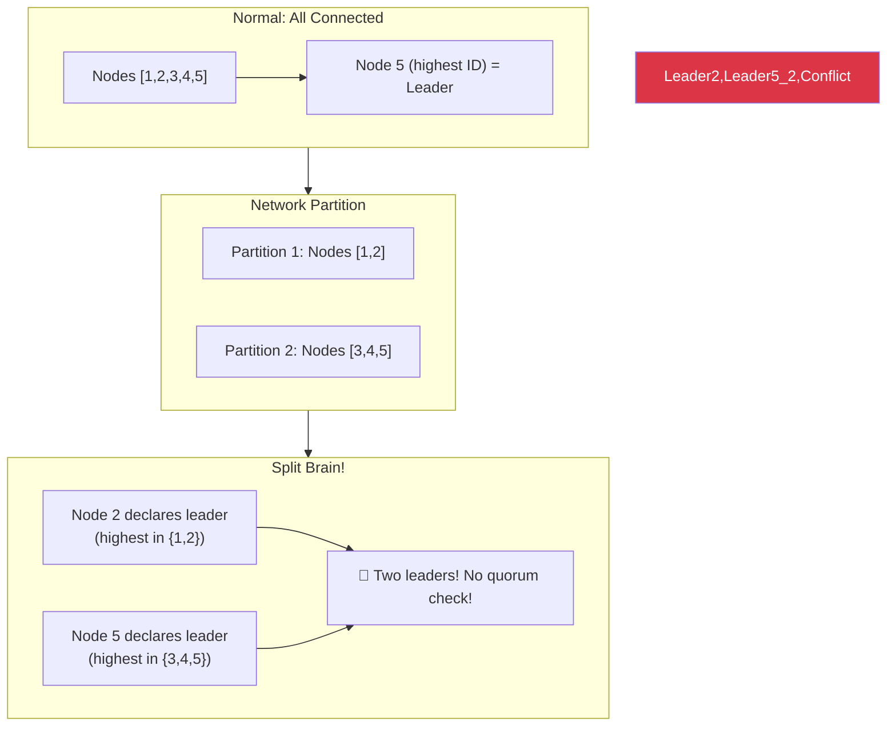
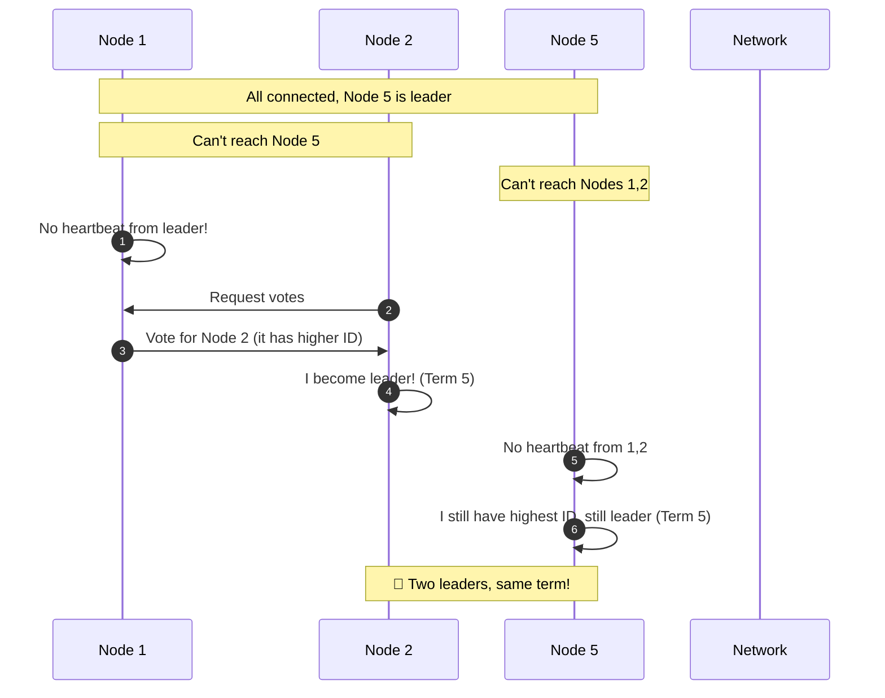
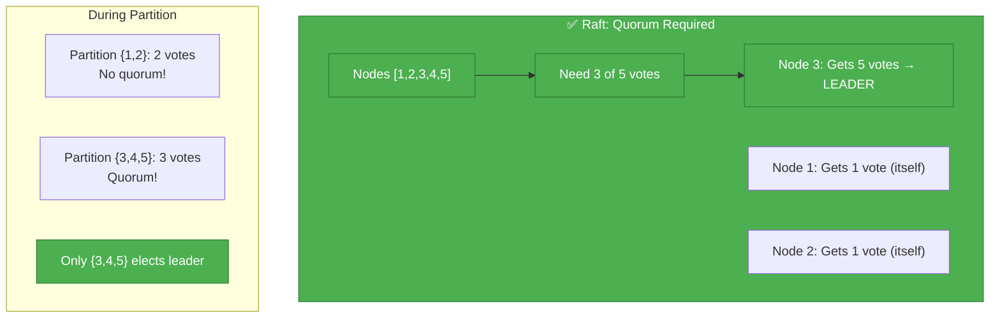
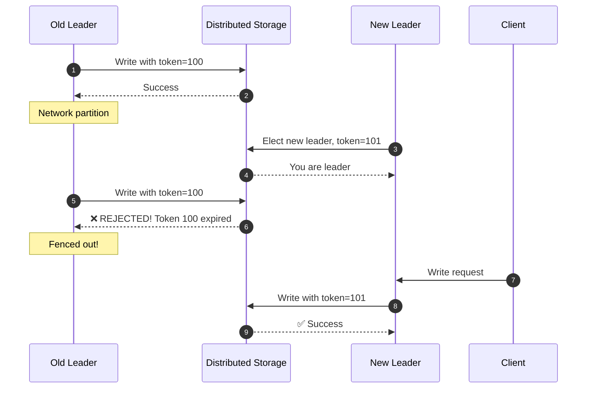
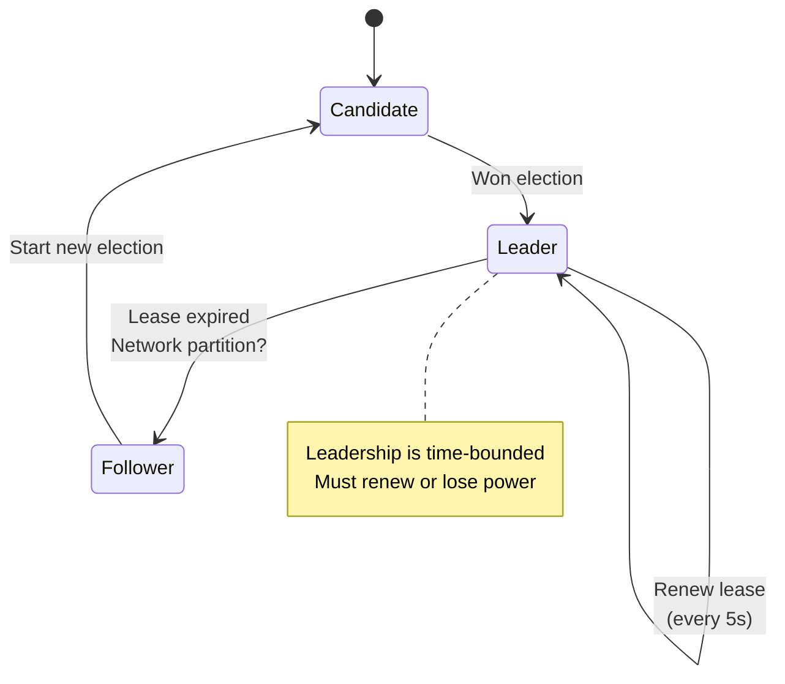

# Incident 105: Leader Election Gone Wrong

---

## Tools & Prerequisites

To debug leader election issues:

### Distributed Coordination Tools

| Tool | Purpose | Quick Usage |
|------|---------|-------------|
| **etcdctl** | etcd key-value store (Raft) | `etcdctl member list`, `etcdctl get /leader` |
| **ZooKeeper CLI** | ZK consensus | `zkCli.sh ls /election` |
| **Consul** | Service discovery + KV | `consul kv get leader` |
| **redis** | For distributed locks | `SET lock:leader <value> NX PX 30000` |

### Key Concepts

**Quorum**: Majority of nodes (N/2 + 1) required for valid decisions.

**Term (Raft)**: Monotonically increasing election number; higher term wins.

**Lease**: Time-bounded leadership; must renew or expires.

**Fencing Token**: Unique token that changes; old leader can't operate.

**Bully Algorithm**: Highest-ID node declares victory; vulnerable to split brain.

---

## Visual: Leader Election Issues

### The Bully Algorithm Problem



### Split Brain Timeline



### Raft-Style Election (Correct)



### Fencing Token Solution



### Lease-Based Leadership



## The Situation

Your cluster uses a custom leader election algorithm (not Raft, not Zab):

```go
// "Bully" style leader election
type Node struct {
    id       int
    peers    []int
    isLeader bool
    leaderID int
}

func (n *Node) ElectLeader() {
    // If I have highest ID, I become leader
    for _, peerID := range n.peers {
        if peerID > n.id {
            // Someone has higher ID, wait for them
            return
        }
    }
    // I have highest ID - I'm leader!
    n.isLeader = true
    n.leaderID = n.id
    announceLeadership()
}
```

---

## The Incident Report

```
Time: During network partition

Issue: Multiple leaders elected, split brain, conflicting writes
Impact: Data corruption, conflicting records
Severity: P0 (data loss)

Scenario:
- Cluster: Nodes [1, 2, 3, 4, 5]
- Partition: {1, 2} isolated from {3, 4, 5}
- Node 2 becomes leader for partition {1, 2}
- Node 5 becomes leader for partition {3, 4, 5}
- Both accept writes → merge conflict!
```

---

## What is Leader Election?

**Goal:** In a distributed system, ensure exactly one leader makes decisions.

**Why needed:**
- Prevent split brain (multiple leaders)
- Coordination point for decisions
- Serialize operations

**Common algorithms:**
- **Bully:** Highest ID node becomes leader
- **Raft:** Vote-based with quorum
- **Paxos:** Precursor to Raft
- **Zab:** ZooKeeper's consensus

---

## What is Split Brain?

Imagine a country with two governments claiming to be legitimate.

**Both pass laws, both collect taxes, citizens confused.**

**In systems:**
- Two leaders both think they're in charge
- Both accept writes
- When partition heals: conflicting data!

```
Partition 1:  [Leader 2] accepts writes A, B, C
Partition 2:  [Leader 5] accepts writes X, Y, Z

After heal:  Which writes are valid?
```

---

## The Problems

### Problem 1: No Quorum

Your bully algorithm doesn't require majority:

```
Nodes [1,2,3,4,5]:
- Node 2 sees {1, 2} → 2 out of 5 nodes
- Still becomes leader!
- Should need 3 out of 5 (majority)
```

### Problem 2: Network Partitions

```
Initial:   [1-2-3-4-5] connected
Partition: [1-2] | [3-4-5]

Leader election in each partition:
- [1-2]: Node 2 becomes leader
- [3-4-5]: Node 5 becomes leader

Both think they're legitimate! Split brain!
```

### Problem 3: No Lease

Even after partition heals, both leaders may remain:

```
Node 2: "I was elected first, I'm still leader"
Node 5: "I was elected in my partition, I'm still leader"
```

---

## Jargon

| Term | Definition |
|------|------------|
| **Leader election** | Process of selecting single coordinator in distributed system |
| **Split brain** | Multiple nodes think they're leader simultaneously |
| **Quorum** | Majority of nodes (N/2 + 1) required for decisions |
| **Term** | Logical clock incrementing on each election; higher term wins |
| **Lease** | Time-bounded leadership; must be renewed or expires |
| **Bully algorithm** | Highest-ID node becomes leader; no quorum required |
| **Fencing** | Preventing old leader from making changes (e.g., via token) |
| **Epoch** | Period of time during which a leader is valid |

---

## Questions

1. **Why is quorum necessary for leader election?** (Prevents minority partition leader)

2. **How does Raft prevent split brain?** (Term numbers + quorum)

3. **What's the role of fencing tokens?** (Preventing old leaders)

4. **How do leader leases help?** (Time-bounded authority)

5. **As a Principal Engineer, how do you design systems resilient to leader election issues?**

---

**When you've thought about it, read `step-01.md`**
