# Incident 106: Backpressure Mismatch

---

## Tools & Prerequisites

To debug backpressure issues:

### Kafka & Stream Processing Tools

| Tool | Purpose | Quick Usage |
|------|---------|-------------|
| **kafka-consumer-groups.sh** | Check consumer lag | `--describe --group my-group` |
| **kafka-consumer-perf.sh** | Test consumer performance | `--topic messages --messages 100000` |
| **JMX/Metrics** | Monitor queue sizes | `kafka.consumer:type=ConsumerMetrics` |
| **jstack** | Check thread states | `jstack <pid> \| grep BLOCKED` |
| **Reactive Streams debug** | Monitor async backpressure | Reactor instrumentation |

### Key Concepts

**Backpressure**: Signal from consumer to producer to slow down; prevents overload.

**Flow Control**: Mechanism to match producer rate to consumer rate.

**Pull-based**: Consumer requests data when ready (Kafka, HTTP polling).

**Push-based**: Producer sends data when available (WebSocket, channels).

**Buffer Bloat**: Large queue hides mismatch between production and consumption.

---

## Visual: Backpressure

### Push vs Pull Models


### Buffer Bloat Problem


### In-Flight Messages Accumulation

**In-Flight Messages Over Time**

| Time | Produced (line1) | Consumed (line2) |
|------|------------------|------------------|
| T=0 | 10,000 | 0 |
| T=10s | 50,000 | 5,000 |
| T=20s | 100,000 | 10,000 |
| T=30s | 150,000 | 15,000 |
| T=40s | 200,000 | 20,000 |
| T=50s | 250,000 | 25,000 |

Production outpaces consumption, causing unbounded message accumulation.

### Credit-Based Flow Control

```mermaid
sequenceDiagram
    autonumber
    participant Producer as Producer
    participant Consumer as Consumer

    Consumer->>Producer: Initial credits: 1000

    loop Send messages within credits
        Producer->>Consumer: Send 100 messages (credit: 900)
        Producer->>Consumer: Send 100 messages (credit: 800)
    end

    Note over Producer: Credits low: 100
    Producer->>Producer: 🛑 Stop sending

    Consumer->>Consumer: Process 500 messages
    Consumer->>Producer: Grant 500 credits
    Producer->>Producer: ✅ Resume sending
```



### Reactive Streams Backpressure

```mermaid
flowchart LR
    subgraph Reactive ["✅ Reactive Streams (Automatic Backpressure)"]
        Source["Publisher<br/>(onSubscribe, onNext)"]
        MAP1["map(process)"]
        FILTER["filter(valid)"]
        SUB["Subscriber"]

        Source -->|Request(n)| MAP1
        MAP1 -->|Request(m)| FILTER
        FILTER -->|Request(k)| SUB

        SUB -->|pull| Source
    end

    classDef good fill:#4caf50,stroke:#2e7d32,color:#fff

    class Reactive,Source,MAP1,FILTER,SUB good
```

### Solutions

```mermaid
graph TB
    subgraph Solutions ["Backpressure Solutions"]
        S1["🔢 Smaller Buffers<br/>Don't hide the problem"]
        S2["⏸️ Blocking Sends<br/>Producer blocks when queue full"]
        S3["📊 Dynamic Throttling<br/>Adjust rate based on lag"]
        S4["🔄 Reactive Streams<br/>Built-in backpressure"]
    end

    classDef good fill:#4caf50,stroke:#2e7d32,color:#fff

    class S1,S2,S3,S4 good
```



### Pull vs Push Comparison


## The Situation

Your data pipeline processes events:

```
┌─────────────────────────────────────────────────────────────┐
│                    Producer Service                         │
│                   (Generates 10,000 msg/s)                   │
└────────────────────────┬────────────────────────────────────┘
                         │
                         ▼
┌─────────────────────────────────────────────────────────────┐
│                      Kafka Topic                            │
│                    (10 partitions)                          │
└────────────────────────┬────────────────────────────────────┘
                         │
                         ▼
┌─────────────────────────────────────────────────────────────┐
│                   Consumer Service                          │
│                   (Processes 5,000 msg/s)                    │
└─────────────────────────────────────────────────────────────┘
```

**Producer:** Push-based, sends as fast as possible
**Consumer:** Pull-based, fetches when ready

---

## The Incident Report

```
Time: After consumer deployment

Issue: Consumer memory exhaustion, OOM kills
Impact: Messages堆积, processing lag growing
Severity: P0

Observation:
- Producer: 10,000 msg/s (no backpressure awareness)
- Consumer: Fetches 1000 messages per batch
- Consumer processing: 500 msg/s
- In-flight messages: Growing unbounded!
```

---

## What is Backpressure?

**Analogy:** Restaurant kitchen

**Without backpressure:**
- Waiters keep sending orders to kitchen
- Kitchen overwhelmed, orders pile up
- Kitchen slows down more, orders pile up faster
- System collapses

**With backpressure:**
- Kitchen tells waiters "stop, we're full"
- Waiters stop sending orders
- Kitchen catches up
- Waiters resume sending

**In systems:** Signal from consumer to producer: "slow down, I can't keep up"

---

## The Problem: Backpressure Mismatch

```
Producer (Go):  channels are buffered
    ch := make(chan Message, 10000)  // Large buffer!
    for msg := range input {
        ch <- msg  // Never blocks! (until buffer full)
    }

Consumer (Java):  polls Kafka
    while (true) {
        List<Message> batch = consumer.poll(1000);  // Always gets 1000
        processAsync(batch);  // Returns immediately!
    }
```

**Mismatch:**
- Producer: Never slows down (large buffer)
- Consumer: Fetches optimistically
- Queue between them: Grows without bound!

---

## Jargon

| Term | Definition |
|------|------------|
| **Backpressure** | Signal from consumer to producer to slow down; prevents overload |
| **Flow control** | Mechanism to match producer rate to consumer rate |
| **Pull-based** | Consumer requests data when ready (Kafka, HTTP polling) |
| **Push-based** | Producer sends data when available (WebSocket, channels) |
| **Buffer bloat** | Large queue hiding mismatch between production and consumption |
| **Head-of-line blocking** | Slow first item blocks entire queue |
| **Credit-based flow control** | Consumer grants "credits" to producer; producer sends within credits |
| **Reactive streams** | Programming model with built-in backpressure support |

---

## Questions

1. **How does Kafka provide backpressure?** (Consumer controls fetch rate)

2. **What's the role of buffer sizes?** (Large buffers hide problems vs expose them)

3. **How do you implement backpressure in async systems?** (Futures, promises, callbacks)

4. **What's the relationship between backpressure and load shedding?**

5. **As a Principal Engineer, how do you design end-to-end backpressure?**

---

**When you've thought about it, read `step-01.md`**
