# Incident 108: Lease Expiration Race

---

## Tools & Prerequisites

To debug lease-related issues:

### Distributed Coordination Tools

| Tool | Purpose | Quick Usage |
|------|---------|-------------|
| **etcdctl** | etcd key-value store | `etcdctl lease grant 30` |
| **ZooKeeper CLI** | ZK ephemeral nodes | `zkCli.sh create -e /lock` |
| **Consul** | Service sessions | `consul session create -ttl 30s` |
| **redis** | For distributed locks | `SET lock:leader value NX PX 30000` |
| **curl** | For HTTP-based leases | `curl -X PUT http://store/lease?ttl=30` |

### Key Commands

```bash
# etcd lease operations
etcdctl lease grant 30     # Create 30s lease
etcdctl lease list        # List all leases
etcdctl lease keep-alive   # Renew lease
etcdctl lease revoke       # Explicitly revoke

# ZooKeeper ephemeral nodes (auto-expire on session close)
echo "create -e /leader-election/node" | zkCli.sh

# Redis-based lock with TTL
redis-cli SET lock:leader holder-123 NX PX 30000

# Check clock skew between servers
ssh server1 "date +%s.%N"
ssh server2 "date +%s.%N"
# Compare outputs

# Monitor lease renewals
watch -n 1 'etcdctl get leader --prefix'
```

### Key Concepts

**Lease**: Time-bounded lock with automatic expiration; used for leader election.

**TTL (Time To Live)**: Duration lease remains valid before expiration.

**Renewal**: Extending lease expiration before it expires; must happen periodically.

**Clock Skew**: Difference between system clocks on different machines; affects lease expiration.

**Fencing Token**: Monotonically increasing value preventing stale leaseholders from operating.

**Keep-Alive**: Periodic heartbeat showing leaseholder is still alive.

**Ephemeral Node**: ZK concept; node tied to session and auto-deleted on disconnect.

**Compare-And-Swap**: Atomic operation checking value before writing; prevents race conditions.

**Lease Drift**: Clocks diverging over time despite NTP synchronization.

---

## Visual: Lease Expiration

### Normal Lease Lifecycle


### Lease Renewal Race Condition


### Check-Then-Act Race

```mermaid
sequenceDiagram
    autonumber
    participant A as Process A
    participant B as Process B
    participant Store as Lease Store

    Note over A,Store: Lease expires at 10:00:00

    par Both check simultaneously
        A->>Store: Is lease expired?
        B->>Store: Is lease expired?
    end

    Store-->>A: Yes, expired
    Store-->>B: Yes, expired

    par Both try to acquire
        A->>Store: Acquire lease
        B->>Store: Acquire lease
    end

    Note over Store: Both succeed without atomic check!

    Store-->>A: ✅ Acquired
    Store-->>B: ✅ Acquired

    Note over A,B: Both think they hold lease!
```



### Clock Skew Problem

```mermaid
flowchart TB
    subgraph Clocks ["Clock Skew Scenario"]
        A["Server A Clock<br/>10:00:35 (fast by 10s)"]
        B["Server B Clock<br/>10:00:25 (slow by 10s)"]
        Lease["Lease stored with<br/>expiry: 10:00:30"]
    end

    subgraph Perception ["Different Perceptions"]
        PA["A sees: 10:00:35 > 10:00:30<br/>✅ Lease expired, can acquire"]
        PB["B sees: 10:00:25 < 10:00:30<br/>✅ Lease still valid"]
    end

    A --> PA
    B --> PB
    Lease --> PA
    Lease --> PB

    style PA fill:#ffcdd2
    style PB fill:#c8e6c9
```



### Fencing Token Solution

```mermaid
sequenceDiagram
    autonumber
    participant A as Old Leader
    participant Store as Lease Store
    participant B as New Leader
    participant Resource as Protected Resource

    Note over A,Resource: A holds lease with token=100

    A->>Store: Renew lease
    Note over Store: Lease expired! Reject

    B->>Store: Acquire lease
    Store-->>B: ✅ Granted with token=101

    A->>Resource: Write with token=100
    Resource-->>A: ❌ REJECTED! Token 100 expired

    B->>Resource: Write with token=101
    Resource-->>B: ✅ Accepted

    Note over Resource: Old leader fenced out!
```



### Correct Lease Renewal (Atomic)

```mermaid
flowchart TB
    subgraph Wrong ["❌ Check-Then-Act (Race)"]
        W1["Check: I am holder?"]
        W2["Check: Lease expired?"]
        W3["Renew lease"]
        W4["❌ Not atomic!"]

        W1 --> W2 --> W3 --> W4
    end

    subgraph Correct ["✅ Atomic Compare-And-Swap"]
        C1["Single atomic operation:"]
        C2["IF holder == me<br/>AND version == expected<br/>THEN renew"]
        C3["ELSE fail"]

        C1 --> C2 --> C3
    end

    style Wrong fill:#ffcdd2
    style Correct fill:#c8e6c9
```



### Keep-Alive Strategy

```mermaid
sequenceDiagram
    autonumber
    participant Holder as Lease Holder
    participant Store as Lease Store

    Note over Holder: TTL = 30s

    loop Every 10s
        Holder->>Store: Keep-alive (renew)
        Store-->>Holder: ✅ Renewed until 10:00:40
        Note over Holder: Wait 10s...
    end

    Note over Holder: Network partition at 10:00:25!

    Holder->>Holder: Keep-alive at 10:00:35
    Note over Holder: Request blocked

    Store->>Store: 10:00:40 - Lease expires
    Note over Holder: Others can acquire
```



### Lease vs Lock vs Election

```mermaid
graph TB
    subgraph Comparison ["Distributed Coordination"]
        L1["🔒 Lock<br/>Held indefinitely<br/>Explicit release<br/>Can get stuck"]
        L2["⏰ Lease<br/>Time-bounded (TTL)<br/>Auto-expires<br/>Must renew"]
        L3["👑 Election<br/>Lease on 'leader' role<br/>Singular leader<br/>Term-based"]
    end

    L1 -->|Upgrade| L2
    L2 -->|Application| L3

    style L1 fill:#ffcdd2
    style L2 fill:#fff3e0
    style L3 fill:#c8e6c9
```



---

## The Situation

Your distributed lock service uses leases:

```go
type Lease struct {
    Key       string
    Holder    string
    ExpiresAt time.Time
}

func AcquireLease(key, holder string, ttl time.Duration) error {
    now := time.Now()

    // Check if lease expired
    existing, _ := store.Get(key)
    if existing != nil && existing.ExpiresAt.After(now) {
        return ErrLeaseHeld  // Still valid
    }

    // Acquire lease
    store.Set(key, &Lease{
        Key:       key,
        Holder:    holder,
        ExpiresAt: now.Add(ttl),
    })
    return nil
}

func RenewLease(key, holder string, ttl time.Duration) error {
    existing, _ := store.Get(key)
    if existing.Holder != holder {
        return ErrNotHolder
    }

    existing.ExpiresAt = time.Now().Add(ttl)
    return nil
}
```

---

## The Incident Report

```
Time: During leader reelection

Issue: Two leaders simultaneously thinking they hold lease
Impact: Conflicting writes, split brain
Severity: P0

Timeline:
10:00:00 - Leader A acquires lease, expires 10:00:30
10:00:25 - Leader A sends renew request
10:00:27 - Network partition, renew request delayed
10:00:30 - Lease expires (A thinks renewal in flight)
10:00:31 - Leader B acquires lease (expired)
10:00:35 - Leader A's renew request arrives! Lease renewed!
10:00:35 - Both A and B think they hold lease!
```

---

## What is a Lease?

**Lease = Time-bounded lock**

```
Acquire lease for resource with TTL=30s:
  - Holder has exclusive access for 30 seconds
  - Must renew before 30s or lose lease
  - If crash, lease auto-expires (no stuck lock!)
```

**vs Lock:**
- Lock: Held indefinitely until explicitly released
- Lease: Auto-expires after TTL

**vs Election:**
- Leader election: Lease on "leader" role

---

## The Race Condition

```
Time    | Holder A (renews at T-5)           | Storage
--------|-----------------------------------|------------------
T-5     | Renew request sent               | Expires T
T       | (Network delay)                  | Expires T
T+1     | Lease expired                    | EXPIRED!
T+1     | B acquires lease                 | Holder=B, Exp T+31
T+5     | A's renew arrives!               | Holder=A, Exp T+35

Result: Both A and B think they're holder!
```

---

## The Problems

### Problem 1: Renew Without Checking Expiration

```go
// WRONG: Doesn't check if lease already expired
func RenewLease(key, holder string, ttl time.Duration) error {
    lease, _ := store.Get(key)
    if lease.Holder != holder {
        return ErrNotHolder  // Wrong holder
    }
    // But what if lease already expired and reassigned?
    lease.ExpiresAt = time.Now().Add(ttl)
    return nil
}
```

### Problem 2: Clock Skew

```
Server A (clock fast):  Current time = 10:00:35
Server B (clock slow): Current time = 10:00:25

Lease expires 10:00:30 (whose clock?)
A: Sees expired, acquires
B: Thinks still valid, holds
→ Both have lease!
```

### Problem 3: Check-Then-Act Race

```
A checks: Lease expired → OK to acquire
B checks: Lease expired → OK to acquire
A acquires
B acquires (B's check was before A's acquire!)
→ Both acquired!
```

---

## Jargon

| Term | Definition |
|------|------------|
| **Lease** | Time-bounded lock with auto-expiration |
| **TTL (Time To Live)** | How long lease remains valid |
| **Renewal** | Extending lease before expiration |
| **Clock skew** | Difference between clocks on different machines |
| **Fencing token** | Monotonically increasing value preventing stale leaseholders |
| **Keep-alive** | Periodic message to show leaseholder still alive |
| **Drift** | Clocks diverging over time (NTP helps but doesn't eliminate) |

---

## Questions

1. **How do you make lease renewal atomic with expiration check?**

2. **What's the role of fencing tokens in lease systems?**

3. **How does clock skew affect lease expiration?**

4. **What's the difference between lease and election?**

5. **As a Principal Engineer, how do you design systems resilient to lease races?**

---

**When you've thought about it, read `step-01.md`**
