# PostgreSQL 100: MVCC Revealed

---

## Tools & Prerequisites

To debug MVCC and visibility issues:

### PostgreSQL MVCC Debugging Tools

| Tool | Purpose | Quick Usage |
|------|---------|-------------|
| **pg_stat_activity** | View active transactions | `SELECT pid, xid, state, query FROM pg_stat_activity;` |
| **pg_stat_database** | Database-level statistics | `SELECT xact_commit, xact_rollback FROM pg_stat_database;` |
| **pg_class** | Table size and bloat info | `SELECT relname, n_live_tup, n_dead_tup FROM pg_stat_user_tables;` |
| **pageinspect** | Inspect raw page data | `CREATE EXTENSION pageinspect; SELECT * FROM heap_page_items(get_raw_page('accounts', 0));` |
| **txid_current()** | Get current transaction ID | `SELECT txid_current();` |
| **pg_xact_commit_timestamp()** | Transaction commit time | `SELECT pg_xact_commit_timestamp(xid);` |

### Key Queries

```sql
-- Check row version metadata (xmin, xmax, ctid)
SELECT id, xmin, xmax, ctid, balance
FROM accounts
WHERE id = 1;

-- Check for long-running transactions
SELECT pid, now() - xact_start AS duration, state, query
FROM pg_stat_activity
WHERE state IN ('idle in transaction', 'active')
ORDER BY duration DESC;

-- Check table bloat (dead tuples)
SELECT
    schemaname,
    tablename,
    n_live_tup,
    n_dead_tup,
    n_dead_tup * 100.0 / NULLIF(n_live_tup + n_dead_tup, 0) AS dead_ratio
FROM pg_stat_user_tables
WHERE n_dead_tup > 0;

-- View transaction snapshot
SELECT txid_current_snapshot();
-- Returns: 1001:1002:1001 (min: max: running)

-- Check if autovacuum is running
SELECT pid, relname, phase, heap_blks_total
FROM pg_stat_progress_vacuum;
```

### Key Concepts

**MVCC (Multi-Version Concurrency Control)**: PostgreSQL keeps multiple versions of each row; readers never block writers.

**xmin**: Transaction ID that created the row version.

**xmax**: Transaction ID that deleted/expired the row version (0 = alive).

**ctid**: Physical location of row (page number, row offset).

**Snapshot**: Set of "visible" transactions based on transaction IDs; taken at BEGIN.

**Transaction ID (XID)**: 32-bit counter; wraps around after ~4 billion transactions.

**Vacuum**: Process that removes dead tuples and prevents transaction ID wraparound.

**Visibility Rules**: Row is visible if `xmin` is committed AND `xmax` is zero/uncommitted.

---

## Visual: MVCC Architecture

### How MVCC Works


### Transaction Timeline


### Snapshot Visibility Rules

```mermaid
flowchart TB
    subgraph Visibility ["MVCC Visibility Decision"]
        Input["Check Row Visibility"]

        Check1{"xmin in<br/>snapshot?"}
        Check2{"xmax = 0<br/>or xmax not in<br/>snapshot?"}

        Visible["✅ ROW VISIBLE"]
        Invisible["❌ ROW INVISIBLE"]

        Input --> Check1
        Check1 -->|No| Invisible
        Check1 -->|Yes| Check2
        Check2 -->|Yes| Visible
        Check2 -->|No| Invisible
    end

    style Visible fill:#c8e6c9
    style Invisible fill:#ffcdd2
```



### READ COMMITTED vs REPEATABLE READ


### Table Bloat from MVCC

**Dead Tuples Accumulation Without Autovacuum**

| Time | Live Tuples | Dead Tuples |
|------|-------------|-------------|
| T=0 | 100,000 | 100,000 |
| T=1h | 100,000 | 300,000 |
| T=2h | 100,000 | 500,000 |
| T=4h | 100,000 | 800,000 |
| T=8h | 100,000 | 1,100,000 |
| T=24h | 100,000 | 1,500,000 |

Live tuples (line) remain constant at 100,000. Dead tuples (bar) accumulate to 1.5 million.

### Transaction ID Wraparound

```mermaid
sequenceDiagram
    autonumber
    participant Time as Time
    participant XID as Transaction ID
    participant System as PostgreSQL

    Note over Time,XID: Normal operation
    XID->>System: XID = 1, 2, 3, 4...
    System->>System: xmin < xmax = visible

    Note over Time,XID: 2 billion transactions
    XID->>System: XID = 2,147,483,648
    System->>System: Wraparound mode!
    Note over System: All old XIDs now<br/>appear "in the future"

    System->>System: 🛑 VACUUM FREEZE required
    System->>System: Freeze old tuples
```



### MVCC Write Amplification


---

## The Situation

You're investigating a production issue where a query sees "old" data despite another transaction having committed changes.

**Session 1:**
```sql
BEGIN;
UPDATE accounts SET balance = balance - 100 WHERE id = 1;
-- Transaction left open (not committed)
```

**Session 2 (started after Session 1's UPDATE):**
```sql
BEGIN;
SELECT balance FROM accounts WHERE id = 1;
-- Returns: 1000 (old balance, not 900!)
```

**Session 3 (started after Session 2):**
```sql
BEGIN;
SELECT balance FROM accounts WHERE id = 1;
-- Returns: 1000 (same old balance!)
```

All sessions see old data even though Session 1 ran UPDATE.

---

## What is MVCC?

**MVCC (Multi-Version Concurrency Control):** PostgreSQL keeps multiple versions of each row.

When you UPDATE:
1. Old row marked "dead" but not removed
2. New row inserted
3. Which row you see depends on your transaction's "snapshot"

**No readers block writers, no writers block readers!**

---

## What You See

### Transaction IDs (XIDs)

```sql
-- Check current transaction ID
SELECT txid_current();

-- Check row metadata
SELECT xmin, xmax, ctid FROM accounts WHERE id = 1;
```

**Output:**
```
 xmin | xmax | ctid
------+------+-------
 1001 |    0 | (0,15)
```

- `xmin`: Transaction that created this row
- `xmax`: Transaction that deleted this row (0 = not deleted)
- `ctid`: Physical location (page, row)

### After UPDATE

```sql
BEGIN;
UPDATE accounts SET balance = 900 WHERE id = 1;
-- Don't commit yet!

SELECT id, xmin, xmax, ctid FROM accounts WHERE id = 1;
```

**Output:**
```
 id | xmin | xmax | ctid
----+------+------+-------
  1 | 1002 |    0 | (0,16)  -- New row (not yet visible to others)
```

Old row still exists but marked for deletion (once transaction commits).

---

## The Mystery

**Session 2 starts AFTER Session 1's UPDATE.** Why does it still see old data?

**Answer:** MVCC snapshots are taken at transaction `BEGIN`, not at each statement!

Session 2's snapshot includes all transactions committed BEFORE it started. Session 1 is still uncommitted, so Session 2 doesn't see its changes.

---

## Questions

1. **When does PostgreSQL take the snapshot?** (BEGIN vs first statement)

2. **What's the difference between READ COMMITTED and REPEATABLE READ?**

3. **How do long-running transactions cause bloat?**

4. **What's `xmin` and `xmax` actually used for?**

5. **As a Principal Engineer, how do you design systems that work correctly with MVCC?**

---

**When you've thought about it, read `step-01.md`**
