# PostgreSQL 104: Cursor Pagination

---

## Tools & Prerequisites

To debug pagination performance issues:

### PostgreSQL Performance Tools

| Tool | Purpose | Quick Usage |
|------|---------|-------------|
| **EXPLAIN** | View query execution plan | `EXPLAIN SELECT * FROM orders LIMIT 100 OFFSET 1000;` |
| **EXPLAIN ANALYZE** | Execute and show actual timing | `EXPLAIN ANALYZE SELECT ...;` |
| **pg_stat_statements** | Aggregate query statistics | `SELECT query, calls, total_time FROM pg_stat_statements;` |
| **pg_stat_user_indexes** | Index usage statistics | `SELECT indexrelname, idx_scan FROM pg_stat_user_indexes;` |
| **pg_buffercache** | Buffer cache inspection | `SELECT c.relname, count(*) FROM pg_buffercache b JOIN pg_class c ON b.relfilenode = c.relfilenode GROUP BY c.relname;` |

### Key Queries

```sql
-- Check if index is used for pagination
EXPLAIN ANALYZE
SELECT * FROM orders ORDER BY id LIMIT 100 OFFSET 1000;

-- Compare offset vs cursor performance
EXPLAIN ANALYZE
SELECT * FROM orders ORDER BY id LIMIT 100 OFFSET 10000;

EXPLAIN ANALYZE
SELECT * FROM orders WHERE id > 10000 ORDER BY id LIMIT 100;

-- Check sequential scan count
SELECT seq_scan, idx_scan FROM pg_stat_user_tables
WHERE relname = 'orders';

-- Find slow pagination queries
SELECT
    query,
    calls,
    mean_exec_time,
    total_exec_time
FROM pg_stat_statements
WHERE query LIKE '%OFFSET%'
ORDER BY mean_exec_time DESC
LIMIT 10;

-- Analyze index usage pattern
SELECT
    schemaname,
    tablename,
    indexname,
    idx_scan,
    idx_tup_read,
    idx_tup_fetch
FROM pg_stat_user_indexes
WHERE tablename = 'orders';
```

### Key Concepts

**Offset Pagination**: Uses `LIMIT` + `OFFSET`; database counts and discards all previous rows.

**Cursor Pagination (Keyset)**: Uses `WHERE key > last_seen` to seek directly to starting point.

**Seek Method**: Using indexed column comparison instead of counting offset.

**Bookmark**: The last value from previous page; used as starting point for next query.

**Covering Index**: Index containing all columns needed for query; avoids table lookups.

**Stale Read**: Pagination may show duplicate/missing rows if data changes during navigation.

**Index-Only Scan**: Query satisfied entirely from index; no heap access needed.

---

## Visual: Pagination Performance

### OFFSET vs Cursor Comparison

```mermaid
flowchart TB
    subgraph Offset ["🔴 OFFSET Pagination (Slow)"]
        O1["Request: Page 10000<br/>OFFSET 999900 LIMIT 100"]
        O2["Postgres: Scan 1,000,000 rows"]
        O3["Postgres: Skip 999,900 rows"]
        O4["Postgres: Return 100 rows"]
        O5["Time: 30 seconds"]

        O1 --> O2 --> O3 --> O4 --> O5
    end

    subgraph Cursor ["✅ Cursor Pagination (Fast)"]
        C1["Request: 100 rows after id=999900"]
        C2["Postgres: Index seek to id=999900"]
        C3["Postgres: Scan next 100 rows"]
        C4["Postgres: Return 100 rows"]
        C5["Time: 10ms"]

        C1 --> C2 --> C3 --> C4 --> C5
    end

    style Offset fill:#ffcdd2
    style Cursor fill:#c8e6c9
```



### OFFSET Performance Degradation

**Query Time by Page Number (OFFSET vs Cursor)**

| Page Number | OFFSET Time (ms) | Cursor Time (ms) |
|-------------|------------------|------------------|
| Page 1 | 10 | 10 |
| Page 10 | 50 | 10 |
| Page 100 | 500 | 10 |
| Page 1,000 | 3,000 | 10 |
| Page 10,000 | 30,000 | 10 |
| Page 50,000 | 150,000 | 10 |

OFFSET time grows linearly with page number. Cursor time stays constant at 10ms.

### How OFFSET Works Internally


### Cursor Pagination Flow


### Handling Non-Unique Sort Columns


### Index Scan Comparison


### Pagination Trade-offs

```mermaid
graph TB
    subgraph Offset ["OFFSET Pagination"]
        O1["✅ Simple: page number + limit"]
        O2["✅ Jump to any page"]
        O3["❌ Performance degrades"]
        O4["❌ Database does extra work"]
        O5["❌ Inconsistent if data changes"]
    end

    subgraph Cursor ["Cursor Pagination"]
        C1["✅ Consistent O(limit) performance"]
        C2["✅ No wasted work"]
        C3["✅ Works with real-time data"]
        C4["❌ No random page access"]
        C5["❌ Requires unique sort"]
    end

    style Offset fill:#fff3e0
    style Cursor fill:#e8f5e9
```



### Real-Time Data Pagination Issues


---

## The Situation

Your API paginates through a million records:

```sql
-- Page 1
SELECT * FROM orders ORDER BY id LIMIT 100 OFFSET 0;

-- Page 2
SELECT * FROM orders ORDER BY id LIMIT 100 OFFSET 100;

-- Page 10,000
SELECT * FROM orders ORDER BY id LIMIT 100 OFFSET 999900;
```

**Problem:** Page 10,000 takes 30+ seconds. Page 1 takes 10ms.

---

## What is Cursor Pagination?

**Offset pagination (what you have):**
```
"Give me page 5, 100 per page" → OFFSET 400 LIMIT 100
```

**Cursor pagination (keyset pagination):**
```
"Give me 100 after ID 12345" → WHERE id > 12345 ORDER BY id LIMIT 100
```

**Analogy:**
- Offset: "Start from beginning, count to page 5"
- Cursor: "Continue from where we left off"

---

## Why OFFSET is Slow

```
OFFSET 999900 LIMIT 100

PostgreSQL must:
1. Scan 1,000,000 rows (not just 100!)
2. Skip first 999,900 rows
3. Return last 100 rows

All that work, then throw away 999,900 rows!
```

**Performance degradation:**
```
Page 1:   OFFSET 0     → 10ms   (scan 100 rows)
Page 10:  OFFSET 900   → 50ms   (scan 1000 rows)
Page 100: OFFSET 9900  → 500ms  (scan 10,000 rows)
Page 10000: OFFSET 999900 → 30s    (scan 1,000,000 rows!)
```

---

## The Real Problem

Even with an index on `id`:

```sql
CREATE INDEX idx_orders_id ON orders(id);

EXPLAIN SELECT * FROM orders ORDER BY id LIMIT 100 OFFSET 999900;
```

PostgreSQL **still** scans through the index to count offset rows. Index helps but doesn't eliminate the scan.

---

## Jargon

| Term | Definition |
|------|------------|
| **Offset pagination** | Page number + limit; requires counting all previous rows |
| **Cursor pagination** | Continue from last seen key; no counting |
| **Keyset pagination** | Same as cursor; uses "keyset" to resume |
| **Seek method** | Using WHERE key > last_key instead of OFFSET |
| **Bookmark** | Value from last row to resume pagination |
| **Stale read** | Seeing old data due to pagination cursor from old snapshot |

---

## Questions

1. **How do you implement cursor pagination?**

2. **What if sort column isn't unique?** (Multiple rows with same value)

3. **What if user sorts by multiple columns?** (ORDER BY created_at, id)

4. **How do you handle "previous page" with cursor pagination?**

5. **As a Principal Engineer, when should you use OFFSET vs cursor?**

---

**When you've thought about it, read `step-01.md`**
