# PostgreSQL 105: Write Skew

---

## Tools & Prerequisites

To debug write skew and concurrency anomalies:

### Concurrency Debugging Tools

| Tool | Purpose | Quick Usage |
|------|---------|-------------|
| **pg_stat_activity** | Check running transactions | `SELECT * FROM pg_stat_activity WHERE state != 'idle';` |
| **pg_locks** | View held locks | `SELECT * FROM pg_locks WHERE NOT granted;` |
| **pg_stat_database** | Check serialization failures | `SELECT xact_commit, xact_rollback, conflicts FROM pg_stat_database;` |
| **pg_stat_database_conflicts** | Conflict details | `SELECT * FROM pg_stat_database_conflicts;` |
| **EXPLAIN ANALYZE** | Query execution plan | `EXPLAIN ANALYZE SELECT ...;` |
| **psql -E` | Show actual queries | `psql -E -c "SELECT ..."` |

### Key Commands

```bash
# Check transaction isolation level
psql -c "SHOW default_transaction_isolation;"

# Monitor serialization failures
psql -c "SELECT datname, conflicts, serialization_failures FROM pg_stat_database_conflicts;"

# Check for concurrent transactions
psql -c "SELECT pid, state, query, state_change FROM pg_stat_activity WHERE state IN ('idle in transaction', 'active');"

# View lock details
psql -c "SELECT pid, relation::regclass, mode, granted FROM pg_locks WHERE NOT granted ORDER BY pid;"

# Check for long-running transactions
psql -c "SELECT pid, now() - xact_start AS duration, state, query FROM pg_stat_activity WHERE state != 'idle' ORDER BY duration DESC;"

# Enable detailed logging
psql -c "ALTER SYSTEM SET log_min_messages = 'DEBUG1';"
psql -c "ALTER SYSTEM SET log_statement = 'all';"

# Monitor for predicate locks (serializable mode)
psql -c "SELECT * FROM pg_locks WHERE locktype = 'virtualxid';"

# Check database stats
psql -c "SELECT * FROM pg_stat_database WHERE datname = 'mydb';"

# Analyze slow queries with write skew
psql -c "SELECT * FROM pg_stat_statements WHERE calls > 100 ORDER BY mean_exec_time DESC;"

# Test with SERIALIZABLE explicitly
psql -c "BEGIN TRANSACTION ISOLATION LEVEL SERIALIZABLE;"

# Check for blocked transactions
psql -c "
SELECT
    blocked_locks.pid AS blocked_pid,
    blocked_activity.query AS blocked_statement,
    blocking_locks.pid AS blocking_pid,
    blocking_activity.query AS blocking_statement
FROM pg_catalog.pg_locks blocked_locks
JOIN pg_catalog.pg_stat_activity blocked_activity ON blocked_activity.pid = blocked_locks.pid
JOIN pg_catalog.pg_locks blocking_locks ON blocking_locks.locktype = blocked_locks.locktype
JOIN pg_catalog.pg_stat_activity blocking_activity ON blocking_activity.pid = blocking_locks.pid
WHERE NOT blocked_locks.granted;
"

# Check transaction deadlock count
psql -c "SELECT datname, deadlocks FROM pg_stat_database;"

# Monitor transaction ID wraparound
psql -c "SELECT datname, age(datfrozenxid), autovacuum_freeze_max_age FROM pg_database;"

# View vacuum stats
psql -c "SELECT relname, last_vacuum, last_autovacuum, vacuum_count, autovacuum_count FROM pg_stat_user_tables;"
```

### Key Concepts

**Write Skew**: Two transactions read same data concurrently, make decisions based on it, and their updates violate a constraint.

**Serializable Isolation**: Highest isolation level; prevents all anomalies including write skew via predicate locks.

**Repeatable Read**: PostgreSQL's default; snapshot isolation prevents dirty/non-repeatable reads but NOT write skew.

**Read Committed**: Each statement sees committed changes from other transactions; allows non-repeatable reads.

**Predicate Lock**: Lock on WHERE clause condition; prevents other transactions from inserting rows that would match.

**SI Anomaly**: Snapshot Isolation anomaly; write skew is a type of SI anomaly.

**FOR UPDATE**: Locks rows but doesn't prevent write skew because snapshot is taken at first SELECT.

**SELECT FOR UPDATE SKIP LOCKED**: Skip locked rows instead of waiting; alternative deadlock avoidance.

**FOR SHARE**: Shared lock allowing reads but blocking writes; weaker than FOR UPDATE.

**Constraint Exclusion**: Database optimization skipping constraint checks when no relevant data changed.

**Serializable Failure**: Transaction aborted due to serialization conflict; must retry.

**Transaction Snapshot**: Consistent view of database at transaction start; not updated when other transactions commit.

**Lost Update**: One update overwrites another without seeing intermediate state; different from write skew.

**Phenomena**: ANSI SQL defined anomalies (dirty read, non-repeatable read, phantom, write skew).

---

## The Situation

You have a ticket booking system:

```sql
CREATE TABLE tickets (
    id SERIAL PRIMARY KEY,
    event_id INT NOT NULL,
    total_tickets INT NOT NULL,
    sold_tickets INT NOT NULL DEFAULT 0,
    CHECK (sold_tickets <= total_tickets)
);
```

**Business rule:** Never sell more than total_tickets.

**Code:**
```python
def book_ticket(event_id, quantity):
    tx = db.begin()

    # Check availability
    tickets = tx.execute(
        "SELECT total_tickets, sold_tickets FROM tickets WHERE event_id = %s FOR UPDATE",
        event_id
    ).fetchone()

    if tickets.sold_tickets + quantity > tickets.total_tickets:
        raise SoldOutError()

    # Book tickets
    tx.execute(
        "UPDATE tickets SET sold_tickets = sold_tickets + %s WHERE event_id = %s",
        quantity, event_id
    )

    tx.commit()
```

---

## The Incident Report

```
Issue: Oversold tickets! Sold 105 tickets for 100-ticket event

Concurrency scenario:
Time  | Transaction A                | Transaction B
------|------------------------------|------------------------------
T1    | BEGIN                        |
T2    | SELECT tickets FOR UPDATE    | BEGIN
T3    | Sees 50 sold, 50 available   | SELECT tickets FOR UPDATE
T4    |                              | Sees 50 sold, 50 available
T5    | UPDATE +50 (now 100)          |
T6    | COMMIT                       | UPDATE +60 (now 110!)
T7    |                              | COMMIT

Result: 110 tickets sold, max was 100!
```

---

## Visual: Write Skew Anomaly

### The Write Skew Scenario

```mermaid
sequenceDiagram
    autonumber
    participant TxA as 🔵 Transaction A
    participant DB as 🗄️ Database
    participant TxB as 🟠 Transaction B

    TxA->>DB: BEGIN
    Note over TxA: Isolation: REPEATABLE READ

    TxB->>DB: BEGIN
    Note over TxB: Isolation: REPEATABLE READ

    TxA->>DB: SELECT sold_tickets FOR UPDATE
    Note over TxA: Snapshot: sold=50, available=50

    TxB->>DB: SELECT sold_tickets FOR UPDATE
    Note over TxB: Snapshot: sold=50, available=50<br/>(Wait for A's lock)

    TxA->>DB: UPDATE sold_tickets = sold + 50
    Note over TxA: Sees 50 available, OK to book 50

    TxA->>DB: COMMIT
    Note over DB: sold_tickets now = 100

    TxB->>DB: UPDATE sold_tickets = sold + 60
    Note over TxB: Uses snapshot: sold=50<br/>Still thinks 60 is OK!

    TxB->>DB: COMMIT
    Note over DB: sold_tickets now = 160!<br/>🚨 OVERSOLD!
```



### Snapshot Isolation Problem

```mermaid
flowchart TB
    Start["📊 Database State<br/>sold: 50, total: 100"]

    subgraph TXA ["🔵 Transaction A"]
        A1["SELECT: Sees sold=50"]
        A2["Check: 50+50 ≤ 100 ✅"]
        A3["UPDATE: sold = 100"]
        A4["COMMIT"]
    end

    subgraph TXB ["🟠 Transaction B"]
        B1["SELECT: Sees sold=50<br/>(Snapshot from T1!)"]
        B2["Check: 50+60 ≤ 100 ✅"]
        B3["UPDATE: sold = 160"]
        B4["COMMIT"]
    end

    Result["🚨 Result: sold=160<br/>Constraint violated!"]

    Start --> TXA
    Start --> TXB
    TXA --> Result
    TXB --> Result

    style Result fill:#dc3545,color:#fff
```



### Why FOR UPDATE Didn't Help


### Isolation Levels Comparison

```mermaid
graph TB
    subgraph Levels ["PostgreSQL Isolation Levels"]
        RU["📗 Read Uncommitted<br/>Dirty reads possible"]

        RC["📘 Read Committed<br/>No dirty reads<br/>Write skew possible"]

        RR["📙 Repeatable Read<br/>(Default)<br/>Snapshot isolation<br/>⚠️ Write skew possible!"]

        Serial["📕 Serializable<br/>No anomalies<br/>✅ Prevents write skew"]
    end

    classDef safe fill:#4caf50,stroke:#2e7d32,color:#fff
    classDef warn fill:#ffc107,stroke:#f57c00
    classDef danger fill:#dc3545,stroke:#c62828,color:#fff

    class Serial safe
    class RR warn
    class RC,RU danger
```



### Predicate Locks (Serializable Solution)


### Solutions Comparison

```mermaid
graph TB
    subgraph Solutions ["Solutions to Write Skew"]
        Serial["📕 SERIALIZABLE<br/>Predicate locks<br/>✅ Full safety<br/>⚠️ Performance cost"]

        ExplicitLock["🔒 Explicit LOCK TABLE<br/>Prevents concurrency<br/>✅ Simple<br/>⚠️ Scalability issue"]

        SelectForUpdate["📝 SELECT FOR UPDATE<br/>Doesn't work!<br/>❌ Snapshot problem"]

        Constraint["✅ UNIQUE constraint<br/>Database-level enforcement<br/>✅ Best when applicable"]
    end

    classDef good fill:#4caf50,stroke:#2e7d32,color:#fff
    classDef warn fill:#ffc107,stroke:#f57c00
    classDef bad fill:#dc3545,stroke:#c62828,color:#fff

    class Serial,Constraint good
    class ExplicitLock warn
    class SelectForUpdate bad
```



---

## What is Write Skew?

**Write skew:** Two transactions read same data, make decisions based on it, and their concurrent updates violate a constraint.

**Different from deadlock:** Transactions don't wait for each other. Both succeed!

**Different from lost update:** Both updates apply, but result violates business rule.

**REPEATABLE READ isolation doesn't prevent write skew!**

---

## Why FOR UPDATE Didn't Help

```sql
-- Transaction A
SELECT ... FOR UPDATE  -- Locks row
-- [row locked]

-- Transaction B
SELECT ... FOR UPDATE  -- Waits for A's lock
-- A commits
-- B now sees A's changes, right?

NO! In REPEATABLE READ:
- Snapshot taken at first SELECT
- B's snapshot shows 50 sold tickets
- B doesn't see A's uncommitted update (snapshot isolation)
- Both see 50 available, both proceed
```

---

## The Jargon

| Term | Definition |
|------|------------|
| **Write skew** | Two transactions read same state, concurrent updates violate constraint |
| **Serializable** | Isolation level preventing all anomalies including write skew |
| **Predicate lock** | Lock on WHERE clause condition, not just rows |
| **SI anomaly** | Snapshot Isolation anomaly (write skew is an SI anomaly) |
| **FOR UPDATE** | Locks rows, doesn't prevent write skew |
| **Constraint exclusion** | Constraint-based locking preventing write skew |

---

## Questions

1. **Why didn't FOR UPDATE prevent this?** (Snapshot isolation)

2. **How does SERIALIZABLE prevent write skew?** (Predicate locks)

3. **What's the performance cost of SERIALIZABLE?**

4. **How do you detect write skew in production?**

5. **As a Principal Engineer, how do you design systems safe from write skew?**

---

**When you've thought about it, read `step-01.md`**
