# PostgreSQL 106: Foreign Key Cascade Mistake

---

## Tools & Prerequisites

To debug foreign key cascade issues:

### PostgreSQL FK Analysis Tools

| Tool | Purpose | Quick Usage |
|------|---------|-------------|
| **information_schema.table_constraints** | List all constraints | `SELECT * FROM information_schema.table_constraints WHERE constraint_type = 'FOREIGN KEY';` |
| **information_schema.key_column_usage** | FK column details | `SELECT * FROM information_schema.key_column_usage WHERE constraint_name = 'fk_name';` |
| **pg_depend** | Dependency relationships | `SELECT * FROM pg_depend WHERE deptype = 'f';` |
| **pg_constraint** | Constraint definitions | `SELECT conname, confrelid, confupdtype, confdeltype FROM pg_constraint WHERE contype = 'f';` |
| **EXPLAIN (verbose, buffers)** | Check cascade operations | `EXPLAIN (verbose, buffers) DELETE FROM users WHERE id = 1;` |

### Key Queries

```sql
-- List all foreign keys with CASCADE delete
SELECT
    tc.table_name,
    kcu.column_name,
    ccu.table_name AS foreign_table_name,
    ccu.column_name AS foreign_column_name,
    rc.delete_rule
FROM information_schema.table_constraints AS tc
JOIN information_schema.key_column_usage AS kcu
    ON tc.constraint_name = kcu.constraint_name
JOIN information_schema.constraint_column_usage AS ccu
    ON ccu.constraint_name = tc.constraint_name
JOIN information_schema.referential_constraints AS rc
    ON rc.constraint_name = tc.constraint_name
WHERE tc.constraint_type = 'FOREIGN KEY'
AND rc.delete_rule = 'CASCADE';

-- Visualize cascade depth (recursive CTE)
WITH RECURSIVE cascade_tree AS (
    -- Base: users table
    SELECT
        'users'::text AS table_name,
        0 AS depth,
        ARRAY['users'] AS path
    UNION ALL
    -- Recursive: find all tables that reference us
    SELECT
        tc.table_name::text,
        c.depth + 1,
        c.path || tc.table_name
    FROM cascade_tree c
    JOIN information_schema.table_constraints tc
        ON tc.table_name NOT IN (SELECT unnest(c.path))
    JOIN information_schema.referential_constraints rc
        ON rc.constraint_name = tc.constraint_name
    JOIN information_schema.constraint_column_usage ccu
        ON ccu.constraint_name = tc.constraint_name
    WHERE ccu.table_name = c.table_name
    AND rc.delete_rule = 'CASCADE'
    AND c.depth < 10
)
SELECT * FROM cascade_tree WHERE depth > 0;

-- Check what will be deleted before executing
EXPLAIN (verbose)
DELETE FROM users WHERE id = 123;

-- Count cascading deletes before execution
SELECT
    'posts' as table_name,
    COUNT(*) as will_delete
FROM posts WHERE user_id = 123
UNION ALL
SELECT
    'comments',
    COUNT(*)
FROM comments
WHERE post_id IN (SELECT id FROM posts WHERE user_id = 123)
UNION ALL
SELECT
    'comments by user',
    COUNT(*)
FROM comments WHERE user_id = 123;
```

### Key Concepts

**Foreign Key**: Constraint enforcing referential integrity; child rows must reference valid parent rows.

**CASCADE**: Automatically delete/update child rows when parent is deleted/updated.

**CASCADE Depth**: Number of levels a delete operation propagates through.

**Circular CASCADE**: A → B → A pattern; can cause unintended widespread deletion.

**ON DELETE Actions**: CASCADE, SET NULL, SET DEFAULT, RESTRICT, NO ACTION.

**Referential Integrity**: Property ensuring relationships between tables remain valid.

**Soft Delete**: Mark rows as deleted instead of actually deleting them.

**Dependency Graph**: Visual representation of FK relationships and cascade paths.

---

## Visual: Foreign Key Cascades

### Cascade Propagation Network

```mermaid
flowchart TB
    subgraph Cascade ["CASCADE Deletion Network"]
        Users["👤 users<br/>(id)"]

        Posts["📝 posts<br/>(user_id → CASCADE)"]
        Comments["💬 comments<br/>(user_id → CASCADE, post_id → CASCADE)"]
        Likes["❤️ likes<br/>(user_id → CASCADE, post_id → CASCADE)"]
        Notifications["🔔 notifications<br/>(user_id → CASCADE)"]

        Users -->|"ON DELETE CASCADE"| Posts
        Users -->|"ON DELETE CASCADE"| Comments
        Users -->|"ON DELETE CASCADE"| Likes
        Users -->|"ON DELETE CASCADE"| Notifications

        Posts -->|"ON DELETE CASCADE"| Comments
        Posts -->|"ON DELETE CASCADE"| Likes

        Comments -.->|"Can refer back"| Users
    end

    style Users fill:#ffcdd2
```



### Step-by-Step Cascade Execution


### Circular Cascade Danger

```mermaid
flowchart TB
    subgraph Circular ["🚨 Circular CASCADE Pattern"]
        A["Table A<br/>PRIMARY KEY id"]
        B["Table B<br/>a_id → A.id (CASCADE)<br/>b_id → B.id (CASCADE)"]

        A -->|"CASCADE"| B
        B -.->|"references"| A
    end

    subgraph Safe ["✅ Safe One-Way Cascade"]
        C["Table C<br/>PRIMARY KEY id"]
        D["Table D<br/>c_id → C.id (CASCADE)"]

        C -->|"one-way"| D
    end

    style Circular fill:#ffcdd2
    style Safe fill:#c8e6c9
```



### CASCADE Impact Radius


### ON DELETE Strategy Comparison

```mermaid
graph TB
    subgraph CASCADE ["CASCADE"]
        C1["❌ Automatic deletion"]
        C2["❌ Hard to predict impact"]
        C3["❌ Can delete massive amounts"]
        C4["✅ No orphaned rows"]
    end

    subgraph RESTRICT ["RESTRICT / NO ACTION"]
        R1["✅ Blocks if children exist"]
        R2["✅ Explicit control"]
        R3["✅ Must delete children first"]
        R4["❌ Application must handle"]
    end

    subgraph SET_NULL ["SET NULL"]
        S1["✅ Keeps child rows"]
        S2["✅ Preserves history"]
        S3["❌ Requires nullable column"]
        S4["❌ Requires application NULL handling"]
    end

    subgraph SoftDelete ["Soft Delete (deleted_at)"]
        SD1["✅ No data lost"]
        SD2["✅ Can recover"]
        SD3["✅ Audit trail"]
        SD4["❌ Must filter everywhere"]
        SD5["❌ Storage grows"]
    end

    style CASCADE fill:#ffcdd2
    style RESTRICT fill:#fff3e0
    style SET_NULL fill:#e1f5fe
    style SoftDelete fill:#c8e6c9
```



### Audit Before Delete Flow


### Safe Deletion Architecture


---

## The Situation

Your schema has foreign keys with CASCADE:

```sql
CREATE TABLE users (
    id SERIAL PRIMARY KEY,
    email VARCHAR(255) UNIQUE NOT NULL
);

CREATE TABLE posts (
    id SERIAL PRIMARY KEY,
    user_id INT REFERENCES users(id) ON DELETE CASCADE,
    title VARCHAR(255) NOT NULL
);

CREATE TABLE comments (
    id SERIAL PRIMARY KEY,
    post_id INT REFERENCES posts(id) ON DELETE CASCADE,
    user_id INT REFERENCES users(id) ON DELETE CASCADE,
    content TEXT NOT NULL
);
```

---

## The Incident Report

```
Issue: Running GDPR deletion script deleted 100x more data than expected
Impact: User deleted → all their posts → all comments on those posts → cascading further
Severity: P1 (data loss)

What happened:
DELETE FROM users WHERE id = 123;
-- Expected: Delete user, their posts, their comments

-- But actually deleted:
-- User 123
-- All posts by user 123
-- All comments on those posts (including by OTHER users!)
-- Comments by user 123 on OTHER posts (if CASCADE both ways)
-- ... potentially more cascades
```

---

## The Problem

**CASCADE follows relationships:**

```
users
  ↓ (posts.user_id)
posts
  ↓ (comments.post_id)
comments
  └ (comments.user_id) ← Can come back to users!
```

**With CASCADE both directions:**
- Delete user → Delete user's posts
- Delete posts → Delete all comments on those posts
- But also: Delete user → Delete comments by user

**The cascade network is not obvious!**

---

## Real World Impact

```
User 123 is deleted:

1. DELETE FROM users WHERE id = 123

2. Cascade to posts (user_id FK):
   DELETE FROM posts WHERE user_id = 123
   → Deletes 50 posts

3. Cascade to comments (post_id FK):
   DELETE FROM comments WHERE post_id IN (1, 2, ..., 50)
   → Deletes 500 comments!

4. Cascade to comments (user_id FK):
   DELETE FROM comments WHERE user_id = 123
   → But comments already deleted in step 3

Result: User deleted, 500 comments deleted (including by OTHER users)
Those other users lost their comments without notice!
```

---

## Jargon

| Term | Definition |
|------|------------|
| **Foreign key** | Constraint enforcing referential integrity between tables |
| **CASCADE** | Automatically delete child rows when parent deleted |
| **CASCADE depth** | How many levels of CASCADE propagate |
| **Circular CASCADE** | A → B → A cascade pattern (dangerous!) |
| **ON DELETE action** | CASCADE, SET NULL, SET DEFAULT, RESTRICT, NO ACTION |
| **Referential integrity** | Constraint that relationships remain valid |

---

## Questions

1. **How do you visualize CASCADE relationships?** (Dependency graph)

2. **What's the danger of circular CASCADE?**

3. **How do you audit CASCADE behavior before DELETE?**

4. **What are safer alternatives to CASCADE?**

5. **As a Principal Engineer, how do you design safe deletion policies?**

---

**When you've thought about it, read `step-01.md`**
