# Incident 003: Cache Stampede

---

## Tools & Prerequisites

To debug cache stampede issues:

### Cache Monitoring Tools

| Tool | Purpose | Quick Usage |
|------|---------|-------------|
| **redis-cli --latency** | Check Redis latency | `redis-cli --latency` |
| **redis-cli monitor** | Watch Redis commands (dev only!) | `redis-cli MONITOR` |
| **redis-cli info stats** | Cache statistics | `redis-cli INFO stats \| grep hits` |
| **slowlog** | Redis slow queries | `redis-cli SLOWLOG GET 10` |
| **memcached-tool** | Memcache stats | `memcached-tool localhost:11211 stats` |
| **tcpdump** | Capture cache traffic | `tcpdump -i any port 6379 -A` |

### Key Commands

```bash
# Check Redis hit rate
redis-cli INFO stats | grep keyspace
redis-cli INFO stats | grep hits

# Monitor a specific key in real-time
redis-cli --scan --pattern 'user:tech_celeb'

# Check memory fragmentation
redis-cli INFO memory

# View connected clients
redis-cli CLIENT LIST

# Check hot keys (Redis 4+)
redis-cli --hotkeys

# Get TTL of key
redis-cli TTL user:tech_celeb
```

### Key Concepts

**Cache Stampede**: Many requests miss for same expired key simultaneously; all hit backend.

**Cache Miss**: Requested data not found in cache; must fetch from slower backend.

**Cache Hit Rate**: Percentage of requests served from cache; higher is better.

**TTL (Time To Live)**: How long data remains in cache before auto-expiring.

**Cache Invalidation**: Removing data from cache (usually because data changed).

**Hot Key**: Cache key receiving disproportionately high traffic.

**Request Coalescing**: Merging identical requests into one backend call.

**Lock Cache**: Lock key during recalculation to prevent duplicate work.

**Probabilistic Early Expiration**: Add random jitter to TTL to spread out expiration.

---

## Visual: Cache Stampede

### What is Cache Stampede?

```mermaid
flowchart TB
    subgraph Normal ["Normal Cache Operation"]
        N1["10 requests arrive"]
        N2["Cache hit: 9 requests served"]
        N3["Cache miss: 1 request"]
        N4["Database: 1 query"]

        N1 --> N2
        N1 --> N3
        N3 --> N4
    end

    subgraph Stampede ["🔴 Cache Stampede"]
        S1["10,000 requests arrive"]
        S2["Key expired!"]
        S3["Cache miss: ALL 10,000 requests"]
        S4["Database: 10,000 queries!"]

        S1 --> S2
        S2 --> S3
        S3 --> S4
    end

    style Normal fill:#c8e6c9
    style Stampede fill:#ffcdd2
```



### Timeline of Stampede

```mermaid
gantt
    title Cache Stampede Timeline
    dateFormat  HH:mm:ss
    axisFormat :%M

    section Cache
    Cached :08:55, 09:00
    Expired/Invalidated :crit, 09:00, 09:00
    Empty :crit, 09:00, 09:05

    section Requests
    Normal traffic :active, 08:55, 09:00
    Viral spike :crit, 09:00, 09:05

    section Database
    15% CPU :active, 08:55, 09:00
    98% CPU :crit, 09:00, 09:05
```

### Stampede Sequence

```mermaid
sequenceDiagram
    autonumber
    participant Clients as Many Clients
    participant Cache as Redis Cache
    participant DB as Database

    Note over Clients,DB: Key "user:tech_celeb" expires

    par All clients request simultaneously
        Clients->>Cache: GET user:tech_celeb
        Clients->>Cache: GET user:tech_celeb
        Clients->>Cache: GET user:tech_celeb
    end

    Cache-->>Clients: MISS (for all!)
    Note over Cache: Key was invalidated!

    par All hit database
        Clients->>DB: SELECT * FROM profiles...
        Clients->>DB: SELECT * FROM profiles...
        Clients->>DB: SELECT * FROM profiles...
    end

    DB-->>DB: 🔥 10,000 identical queries!
    DB-->>Clients: Responses (very slow)
```



### Solution: Lock Cache


### Solution: Request Coalescing

```mermaid
flowchart TB
    subgraph Without ["Without Coalescing"]
        W1["Request 1: Cache miss"]
        W2["Request 2: Cache miss"]
        W3["Request N: Cache miss"]
        W4["N database queries!"]

        W1 --> W4
        W2 --> W4
        W3 --> W4
    end

    subgraph With ["With Coalescing"]
        C1["Request 1: Cache miss → Start fetch"]
        C2["Request 2: Waiting for in-flight"]
        C3["Request N: Waiting for in-flight"]
        C4["Complete → Broadcast to all waiters"]

        C1 --> C4
        C2 -.->|waiting| C4
        C3 -.->|waiting| C4
    end

    style Without fill:#ffcdd2
    style With fill:#c8e6c9
```



### Solution: Probabilistic Expiration

```mermaid
flowchart TB
    subgraph FixedTTL ["❌ Fixed TTL"]
        F1["All keys: TTL = 3600s"]
        F2["All expire at same time!"]
        F3["Massive stampede"]

        F1 --> F2 --> F3
    end

    subgraph JitterTTL ["✅ TTL with Jitter"]
        J1["Keys: TTL = 3600s ± random(0, 600)"]
        J2["Expirations spread out"]
        J3["No single spike"]

        J1 --> J2 --> J3
    end

    style FixedTTL fill:#ffcdd2
    style JitterTTL fill:#c8e6c9
```



### Stampede Impact Over Time

**Database Queries Per Second During Stampede**

| Time | Queries/sec |
|------|-------------|
| 8:55 | 100 |
| 9:00 | 8,000 |
| 9:01 | 9,500 |
| 9:02 | 7,000 |
| 9:03 | 4,000 |
| 9:04 | 1,500 |
| 9:05 | 200 |

### Cache Warmer

```mermaid
sequenceDiagram
    autonumber
    participant Scheduler as Cache Warmer
    participant Cache as Redis
    participant DB as Database

    Note over Scheduler,DB: Before expiration

    Scheduler->>Cache: Find keys expiring soon
    Cache-->>Scheduler: user:tech_celeb (TTL: 30s)

    Scheduler->>DB: SELECT * FROM profiles WHERE user_id = 'tech_celeb'
    DB-->>Scheduler: Profile data

    Scheduler->>Cache: SET user:tech_celeb (TTL: 3600)
    Cache-->>Scheduler: ✅ Refreshed

    Note over Scheduler,DB: Key won't expire for another hour!

    Scheduler->>Cache: Find next hot key
```



---

## The Situation

You're a Tech Lead at SocialStream. Your service handles user profile lookups.

**Time:** Black Friday, 9:00 AM UTC

A popular influencer (@tech_celeb) posts a viral video. Millions of users flood to view their profile.

Your monitoring starts screaming:

```
🚨 ALERT: api-backend latency > 5000ms
🚨 ALERT: redis_cpu > 95%
🚨 ALERT: database_cpu > 90%
```

---

## System Architecture

```
┌────────────────────────────────────────────────────────────┐
│                      Load Balancer                         │
└────────────────────┬───────────────────────────────────────┘
                     │
         ┌───────────┴───────────┐
         ▼                       ▼
┌─────────────────┐     ┌─────────────────┐
│  API Instance 1  │     │  API Instance 2  │
│  (Node.js)       │     │  (Node.js)       │
└────────┬─────────┘     └────────┬─────────┘
         │                       │
         └───────────┬───────────┘
                     ▼
         ┌───────────────────────┐
         │   Redis Cache          │
         │   (cache.m5.large)     │
         │   - GET user profiles  │
         │   - TTL: 3600 seconds  │
         └───────────┬───────────┘
                     │ (cache miss)
                     ▼
         ┌───────────────────────┐
         │   PostgreSQL          │
         │   (db.m5.2xlarge)     │
         └───────────────────────┘
```

---

## Cache Lookup Code

```javascript
async function getUserProfile(userId) {
  // Check Redis first
  let profile = await redis.get(`user:${userId}`);

  if (!profile) {
    // Cache miss - fetch from DB
    console.log(`Cache miss for user:${userId}`);
    profile = await db.query(
      'SELECT * FROM profiles WHERE user_id = $1', [userId]
    );

    // Cache for 1 hour
    await redis.setex(`user:${userId}`, 3600, JSON.stringify(profile));
  }

  return JSON.parse(profile);
}
```

---

## What You Observe

### Timeline

| Time | Requests/sec | Cache Hit Rate | DB CPU | Redis CPU |
|------|--------------|----------------|--------|-----------|
| 8:55 | 500 | 95% | 15% | 20% |
| 9:00 | 5,000 | 5% | 92% | 95% |
| 9:05 | 8,000 | 1% | 98% | 98% |

### Redis Logs

```
[9:00:01] GET user:tech_celeb (MISS)
[9:00:01] GET user:tech_celeb (MISS)
[9:00:01] GET user:tech_celeb (MISS)
... (repeated 5000 times in one second!)
```

### Database Logs

```
[9:00:01] LOG: duration: 850.423 ms SELECT * FROM profiles WHERE user_id = 'tech_celeb'
[9:00:01] LOG: duration: 912.167 ms SELECT * FROM profiles WHERE user_id = 'tech_celeb'
[9:00:01] LOG: duration: 789.334 ms SELECT * FROM profiles WHERE user_id = 'tech_celeb'
```

---

## Context

The `@tech_celeb` profile was **just updated** (new profile picture) 30 seconds before the viral post.

The update code does:
```javascript
await redis.del(`user:${userId}`);  // Invalidate cache
```

But it doesn't repopulate the cache immediately after deletion.

---

## Jargon

| Term | Definition |
|------|------------|
| **Cache stampede** | When a cached item expires or is invalidated, MANY simultaneous requests all see "cache miss" and hit the backend database at once, overwhelming it. Like cattle all rushing through a narrow gate at once. |
| **Cache miss** | Requested data not found in cache, must fetch from slower backend (database) |
| **Cache hit rate** | Percentage of requests served from cache (higher is better, 95%+ is good) |
| **TTL (Time To Live)** | How long data remains in cache before expiring (in seconds) |
| **Invalidate** | Remove data from cache (usually because the data changed) |
| **Hot key** | A cache key that receives disproportionately high traffic (like a celebrity's profile) |

---

## What is a Stampede?

Imagine a stadium with 50,000 people and 10 gates. When the game ends, everyone rushes to exit at once.

**Without coordination**: All 50,000 people try to use gate 1 simultaneously.

**With stampede**: Gate 1 is overwhelmed, people can't get out, backups form.

**In cache terms**: When a popular cache key expires, thousands of requests all hit the database simultaneously, overwhelming it.

---

## Your Task

1. **What's happening?** (Why is everyone hitting the database for the same user?)

2. **What triggered this?** (What happened 30 seconds ago?)

3. **Why is the cache not helping?** (Think about timing)

4. **What are the fix options?** (Immediate vs. long-term)

5. **As a Staff Engineer, how do you prevent this class of problem?**

---

**When you've thought about it, read `step-01.md`**
