# Design 010: Sharded Key-Value Store

---

## Tools & Prerequisites

To design and debug sharded KV stores:

### Distributed Systems Tools

| Tool | Purpose | Quick Usage |
|------|---------|-------------|
| **etcd** | Distributed KV store (Raft) | `etcdctl get key`, `etcdctl put key value` |
| **Consul** | Service discovery + KV | `consul kv get key` |
| **Redis Cluster** | Sharded Redis | `redis-cli -c -p 7000` |
| **Cassandra** | Distributed wide-column | `cqlsh` |
| **DynamoDB-local** | Local DynamoDB testing | `java -Djava.library.path=./DynamoDBLocal_lib -jar DynamoDBLocal.jar` |

### Key Concepts

**Sharding**: Splitting data across multiple servers based on a shard key.

**Replication Factor (RF)**: Number of copies of each data (e.g., RF=3 means 3 copies).

**Quorum**: Minimum nodes required for operation; typically `RF/2 + 1`.

**Partition Key**: Key used to determine which shard owns the data.

**Consistent Hashing**: Hash ring minimizing data movement when topology changes.

**Vector Clock**: Data structure tracking causality between replicas.

**Gossip Protocol**: Peer-to-peer state dissemination for cluster membership.

**Rebalancing**: Moving data between shards when adding/removing nodes.

**Write Path**: Client → Coordinator → Replica → Quorum → Response.

**Read Path**: Client → Coordinator → Replica → Quorum → Response.

---

## Visual: Sharded KV Architecture

### Sharded Architecture Overview


### Sharding Strategies Comparison


### Write Path with Quorum


### Read Repair


### Handling Hot Keys

```mermaid
flowchart TB
    subgraph Problem ["🔴 Hot Key Problem"]
        Hot["Key: popular_user<br/>10,000 req/s"]
        S1["Shard 1<br/>Normal load: 100 req/s"]
        Overwhelmed["Shard 1 now: 10,100 req/s<br/>❌ OVERWHELMED!"]

        Hot --> S1
        S1 --> Overwhelmed
    end

    subgraph Solutions ["✅ Mitigation Strategies"]
        SL["Split hot key<br/>(popular_user → popular_user_1,2,3)"]
        Cache["Local caching<br/>at application layer"]
        Replica["Extra replicas<br/>for hot keys only"]
        Throttle["Rate limiting<br/>protect shard"]

        SL --> Cache
        Cache --> Replica
        Replica --> Throttle
    end

    style Problem fill:#ffcdd2
    style Solutions fill:#c8e6c9
```



### Rebalancing Data


### CAP Theorem Trade-offs


### Request Flow


### Node Failure Recovery


---

## The Requirement

Your team needs to build a distributed key-value store:

**Functional requirements:**
- `GET(key)` → value or "not found"
- `SET(key, value)` → success/error
- `DELETE(key)` → success/error

**Non-functional requirements:**
- Scale to 10 billion keys
- Handle 1 million reads/second, 100,000 writes/second
- < 50ms P99 latency for reads
- < 100ms P99 latency for writes
- Highly available (99.99% uptime)
- Eventually consistent (tolerate brief inconsistencies)

**Constraints:**
- Keys are strings (1-256 bytes)
- Values are blobs (up to 1 MB)
- Total data: ~100 TB
- Budget: Limited (can't just throw money at it)

---

## What is Sharding?

Imagine a library with millions of books.

**Unsharded (single server):**
- All books in one building
- One librarian handles all requests
- When building is full, you're stuck

**Sharded (distributed):**
- Books split across multiple buildings
- Each building has its own librarian
- When one building is full, add another
- Each request goes to specific building based on book category

**In database terms:** Sharding splits data across multiple servers based on a shard key.

---

## Questions to Answer

### 1. Data Model

What does the data model look like?

```sql
-- Option 1: Simple table
CREATE TABLE kv (
    key TEXT PRIMARY KEY,
    value BYTEA,
    version BIGINT,
    created_at TIMESTAMPTZ,
    updated_at TIMESTAMPTZ
);

-- Option 2: With TTL
CREATE TABLE kv (
    key TEXT PRIMARY KEY,
    value BYTEA,
    version BIGINT,
    expires_at TIMESTAMPTZ
);
```

**What about TTL (time-to-live) for automatic expiration?**

### 2. Sharding Strategy

How do you distribute keys across shards?

**Option A: Hash-based sharding**
```
shard = hash(key) % N
```

**Option B: Range-based sharding**
```
shard = find_shard_by_range(key, ranges)
```

**Option C: Consistent hashing**
```
shard = consistent_hash(key, ring)
```

**What are the trade-offs?**

### 3. Replication

How do you handle replication for high availability?

**Option A: Master-slave**
```
Write → Master → Slaves (read-only)
Read  → Slaves
```

**Option B: Multi-master**
```
Write → Any master → Sync to other masters
Read  → Any node
```

**Option C: Raft-based consensus**
```
Write → Leader → Followers (quorum required)
Read  → Leader (strong) or Follower (eventual)
```

### 4. Consistency vs Availability

Which to prioritize?

- **Strong consistency:** Every read sees latest write (CAP theorem: CA, not AP)
- **Eventual consistency:** Reads might be stale but system stays available (CAP: AP)

### 5. Handling Hot Keys

What if one key is very popular?

```
key: "global_config"  → 1 million reads/second
shard: 5              → 200,000 reads/second just for this key!
```

---

## Jargon

| Term | Definition |
|------|------------|
| **Sharding** | Splitting data across multiple servers based on a key |
| **Replication** | Copying data to multiple servers for redundancy |
| **Consistent hashing** | Hashing technique minimizing data movement when adding/removing nodes |
| **Quorum** | Minimum nodes required for operation (e.g., 2 of 3) |
| **Hot key** | Key accessed much more frequently than others (skew) |
| **Split brain** | When network partition causes multiple nodes to think they're leader |
| **Vector clock** | Data structure for tracking causality in distributed systems |
| **Gossip protocol** | Nodes periodically share state with random peers |
| **Rebalancing** | Moving data between shards when adding/removing nodes |
| **TTL (Time To Live)** | Automatic expiration of data after specified time |
| **Write path** | Journey of write from client to durable storage |
| **Read path** | Journey of read from client to returning value |

---

## Your Task

Design the system addressing:

1. **Sharding strategy** (how to distribute keys)

2. **Replication strategy** (how to ensure availability)

3. **Handling node failures** (what happens when shard goes down)

4. **Handling rebalancing** (adding/removing shards)

5. **Handling hot keys** (what about skewed access patterns)

6. **Operational concerns** (monitoring, deployment, capacity planning)

---

**When you have a design, read `step-01.md`**
