# Design 011: Event Sourcing for Order System

---

## Tools & Prerequisites

To design and debug event-sourced systems:

### Event Sourcing Tools

| Tool | Purpose | Quick Usage |
|------|---------|-------------|
| **EventStoreDB** | Dedicated event store | `esdb-cli --connection-string` |
| **Kafka** | Event streaming platform | `kafka-console-producer --topic events` |
| **Apache Pulsar** | Event streaming with functions | `pulsar-admin topics create events` |
| **PostgreSQL** | Event store with JSONB | Use events table with JSONB column |
| **Redis Streams** | Lightweight event log | `XADD events * field value` |
| **Axon Framework** | Java event sourcing framework | `@EventSourcingHandler` annotations |
| **EventFlow** | .NET event sourcing | `AggregateRoot<OrderId>` base class |

### Key Concepts

**Event Sourcing**: Storing state changes as immutable events; current state derived by replaying.

**Aggregate**: Entity with identity that processes events sequentially; maintains consistency boundary.

**Event Store**: Storage optimized for append-only operations with versioning.

**Projection**: Read model built from events (materialized view).

**Snapshot**: Saved state at specific version; reduces replay cost for long histories.

**Optimistic Locking**: Version-based conflict detection; assumes no conflicts, checks on write.

**CQRS**: Command Query Responsibility Segregation; separate read/write models.

**Saga**: Pattern for managing distributed transactions via compensating events.

**Eventual Consistency**: Read models eventually reflect all events.

**Replay**: Running events through handler to rebuild state.

**Temporal Query**: Querying state as it was at a specific past time.

---

## Visual: Event Sourcing Architecture

### CRUD vs Event Sourcing


### Event Sourcing Architecture


### Order Lifecycle Events


### Event Storage Structure


### Optimistic Locking for Concurrency

```mermaid
sequenceDiagram
    autonumber
    participant A as Process A
    participant B as Process B
    participant DB as Event Store

    Note over A,DB: Both read order 123 at version 5

    A->>DB: Load events for order_123
    DB-->>A: 5 events, version=5

    B->>DB: Load events for order_123
    DB-->>B: 5 events, version=5

    Note over A: User confirms order
    A->>DB: INSERT OrderConfirmed<br/>version=6
    DB-->>A: ✅ Success

    Note over B: User cancels order
    B->>DB: INSERT OrderCancelled<br/>version=6

    DB-->>B: ❌ CONFLICT!<br/>Version 6 exists

    B->>DB: Load events again
    DB-->>B: 6 events, version=6

    B->>B: Ask user: confirm cancel?
    B->>DB: INSERT OrderCancelled<br/>version=7
    DB-->>B: ✅ Success (or reject business rule)
```



### Snapshot Optimization

```mermaid
flowchart TB
    subgraph NoSnapshot ["❌ Without Snapshot"]
        NS1["1000 events"]
        NS2["Replay all 1000"]
        NS3["~5 seconds"]

        NS1 --> NS2 --> NS3
    end

    subgraph WithSnapshot ["✅ With Snapshot"]
        WS1["Snapshot at v500"]
        WS2["Events 501-1000"]
        WS3["Load snapshot + replay 500"]
        WS4["~2.5 seconds"]

        WS1 --> WS2 --> WS3 --> WS4
    end

    style NoSnapshot fill:#ffcdd2
    style WithSnapshot fill:#c8e6c9
```



### CQRS Pattern


### Temporal Query Example

```mermaid
sequenceDiagram
    autonumber
    participant User
    participant System

    Note over User,System: Order timeline:<br/>14:00 Created<br/>14:05 Confirmed<br/>14:10 Preparing<br/>14:35 Ready

    User->>System: What was order state at 14:12?

    System->>System: Load events where timestamp ≤ 14:12

    System->>System: Replay:<br/>1. OrderCreated (14:00)<br/>2. OrderConfirmed (14:05)<br/>3. OrderPreparing (14:10)

    Note over System: State at 14:12 = Preparing

    System-->>User: At 14:12, order was in "Preparing" state
```



### Projection Building


---

## The Situation

Your team is building a food delivery system. Orders go through states:

```
Created → Confirmed → Preparing → Ready for Pickup → Out for Delivery → Delivered
                              ↓
                         Cancelled (at various stages)
```

**Current design:**
```sql
CREATE TABLE orders (
    id BIGSERIAL PRIMARY KEY,
    user_id BIGINT NOT NULL,
    restaurant_id BIGINT NOT NULL,
    status VARCHAR(50) NOT NULL,
    items JSONB NOT NULL,
    total_amount DECIMAL(10,2),
    delivery_address TEXT,
    created_at TIMESTAMPTZ NOT NULL,
    updated_at TIMESTAMPTZ NOT NULL,
    -- Many more columns...
);
```

**Problems:**
1. **No audit trail:** How did we get to this state?
2. **Can't replay bugs:** Can't reproduce past issues
3. **No temporal queries:** What was the order state at 2:30 PM?
4. **Race conditions:** Concurrent updates cause lost updates

---

## What is Event Sourcing?

**Traditional CRUD:**
```
State: Order {status: "confirmed", total: 25.00}
Update: UPDATE orders SET status = 'preparing' WHERE id = 123
State: Order {status: "preparing", total: 25.00}
```
Current state stored. Previous state lost.

**Event Sourcing:**
```
Event 1: OrderCreated {orderId: 123, userId: 456, items: [...], timestamp: 14:00}
Event 2: OrderConfirmed {orderId: 123, restaurantId: 789, timestamp: 14:05}
Event 3: OrderPreparing {orderId: 123, estimatedTime: "30min", timestamp: 14:10}
Event 4: OrderReady {orderId: 123, timestamp: 14:35}
```
Events stored. Current state derived by replaying events.

---

## The Requirements

**Functional:**
- Create order
- Update order status
- Cancel order
- Get order details
- Get order history

**Non-functional:**
- Audit trail (who changed what, when)
- Replay capability (for debugging, testing)
- Temporal queries (state at any point in time)
- Handle concurrent updates
- Scale to 10M events/day

---

## Questions

### 1. Event Design

What do events look like?

**Option A: Separate event types**
```json
{"type": "OrderCreated", "orderId": 123, "userId": 456, "items": [...]}
{"type": "OrderConfirmed", "orderId": 123, "restaurantId": 789}
{"type": "OrderCancelled", "orderId": 123, "reason": "restaurant closed"}
```

**Option B: Generic event structure**
```json
{
  "eventId": "evt_abc123",
  "aggregateId": "order_123",
  "aggregateType": "Order",
  "eventType": "OrderConfirmed",
  "data": {"restaurantId": 789},
  "metadata": {
    "userId": 456,
    "timestamp": "2024-01-15T14:05:00Z",
    "correlationId": "req_xyz789"
  },
  "version": 2
}
```

**Which is better and why?**

### 2. Storage

Where do you store events?

**Option A: Relational database**
```sql
CREATE TABLE events (
    id UUID PRIMARY KEY,
    aggregate_id VARCHAR(100) NOT NULL,
    aggregate_type VARCHAR(50) NOT NULL,
    event_type VARCHAR(100) NOT NULL,
    data JSONB NOT NULL,
    metadata JSONB,
    version BIGINT NOT NULL,
    created_at TIMESTAMPTZ NOT NULL,
    UNIQUE (aggregate_id, version)  -- Prevent concurrency issues
);
CREATE INDEX idx_events_aggregate ON events(aggregate_id, version);
```

**Option B: Event store (specialized)**
```sql
-- Using specialized event store like EventStoreDB
-- Optimized for appending, versioning, snapshots
```

**Option C: Log-based (Kafka)**
```
Events → Kafka topic → Consumers derive state
```

### 3. Read Models

How do you query current state efficiently?

**Option A: Replay events on demand**
```
GET /orders/123
→ Load all events for order 123
→ Replay to get current state
→ Return state
```

**Option B: Materialized view (projection)**
```
Events → Projection → Read Model Table
          (async)
GET /orders/123 → Query read_model_orders table
```

**Option C: Caching**
```
Replay events → Cache state (Redis)
GET /orders/123 → Check cache first
```

### 4. Snapshots

Replaying 10,000 events is slow. How to optimize?

**Option A: No snapshots** (always replay all)
**Option B: Periodic snapshots** (every N events)
**Option C: Smart snapshots** (after state changes, not time)

### 5. Concurrency

What if two processes try to update same order?

```
Process A: Order 123 at version 5 → Adding OrderConfirmed
Process B: Order 123 at version 5 → Adding OrderCancelled
```

Both read version 5. Both write. Which wins?

---

## Jargon

| Term | Definition |
|------|------------|
| **Event sourcing** | Storing state changes as events; current state derived by replaying |
| **Aggregate** | Entity that processes events; has identity and state |
| **Event store** | Storage optimized for appending events in order |
| **Projection** | Read model built from events (materialized view) |
| **Snapshot** | Saved state at specific version; reduces replay needed |
| **Optimistic locking** | Version-based conflict detection (assume no conflicts, check on write) |
| **CQRS** | Command Query Responsibility Segregation - separate read/write models |
| **Saga** | Pattern for managing distributed transactions via events |
| **Eventual consistency** | Read models eventually catch up to events |
| **Replay** | Running events through handler to rebuild state |
| **Temporal query** | Querying state as it was at past time |

---

## Your Task

Design an event-sourced order system:

1. **Event schema** (what events, what structure)

2. **Storage strategy** (where to store events)

3. **Read model strategy** (how to query efficiently)

4. **Concurrency handling** (how to prevent conflicts)

5. **Operational concerns** (monitoring, replay, migration)

---

**When you have a design, read `step-01.md`**
