# Incident 010: Split Brain

---

## Tools & Prerequisites

To debug split brain and leader election issues:

### Distributed Systems Tools

| Tool | Purpose | Quick Usage |
|------|---------|-------------|
| **etcdctl** | etcd key-value operations | `etcdctl get leader --prefix` |
| **kubectl** | Kubernetes pod state | `kubectl get pods -o wide` |
| **consul info** | Consul cluster status | `consul info | grep leader` |
| **zookeeper-cli** | ZK node state | `zkCli.sh ls /` |
| **tcpdump** | Capture election traffic | `tcpdump -i any port 2380 -A` |
| **curl** | Check leader endpoint | `curl http://api:8080/leader` |
| **journalctl** | System logs | `journalctl -u etcd -f` |

### Key Commands

```bash
# Check etcd cluster health
etcdctl endpoint health --cluster
etcdctl member list

# Watch leader changes
etcdctl get leader --watch

# Check Kubernetes pod state across nodes
kubectl get pods -o wide --all-namespaces

# Check pod disruption state
kubectl get endpoints <service>

# Check Consul cluster members
consul members
curl http://localhost:8500/v1/status/leader

# Check ZooKeeper leader
echo "stat" | nc localhost 2181 | grep Mode

# Check Raft logs
journalctl -u raft-service -f | grep -i "leader\|election"

# Simulate network partition for testing
iptables -A INPUT -s <other-node-ip> -j DROP
iptables -A OUTPUT -d <other-node-ip> -j DROP

# Test quorum loss
# Stop nodes one by one and observe behavior
systemctl stop etcd@<node-name>

# Check vote logs
grep -i "vote\|election" /var/log/raft/*.log

# Monitor network connectivity
ping -c 1 <peer-ip>
ss -tupn | grep <raft-port>

# Check system time sync (affects elections)
timedatectl
ntpq -p

# Check disk latency (can cause false elections)
iostat -x 1

# View cluster topology
etcdctl endpoint status --cluster -w table

# Check for fencing tokens
etcdctl get --prefix fence
```

### Key Concepts

**Split Brain**: Multiple nodes believe they are leader simultaneously; causes data inconsistency.

**Leader Election**: Process of selecting a single coordinator in distributed systems.

**Quorum**: Minimum number of nodes required to make decisions (majority: N/2 + 1).

**Network Partition**: Network failure preventing communication between some nodes.

**Heartbeat**: Periodic signal sent by leader to show it's alive; missing heartbeats trigger new election.

**Term**: Raft concept representing time period with one leader; increments on each election.

**Vote**: Nodes vote for candidate during election; candidate needs majority to become leader.

**Raft**: Consensus algorithm for leader election and log replication.

**Fencing Token**: Monotonically increasing value preventing stale leaders from operating.

**Availability Zone (AZ)**: Isolated data center within cloud region.

**Region**: Geographic area containing multiple AZs.

**Consensus**: Agreement among distributed nodes on single value.

**CAP Theorem**: Trade-off between Consistency, Availability, and Partition tolerance.

**Lease**: Time-bounded lock with automatic expiration.

**Probe**: Health check verifying node liveness.

**Raft Log**: Replicated log containing sequence of operations; all committed entries same across nodes.

---

## The Situation

You're running a critical payment processing service across multiple availability zones (AZs).

**Time:** Monday, 2:15 AM UTC

Cloud provider issues a brief network blurb. Your monitoring shows:

```
🚨 CRITICAL: Payment service in us-east-1a cannot reach database
🚨 WARNING: Payment service in us-east-1b and us-east-1c still processing
🚨 INFO: All three zones show themselves as "leader"
```

---

## Architecture

```
              ┌─────────────────────────────────────────┐
              │         Load Balancer (ALB)              │
              └─────────────────────────────────────────┘
                              │
        ┌────────────────────┼────────────────────┐
        │                    │                    │
        ▼                    ▼                    ▼
┌───────────────┐   ┌───────────────┐   ┌───────────────┐
│ us-east-1a     │   │ us-east-1b     │   │ us-east-1c     │
│               │   │               │   │               │
│  API Nodes     │   │  API Nodes     │   │  API Nodes     │
│  + Leader      │   │  + Follower    │   │  + Follower    │
│    Election    │   │    Election    │   │    Election    │
│    (Raft)      │   │    (Raft)      │   │    (Raft)      │
└───────┬───────┘   └───────┬───────┘   └───────┬───────┘
        │                     │                     │
        └─────────────────────┼─────────────────────┘
                              │
        ┌─────────────────────┴─────────────────────┐
        │              Database (RDS Multi-AZ)       │
        │              ┌─────────────────────────┐   │
        │              │   Primary   │   Standby    │   │
        │              │  (1a)      │   (1b)       │   │
        │              └─────────────────────────┘   │
        └────────────────────────────────────────────┘
```

**Raft consensus algorithm** is used for leader election.

---

## Visual: Split Brain Scenario

### Network Partition

```mermaid
flowchart TB
    subgraph Before ["Before Partition"]
        A["Zone 1a<br/>👑 LEADER"]
        B["Zone 1b<br/>👥 FOLLOWER"]
        C["Zone 1c<br/>👥 FOLLOWER"]
    end

    subgraph During ["During Network Partition"]
        A2["Zone 1a<br/>👑 Claims LEADER<br/>No quorum!"]
        B2["Zone 1b<br/>👑 Claims LEADER<br/>No quorum!"]
        C2["Zone 1c<br/>👥 FOLLOWER<br/>Can't reach leader"]
    end

    Before ==>|Network partition| During

    classDef leader fill:#dc3545,stroke:#c62828,color:#fff
    classDef follower fill:#4caf50,stroke:#2e7d32,color:#fff

    class A,A2,B,B2 leader
    class C,C2 follower
```



### Split Brain Timeline

```mermaid
sequenceDiagram
    autonumber
    participant ZA as Zone 1a
    participant ZB as Zone 1b
    participant ZC as Zone 1c
    participant DB as Database

    Note over ZA,ZC: Normal Operation
    ZA->>ZB: Heartbeat (I am leader)
    ZA->>ZC: Heartbeat (I am leader)
    ZB->>ZA: Ack
    ZC->>ZA: Ack

    Note over ZA: 🚨 Network Partition Begins
    ZA-xZB: No connection
    ZA-xZC: No connection

    ZB->>ZB: No heartbeat from 1a<br/>Start election!
    ZB->>ZB: Vote for self<br/>Becomes "leader"

    ZA->>ZA: No heartbeat from others<br/>Start election!
    ZA->>ZA: Vote for self<br/>Becomes "leader"

    Note over ZA,ZB: 🔴 SPLIT BRAIN!<br/>Two leaders!
```



### Raft Election Problem

```mermaid
flowchart TB
    subgraph CorrectRaft ["✅ Correct Raft Election"]
        C1["Node 1a: Request votes"]
        C2["Node 1b: Grants vote"]
        C3["Node 1c: Grants vote"]
        C4["Node 1a wins (3/3 votes)"]
        C5["Single leader!"]

        C1 --> C2
        C1 --> C3
        C2 --> C4
        C3 --> C4
        C4 --> C5
    end

    subgraph BrokenRaft ["🚨 Broken Implementation"]
        B1["Node 1a: Vote for self"]
        B2["Node 1b: Vote for self"]
        B3["Both claim leader<br/>with 1/1 votes!"]
        B4["No quorum check!"]

        B1 --> B3
        B2 --> B3
        B3 --> B4
    end

    classDef good fill:#e8f5e9,stroke:#28a745
    classDef bad fill:#ffebee,stroke:#dc3545

    class CorrectRaft,C1,C2,C3,C4,C5 good
    class BrokenRaft,B1,B2,B3,B4 bad
```



### The Danger: Conflicting Writes


### Quorum Requirements

**3-Node Cluster: Quorum = 2 Nodes**

| Category | Percentage |
|----------|------------|
| Needs Quorum | 67% |
| Can Fail | 33% |


---

## What You See

### Application Logs (from all zones)

```
[2:15:01] us-east-1a: Cannot connect to database (timeout)
[2:15:01] us-east-1a: No heartbeat from leader, starting election
[2:15:02] us-east-1a: I am now the LEADER
[2:15:02] us-east-1b: No heartbeat from leader, starting election
[2:15:03] us-east-1b: I am now the LEADER
[2:15:02] us-east-1c: Leader is still responsive, remaining follower
[2:15:05] us-east-1a: Got heartbeat from another leader, ignoring
```

### Database Connection Stats

| Zone | Active Connections | State |
|------|-------------------|-------|
| us-east-1a | 85 | Connected |
| us-east-1b | 80 | Connected |
| us-east-1c | 82 | Connected |

**All zones CAN connect to the database.**

### Raft Debug Logs

```json
// us-east-1a at 2:15:01
{
  "state": "leader",
  "term": 5,
  "leader_id": "node-1a",
  "votes_for_me": 1,  // Only voted for itself
  "votes_needed": 2   // Majority is 2 of 3
}

// us-east-1b at 2:15:03
{
  "state": "leader",
  "term": 5,
  "leader_id": "node-1b",
  "votes_for_me": 1,
  "votes_needed": 2
}
```

---

## Context

Your team implemented Raft from scratch 6 months ago. The election code:

```go
func (n *Node) startElection() {
  n.state = "candidate"
  n.currentTerm++

  // Vote for self
  n.votes[n.id] = true
  n.votesNeeded = len(n.peers) / 2 + 1

  // Request votes from peers
  for _, peer := range n.peers {
    go n.requestVote(peer)
  }
}

func (n *Node) becomeLeader() {
  n.state = "leader"
  log.Printf("I am now the LEADER (term=%d)", n.currentTerm)

  // Start accepting writes
  n.allowWrites = true
}
```

---

## Jargon

| Term | Definition |
|------|------------|
| **Split brain** | When multiple nodes think they're the leader, causing data divergence |
| **Availability Zone (AZ)** | Isolated data center within a region; one AZ failing shouldn't affect others |
| **Network partition** | Network failure preventing communication between nodes |
| **Leader election** | Process of selecting a single coordinator in distributed system |
| **Raft** | Consensus algorithm for leader election and log replication |
| **Quorum** | Minimum number of nodes needed to make decisions (majority: N/2 + 1) |
| **Term** | Raft concept; time period where one leader is valid; term increments on election |
| **Heartbeat** | Periodic signal to show node is alive |
| **Race condition** | Output depends on timing of uncontrollable events |

---

## What's Happening

1. **2:15:01** - Network blurb prevents zones from seeing each other
2. **2:15:02** - Zone 1a starts election, votes for itself
3. **2:15:03** - Zone 1b starts election, votes for itself
4. **Now** - Both zones think they're leader!

---

## The Danger

**Split brain** means two leaders are accepting writes:

```
User A → Zone 1a (Leader) → "Credit: $100"
User B → Zone 1b (Leader) → "Credit: $50"

Result: Database has conflicting values, no clear truth
```

---

## Your Task

1. **Why did the election trigger without quorum?** (What's wrong with the code?)

2. **Why didn't the nodes realize they weren't the leader?**

3. **What's the immediate fix?** (How do you recover?)

4. **What's the long-term fix?** (How to prevent this?)

5. **As a Staff Engineer, what architectural changes would you make?**

---

**When you've thought about it, read `step-01.md`**
