# Incident 011: Replica Lag Spike

---

## Tools & Prerequisites

To debug replication lag, you'll need:

### PostgreSQL Replication Tools

| Tool | Purpose | Quick Usage |
|------|---------|-------------|
| **psql** | PostgreSQL CLI | `psql -h replica -U postgres` |
| **pg_stat_replication** | View replication status | `SELECT * FROM pg_stat_replication;` |
| **pg_current_wal_lsn** | Current WAL position | `SELECT pg_current_wal_lsn();` |
| **pg_wal_lsn_diff** | Calculate lag in bytes | `SELECT pg_wal_lsn_diff(a, b);` |

### Key Queries

```sql
-- Check replication lag on replica
SELECT
    now() - pg_last_xact_replay_timestamp() AS replication_lag;

-- Check WAL position
SELECT
    pg_current_wal_lsn() AS current_lsn,
    pg_last_wal_receive_lsn() AS receive_lsn,
    pg_last_wal_replay_lsn() AS replay_lsn;

-- Long-running queries (can block replay)
SELECT pid, now() - query_start as duration, query
FROM pg_stat_activity
WHERE state = 'active'
ORDER BY duration DESC;

-- Replica progress (on primary)
SELECT
    client_addr,
    state,
    sent_lsn,
    write_lsn,
    flush_lsn,
    replay_lsn
FROM pg_stat_replication;
```

### Key Concepts

**Streaming Replication**: Primary ships WAL (Write-Ahead Log) to replicas in real-time.

**Replication Lag**: Delay between primary and replica; can be measured in time or WAL bytes.

**Long-running query**: Analytic queries on replicas can block WAL replay, increasing lag.

---

## The Situation

You're running PostgreSQL in streaming replication mode:

```
┌─────────────────────────────────────────────────────────────┐
│                   Primary (write)                              │
│                   us-east-1a (db.m5.2xlarge)                │
└─────────────────────────────┬───────────────────────────────┘
                              │
                              │ Streaming replication
                              │ (WAL shipping)
              ┌───────────────┴────────────────┐
              │                                  │
              ▼                                  ▼
┌─────────────────────┐         ┌─────────────────────┐
│ Replica 1 (read)     │         │ Replica 2 (read)     │
│ us-east-1b           │         │ us-east-1c           │
│ Analytics workload   │         │ User facing API      │
└─────────────────────┘         └─────────────────────┘
```

**Time:** Wednesday, 4:00 PM UTC - Product launch day

Your analytics team reports:

```
Our dashboards show yesterday's data, but today's data is missing!
Real-time queries are returning stale results.
```

---

## What You See

### Replication Lag Graph

```
Replication Lag (seconds)

600 │                                    ╭────╮
500 │                              ╭──────╯    │
400 │                        ╭──────╯           │
300 │                  ╭──────╯                   │
200 │            ╭──────╯                            │
100 │      ╭──────╯                                   │
  0 │──────╯                                            │
    └─┬────┬────┬────┬────┬────┬────┬────┬────┬────┬────┬────┬────
      12   13   14   15   16   17   18   19   20   21   22   23   24
                                      ↑
                                  Launch (new feature)
```

**Replication lag went from <1 second to over 500 seconds!**

### Primary Database Stats

| Metric | Value |
|--------|-------|
| Active connections | 450 |
| CPU utilization | 85% |
| Disk IOPS | 12,000 / 15,000 (80%) |
| WAL generation rate | 50 MB/s |

### Replica Database Stats

| Metric | Replica 1 | Replica 2 |
|--------|-----------|-----------|
| CPU utilization | 5% | 8% |
| Disk IOPS | 200 / 15,000 | 180 / 15,000 |
| Replay lag | 500 seconds | 523 seconds |
| Replay location | 0x3F/78D0C00 | 0x3F/78C1000 |

---

## Recent Changes

**Deployed yesterday**: New "activity feed" feature

```sql
-- New query that runs frequently
SELECT
  a.*,
  u.username,
  u.avatar_url,
  p.content
FROM activities a
JOIN users u ON u.id = a.user_id
JOIN posts p ON p.id = a.post_id
WHERE a.created_at > NOW() - INTERVAL '1 hour'
ORDER BY a.created_at DESC
LIMIT 100;
```

This query runs **500 times per second** (5 front-end instances, 100 req/s each).

---

## Visual: Replica Lag

### Streaming Replication Architecture

```mermaid
flowchart LR
    subgraph Primary ["🟢 Primary (Write)"]
        P1["Application writes"]
        P2["WAL generated"]
        P1 --> P2
    end

    subgraph Replica ["🔵 Replica (Read)"]
        R1["WAL received"]
        R2["WAL replayed"]
        R3["Query served"]
        R1 --> R2 --> R3
    end

    P2 -->|Streaming WAL| R1

    style Primary fill:#4caf50,stroke:#2e7d32,color:#fff
    style Replica fill:#2196f3,stroke:#0d47a1,color:#fff
```



### Replication Lag Timeline

```mermaid
gantt
    title Replica Lag Over 24 Hours
    dateFormat  HH:mm
    axisFormat :%M

    section Primary
    Normal Write Load :12:00, 16:00
    Feature Launch :crit, 16:00, 16:05
    High Write Load :crit, 16:05, 20:00

    section Replica Lag
    Lag: < 1 second :active, 12:00, 16:00
    Lag Increasing :crit, 16:00, 17:00
    Lag: 500+ seconds! :crit, 17:00, 20:00
    Lag Decreasing :17:00, 21:00
    Lag: < 1 second :21:00, 24:00
```

### The Problem: Long Query Blocking Replay


### WAL Replay Buildup

**WAL Records: Primary Generation vs Replay Rate**

| Time | Primary Generation (line1) | Replay Rate (line2) |
|------|---------------------------|---------------------|
| 16:00 | 10 | 10 |
| 16:30 | 50 | 20 |
| 17:00 | 100 | 30 |
| 17:30 | 150 | 35 |
| 18:00 | 180 | 40 |

Primary generation outpaces replay, causing WAL buildup.

### Solutions

```mermaid
graph TB
    subgraph Solutions ["Replica Lag Solutions"]
        S1["🔧 Separate Analytic Replica<br/>Long queries don't affect read replicas"]
        S2["⏱️ Query Timeouts<br/>Kill long-running analytic queries"]
        S3["📊 Read-Only Route Smart Routing<br/>Route analytics to dedicated replica"]
        S4["🔀 Connection Pooling<br/>Reduce connection overhead on replica"]
    end

    classDef good fill:#4caf50,stroke:#2e7d32,color:#fff

    class S1,S2,S3,S4 good
```



---

## Jargon

| Term | Definition |
|------|------------|
| **Replication lag** | Delay between primary (write) and replica (read) databases; how far behind replica is |
| **Streaming replication** | Primary ships WAL (Write-Ahead Log) to replicas in real-time |
| **WAL (Write-Ahead Log)** | Log of all database changes, used for replication and crash recovery |
| **Replay location** | Point in WAL that replica has applied; shows replica progress |
| **IOPS** | Input/Output operations per second; disk performance metric |
| **Long-running query** | Query taking many seconds/minutes, blocks replication |
| **Vacuum** | PostgreSQL process reclaiming space from dead tuples |
| **Bloat** | Database tables having many dead/unused rows, wasting space and slowing queries |

---

## Questions

1. **Why did replica lag suddenly spike?** (What changed yesterday?)

2. **Why is the replica nearly idle (5% CPU) while lagging?** (What's it waiting for?)

3. **What's causing the WAL to be generated so fast?**

4. **How would you investigate and fix this?**

---

**When you've thought about it, read `step-01.md`
