# Incident 012: Hot Partition

---

## Tools & Prerequisites

To debug partitioning issues in Kafka/distributed systems:

### Kafka Tools

| Tool | Purpose | Quick Usage |
|------|---------|-------------|
| **kafka-consumer-groups.sh** | View consumer lag | `kafka-consumer-groups.sh --bootstrap-server localhost:9092 --describe --group my-group` |
| **kafka-run-class.sh** | Interactive shell | `kafka-console-consumer.sh --bootstrap-server localhost:9092 --topic messages` |
| **kafka-topics.sh** | Topic info | `kafka-topics.sh --describe --topic messages` |
| **Burrow** | Consumer lag monitoring | Open-source Kafka monitoring tool |

### Key Commands

```bash
# Check consumer lag
kafka-consumer-groups.sh --bootstrap-server localhost:9092 \
  --describe --group chat-consumers

# View topic partitions
kafka-topics.sh --bootstrap-server localhost:9092 \
  --describe --topic messages

# Check partition distribution
kafka-consumer-groups.sh --bootstrap-server localhost:9092 \
  --group chat-consumers --members
```

### Key Concepts

**Hash Partitioning**: `hash(key) % partitions` - same key always goes to same partition.

**Hot Partition**: One partition gets disproportionately more traffic.

**Consumer Lag**: Offset difference between last produced and last consumed message.

**Rebalancing**: Kafka redistributes partitions when consumers join/leave.

---

## The Situation

Your team built a real-time chat application using Kafka with partitioned topics.

**Topic:** `messages` - 32 partitions
**Partitioning key:** `channel_id` (messages routed to same partition as channel)
**Consumers:** 32 consumer instances, one per partition

---

## The Incident Report

```
Time: Friday, 5:00 PM UTC

Issue: Messages in #general channel are delayed by 30+ seconds

Impact: #general is the company-wide announcement channel
Severity: P1 (degraded experience for all users)
```

---

## What You See

### Consumer Lag by Partition

```
Partition  Consumer-0  Consumer-1  Consumer-2  ...  Consumer-31
──────────────────────────────────────────────────────────
p-000      0.05s      0.08s      0.06s   ...   0.04s
p-001      0.04s      0.07s      0.05s   ...   0.05s
p-002      0.06s      0.05s      0.07s   ...   0.06s
p-003      0.05s      0.06s      0.05s   ...   0.05s
p-004     35.2s      2.1s       1.8s    ...   3.2s    ← HOT!
p-005      0.04s      0.05s      0.06s   ...   0.04s
...
```

**Partition 4 is HOT** - consumer lag of 35 seconds!

### Partition 4 Details

```
#general channel maps to partition 4
hash("general") % 32 = 4

Messages in #general today: ~500,000 (highest volume channel)
Average messages per minute (last hour): ~350

Partition 4 consumer:
- CPU: 95%
- Memory: 85%
- Disk I/O: 100% (maxed out)
- Poll rate: 100 msgs/sec
- Required: 350 msgs/sec
```

---

## Jargon

| Term | Definition |
|------|------------|
| **Hot partition** | Partition receiving disproportionately more traffic than others; creates imbalance |
| **Consumer lag** | How far behind consumer is; difference between newest message and message being processed |
| **Partitioning key** | Field used to determine which partition a message goes to; affects distribution |
| **Rebalancing** | Kafka process of reassigning partitions to consumers when consumers join/leave |
| **Consumer group** | Set of consumers where each partition is consumed by exactly one consumer |
| **Backpressure** | When producer is slowed because consumers can't keep up |
| **Partitioning strategy** | How data is distributed across partitions (hash, range, round-robin) |

---

## The Problem

1. **#general channel is popular** - lots of messages
2. **Channels hash to partitions** - #general always goes to p-004
3. **p-004 consumer is overwhelmed** - can't keep up
4. **Result:** Messages in #general are delayed

Other partitions are idle because their channels have low volume.

---

## Visual: Hot Partition

### Kafka Topic Partition Layout


### Hash Partitioning Problem


### Consumer Lag by Partition

**Consumer Lag by Partition (seconds)**

| Partition | Lag (seconds) |
|-----------|---------------|
| p-0 | 0.05 |
| p-1 | 0.04 |
| p-2 | 0.06 |
| p-3 | 0.05 |
| p-4 | 35 |
| p-5 | 0.04 |
| p-6 | 0.07 |

Partition 4 shows extreme lag (35 seconds) while others are healthy (< 0.1 seconds).

### Solutions

```mermaid
graph TB
    subgraph Solutions ["Hot Partition Solutions"]
        S1["🔀 Increase Partitions<br/>32 → 64+ partitions"]
        S2["🎯 Better Partition Key<br/>Add randomness: hash(channel + timestamp)"]
        S3["⚖️ Salting Key<br/>hash(channel + user_id)"]
        S4["📊 Dynamic Scaling<br/>Add consumers for hot partitions"]
    end

    classDef good fill:#4caf50,stroke:#2e7d32,color:#fff

    class S1,S2,S3,S4 good
```



### Key Salting Strategy

```mermaid
flowchart LR
    subgraph Before ["❌ Before: Pure Channel Hash"]
        B1["#general → always p-4"]
        B2["#random → always p-17"]
    end

    subgraph After ["✅ After: Salting with User"]
        A1["#general + user-A → p-4"]
        A2["#general + user-B → p-15"]
        A3["#general + user-C → p-27"]
        A4["Spreads load!"]
    end

    classDef bad fill:#ffebee,stroke:#dc3545
    classDef good fill:#e8f5e9,stroke:#28a745

    class Before,B1,B2 bad
    class After,A1,A2,A3,A4 good
```



---

## Your Task

1. **Why is this happening?** (Think about the partitioning strategy)

2. **What are the fix options?** (Consider both immediate and architectural)

3. **How do you prevent this across all channels?**

4. **What are the trade-offs of each approach?**

5. **As a Staff Engineer, how do you design for "viral" content that can happen to any channel?**

---

**When you've thought about it, read `solution.md`
