# Incident 015: Cache Avalanche

---

## Tools & Prerequisites

To debug cache avalanche issues:

### Cache Monitoring Tools

| Tool | Purpose | Quick Usage |
|------|---------|-------------|
| **memcached-tool** | Memcache stats | `memcached-tool localhost:11211 stats` |
| **redis-cli --latency** | Check Redis latency | `redis-cli --latency` |
| **redis-cli info stats** | Cache statistics | `redis-cli INFO stats \| grep hits` |
| **stats proxy** | Memcached stats aggregation | `stats-proxy telnet localhost:22100` |
| **tcpdump** | Capture cache traffic | `tcpdump -i any port 11211 -A` |
| **prometheus** | Metrics dashboard | `http://localhost:9090` |

### Key Commands

```bash
# Check Memcached hit rate
echo "stats" | nc localhost 11211 | grep get_hits

# Monitor cache operations in real-time
watch -n 1 'echo "stats" | nc localhost 11211'

# Check Redis expiration events
redis-cli --latency-history

# View TTL distribution across keys
redis-cli --scan --pattern "user:*" | xargs -L 1000 redis-cli TTL

# Check memory usage
echo "stats" | nc localhost 11211 | grep bytes

# Monitor cache size trends
watch -n 5 'redis-cli DBSIZE'

# Track cache miss rate
redis-cli INFO stats | awk '/keyspace_hits|keyspace_misses/'

# Find keys expiring soon (Redis)
redis-cli --scan --pattern "user:*" | while read key; do
  ttl=$(redis-cli TTL "$key")
  if [ "$ttl" -lt 300 ]; then
    echo "$key: $ttl seconds remaining"
  fi
done
```

### Key Concepts

**Cache Avalanche**: Large portion of cache expires simultaneously; many requests hit backend at once.

**Cache Stampede**: Single hot key expires; many requests for that same key hit backend.

**Cache Warming**: Pre-loading cache with expected data to prevent cold starts.

**TTL (Time To Live)**: How long cached data remains valid before auto-expiring.

**Jitter**: Adding random variation to TTL to spread out expirations.

**Cache Hit**: Requested data found in cache (fast response).

**Cache Miss**: Requested data not in cache (slow, requires backend query).

**Cache Hit Rate**: Percentage of requests served from cache (higher is better).

**Connection Pool Exhaustion**: All available database connections in use; new requests wait or fail.

**Exponential Backoff**: Increasing retry delay exponentially after failures.

**Staggered Startup**: Spreading out server startup times to prevent synchronized behavior.

**TTL Spreading**: Different TTLs for cache keys set at same time.

---

## Visual: Cache Avalanche

### Normal vs Avalanche

```mermaid
flowchart TB
    subgraph Normal ["✅ Normal Cache Operation"]
        N1["Requests: 50,000/sec"]
        N2["Cache hits: 47,500 (95%)"]
        N3["Cache misses: 2,500 (5%)"]
        N4["Database: 2,500 queries/sec (50% capacity)"]

        N1 --> N2
        N1 --> N3
        N3 --> N4
    end

    subgraph Avalanche ["🔴 Cache Avalanche"]
        A1["Requests: 50,000/sec"]
        A2["All keys expired simultaneously!"]
        A3["Cache misses: 47,500 (95%)"]
        A4["Database: 47,500 queries/sec (950% capacity!)"]

        A1 --> A2
        A2 --> A3
        A3 --> A4
    end

    style Normal fill:#c8e6c9
    style Avalanche fill:#ffcdd2
```



### Avalanche Timeline

```mermaid
gantt
    title Cache Avalanche Timeline
    dateFormat  HH:mm:ss
    axisFormat :%M

    section Deployment
    Deploy new code :active, 09:00, 09:01
    Cache warming :09:01, 09:10

    section Cache State
    Normal TTL spread :active, 08:00, 09:00
    All TTL = 3600s :crit, 09:01, 09:01
    All keys expire :crit, 10:01, 10:01

    section Database
    2.5K queries/sec :active, 08:00, 09:00
    Warming spikes :09:01, 09:10
    Normal operation :09:10, 10:00
    47.5K queries/sec! :crit, 10:01, 10:15
    Recovering :10:15, 11:00
```

### Stampede vs Avalanche


### The Broken Warming Strategy


### TTL Jitter Solution


### Staggered Startup Solution


### Cache Warming Strategies

```mermaid
flowchart TB
    subgraph Broken ["❌ Broken: Sync Warming"]
        B1["All servers start at once"]
        B2["All query same 100K users"]
        B3["All set same TTL"]
        B4["Avalanche in 1 hour"]

        B1 --> B2 --> B3 --> B4
    end

    subgraph Strategy1 ["✅ Strategy 1: TTL Jitter"]
        S1["Add random ±10% to TTL"]
        S2["Expirations spread naturally"]

        S1 --> S2
    end

    subgraph Strategy2 ["✅ Strategy 2: Staggered Startup"]
        ST1["Start servers in batches"]
        ST2["Different base expiration times"]

        ST1 --> ST2
    end

    subgraph Strategy3 ["✅ Strategy 3: Background Refresh"]
        R1["Refresh cache before expiration"]
        R2["Never expire, always warm"]

        R1 --> R2
    end

    subgraph Strategy4 ["✅ Strategy 4: Cache Warmer Service"]
        CW1["Dedicated warmer service"]
        CW2["Single source of warming"]
        CW3["Predictable refresh schedule"]

        CW1 --> CW2 --> CW3
    end

    style Broken fill:#ffcdd2
    style Strategy1 fill:#c8e6c9
    style Strategy2 fill:#c8e6c9
    style Strategy3 fill:#c8e6c9
    style Strategy4 fill:#c8e6c9
```



### Database Impact Over Time

**Database Queries Per Second During Avalanche**

| Time | Queries/sec |
|------|-------------|
| 8:50 | 2,500 |
| 9:00 | 5,000 |
| 9:10 | 2,500 |
| 10:00 | 2,700 |
| 10:01 | 47,500 |
| 10:05 | 42,000 |
| 10:15 | 15,000 |
| 10:30 | 3,000 |

Normal load: ~2,500 queries/sec. Avalanche spike: 47,500 queries/sec (19x increase).

---

## The Situation

Your team runs a social media API with a caching layer:

```
┌────────────────────────────────────────────────────────────┐
│                      API Servers (100)                      │
│                   50,000 requests/second                    │
└────────────────────────┬───────────────────────────────────┘
                         │
                         ▼
┌────────────────────────────────────────────────────────────┐
│                   Memcached Cluster (50)                    │
│                   Cache hit rate: 95%                       │
└────────────────────────┬───────────────────────────────────┘
                         │ (miss: 5% = 2,500 req/s)
                         ▼
┌────────────────────────────────────────────────────────────┐
│                   PostgreSQL Database                       │
│                   Capacity: 5,000 queries/second            │
└────────────────────────────────────────────────────────────┘
```

**Caching strategy:**
- Popular user profiles cached for 1 hour
- Cache key: `user:{id}`
- On cache miss: Query database, populate cache

---

## The Incident Report

```
Time: Monday, 9:00 AM UTC

Issue: API latency increased from 20ms to 5000ms
Impact: Database CPU at 100%, queries timing out
Severity: P0 (complete service degradation)

Root cause suspected: Cache warming behavior after deployment
```

---

## What is a Cache Avalanche?

Imagine a dam holding back water.

**Normal operation:** Water trickles through continuously (cache hits, occasional misses)

**Cache avalanche:** A section of the dam breaks (large cache expires). All water rushes through at once.

**In cache terms:** When many cached items expire simultaneously, all requests hit the database at once, overwhelming it.

**Difference from cache stampede:**
- **Stampede:** One hot key expires, thousands of requests for that same key
- **Avalanche:** Many keys expire simultaneously, thousands of requests for different keys

---

## What You See

### Database Metrics (Prometheus)

```
Database CPU (PostgreSQL)

100% │                                             ╭──────
     │                                        ╭────╯
 75% │                                   ╭─────╯
     │                              ╭────╯
 50% │                         ╭────╯
     │                    ╭────╯
 25% │               ╭────╯
     │          ╭────╯
  0% │──────╯───┴
     └─┬────┬────┬────┬────┬────┬────┬────┬────┬────┬────
       8:45 8:50 8:55 9:00 9:05 9:10 9:15 9:20 9:25 9:30
                                          ↑
                                      All cache expires
```

### Cache Hit Rate

```
Time    | Cache Hit Rate | DB Queries/sec
--------|----------------|-----------------
8:55    | 95%            | 2,500
9:00    | 5%             | 47,500  ← 19x increase!
9:05    | 3%             | 48,500
9:10    | 15%            | 42,500  ← Recovering
```

### Database Connection Pool

```
Active connections: 450 / 500 (max)
Idle connections: 5
Waiting for connection: 2,500+ (backed up!)
```

### Application Logs

```
[ERROR] Database: connection pool exhausted
[ERROR] API: timeout waiting for database connection
[WARN]  Cache: MISS for user:1234
[WARN]  Cache: MISS for user:5678
[WARN]  Cache: MISS for user:9012
...
[WARN]  Cache: MISS for user:9999
[WARN]  Cache: MISS for user:8888
```

---

## The Deployment

At 9:00 AM, a new deployment went out:

```go
// OLD CODE (deployed last week)
func GetUserProfile(userID int64) (*Profile, error) {
    // Check cache
    key := fmt.Sprintf("user:%d", userID)
    cached, _ := cache.Get(key)

    if cached != nil {
        return cached.(*Profile), nil
    }

    // Cache miss - query DB
    profile, err := db.QueryRow("SELECT * FROM users WHERE id = $1", userID)
    // ... populate cache with 1 hour TTL
    cache.Set(key, profile, 1*time.Hour)

    return profile, nil
}
```

```go
// NEW CODE (deployed at 9:00 AM)
func WarmupCache() error {
    // Warm up cache on startup
    log.Println("Warming up cache...")

    // Get all popular users
    rows, _ := db.Query(`
        SELECT id FROM users
        WHERE followers_count > 10000
        ORDER BY last_active DESC
        LIMIT 100000
    `)

    for rows.Next() {
        var id int64
        rows.Scan(&id)

        // Pre-load into cache
        profile := getProfileFromDB(id)
        cache.Set(fmt.Sprintf("user:%d", id), profile, 1*time.Hour)
    }

    log.Println("Cache warmed up!")
}

// Called on server startup
func main() {
    WarmupCache()  // ← NEW!
    startAPI()
}
```

**What changed:** Each server now warms its local cache on startup by loading 100,000 popular users.

---

## Analysis

**Before deployment:**
- 100 servers, each with different cache contents
- Cache expirations spread out over time
- Database handles 2,500 queries/second (cache misses)

**After deployment (9:00 AM):**
- 100 servers all startup simultaneously
- Each server loads 100,000 users into cache
- Total cache operations: 100 servers × 100,000 = 10,000,000 cache sets!
- All with 1 hour TTL: `3600 seconds from now`

**At 10:00 AM (1 hour later):**
- All 10,000,000 cache entries expire simultaneously
- 50,000 requests/second now all miss cache
- Database hammered with 47,500 queries/second (capacity: 5,000!)

---

## Jargon

| Term | Definition |
|------|------------|
| **Cache avalanche** | Large portion of cache expires simultaneously, overwhelming backend |
| **Cache stampede** | Single hot key expires, many requests hit backend simultaneously |
| **Cache warming** | Pre-loading cache with expected data (e.g., on startup) |
| **TTL (Time To Live)** | How long cached data remains valid; expiration time |
| **Cache hit** | Requested data found in cache (fast) |
| **Cache miss** | Requested data not in cache (slow, needs DB query) |
| **Connection pool** | Reusable database connections; creating new connections is expensive |
| **Jitter** | Adding random variation to prevent synchronized behavior |

---

## Questions

1. **Why did cache warming cause an avalanche?** (Think about TTL)

2. **What's the difference between cache stampede and cache avalanche?**

3. **How do you prevent cache expirations from synchronizing?**

4. **As a Staff Engineer, how do you design cache warming that helps instead of hurts?**

---

**When you've thought about it, read `step-01.md`**
