# Network 101: DNS TTL Issues

---

## Tools & Prerequisites

To debug DNS propagation and caching issues:

### DNS Analysis Tools

| Tool | Purpose | Quick Usage |
|------|---------|-------------|
| **dig** | DNS lookup utility | `dig example.com +short` |
| **nslookup** | Simple DNS query | `nslookup example.com` |
| **host** | Simple lookup | `host example.com` |
| **whois** | Domain info | `whois example.com` |
| **dnstraceroute** | Trace DNS path | `dnstraceroute example.com` |
| **curl -H** | Check DNS from HTTP | `curl -H "Host: ..." http://IP` |

### Key Commands

```bash
# Query specific DNS server
dig @8.8.8.8 example.com

# Check TTL of DNS record
dig example.com +noall +answer

# Check SOA record for TTL
dig example.com SOA

# Trace DNS delegation path
dig +trace example.com

# Check cached record with specific server
dig @resolver1.opendns.com example.com

# Flush local DNS cache (macOS)
sudo dscacheutil -flushcache
sudo killall -HUP mDNSResponder

# Flush local DNS cache (Linux)
sudo systemd-resolve --flush-caches
# or
sudo service dns-clean restart

# Check what different DNS servers return
for server in 8.8.8.8 1.1.1.1 208.67.222.222; do
  echo "Querying $server:"
  dig @$server example.com +short
done

# Monitor DNS changes over time
watch -n 10 'dig example.com +noall +answer +short'

# Check DNS propagation from multiple locations
# Use: https://dnschecker.org/

# Test DNS resolution time
time dig example.com

# Check all DNS record types
dig example.com ANY

# Check DNSSEC validation
dig example.com +dnssec

# View cached DNS entries (systemd)
resolvectl statistics
```

### Key Concepts

**DNS (Domain Name System)**: Hierarchical distributed naming system for network resources.

**TTL (Time To Live)**: Duration DNS record may be cached before re-fetching from authoritative source.

**DNS Cache**: Local storage of DNS responses to reduce lookup latency and load on authoritative servers.

**Authoritative DNS**: Source of truth DNS server hosting actual DNS records.

**Recursive Resolver**: DNS server that queries other DNS servers on behalf of client.

**DNS Propagation**: Process of DNS updates spreading through caching hierarchy.

**Negative Caching**: Caching "not found" (NXDOMAIN) responses; can also have TTL.

**DNS Record Types**: A (IPv4), AAAA (IPv6), CNAME (alias), MX (mail), TXT (text), NS (nameserver).

**SOA (Start of Authority)**: Record containing DNS zone information including default TTL.

**EDNS0**: Extension mechanism for DNS allowing larger packet sizes and additional flags.

**DNSSEC**: DNS Security Extensions providing cryptographic authentication of DNS data.

**Split-horizon DNS**: Different DNS responses based on client location/network.

**Anycast**: Same IP address advertised from multiple locations; routes to nearest instance.

---

## The Situation

You migrated API servers to new datacenter. DNS updated. Some clients still hitting old servers.

**DNS Config:**
```
api.example.com.  IN  A  1.2.3.4  (old)
api.example.com.  IN  A  5.6.7.8  (new)

TTL: 86400 (24 hours)
```

---

## The Incident

```
Day 0: Update DNS to point to new servers
Day 1: 50% of traffic still goes to old servers
Day 2: 20% still on old servers
Day 3: 5% still on old servers
Day 4: Finally all traffic on new servers

But: Old servers were shut down at Day 1!
Result: 50% of requests failing for 3 days
```

---

## The Problem

```
DNS Caching Hierarchy:

Your DNS (TTL=86400)
    ↓
ISP DNS (may cache for TTL, or ignore it!)
    ↓
Recursive Resolver (Google, Cloudflare - may cache longer)
    ↓
Browser/OS (may cache independently)
    ↓
Application (may have connection pool with cached IPs)

Problem: Once cached, old IP used until TTL expires
```

---

## Visual: DNS Caching & Propagation

### DNS Caching Hierarchy

```mermaid
flowchart TB
    Client[👤 User's Browser/App]

    subgraph Caches ["DNS Cache Layers (all can cache!)"]
        OS[💻 OS Cache<br/>Browser Cache]
        ISP["🌐 ISP DNS Cache<br/>May ignore TTL!"]
        Resolver["🔍 Recursive Resolver<br/>Google 8.8.8.8<br/>Cloudflare 1.1.1.1"]
    end

    Auth["📚 Authoritative DNS<br/>Source of Truth"]

    Client --> OS
    OS --> ISP
    ISP --> Resolver
    Resolver --> Auth

    Cache1["⏰ TTL: 86400s (24h)"]
    Cache2["⏰ May cache LONGER!"]
    Cache3["⏰ May cache LONGER!"]

    style Client fill:#e3f2fd
    style Auth fill:#4caf50,color:#fff
    style Cache1,Cache2,Cache3 fill:#ffc107
```



### DNS Migration Timeline (The Incident)


### Traffic Split During Migration

**Day 1: Old Servers Shut Down (But 50% traffic still there!)**

| Category | Percentage |
|----------|------------|
| New Servers (Working) | 50% |
| Old Servers (DOWN!) | 50% |

### TTL Selection Guide

```mermaid
graph TB
    subgraph Scenarios ["TTL Recommendations"]
        Static["📄 Static Assets<br/>CDN, Images<br/>TTL: 1 day - 1 year"]

        API["🔌 API Endpoints<br/>Can change rapidly<br/>TTL: 5-60 minutes"]

        Migration["🚨 Pre-Migration<br/>Lower TTL first!<br/>TTL: 5-10 minutes"]

        Emergency["🆘 Emergency Change<br/>Need fast propagation<br/>TTL: 60 seconds"]
    end

    classDef safe fill:#4caf50,stroke:#2e7d32,color:#fff
    classDef warn fill:#ffc107,stroke:#f57c00
    classDef danger fill:#dc3545,stroke:#c62828,color:#fff

    class Static safe
    class API warn
    class Migration,Emergency danger
```



### DNS Migration Strategy (Correct Way)


---

## The Jargon

| Term | Definition |
|------|------------|
| **TTL** | Time To Live - how long to cache |
| **DNS Cache** | Stores DNS responses locally |
| **Recursive Resolver** | DNS server that queries other DNS servers |
| **Authoritative DNS** | Source of truth for DNS records |
| **Propagation** | Process of DNS updates spreading |
| **Negative Caching** | Caching "not found" responses |

---

## Questions

1. **Why did traffic still go to old servers?**

2. **What's the right TTL for different scenarios?**

3. **How do you handle migrations with DNS?**

4. **What's DNS pre-fetching?**

5. **As a Senior Engineer, what's your DNS migration strategy?**

---

**Read `step-01.md`
