# Network 102: TCP TIME_WAIT Exhaustion

---

## Tools & Prerequisites

To debug TIME_WAIT issues:

### TCP Connection Tools

| Tool | Purpose | Quick Usage |
|------|---------|-------------|
| **ss** | Socket statistics | `ss -s` (summary), `ss -tan` (all TCP) |
| **netstat** | Legacy socket stats | `netstat -an \| grep TIME_WAIT` |
| **lsof** | List open files/sockets | `lsof -i -a -c app_name` |
| **tcpdump** | Capture TCP traffic | `tcpdump -i any port 443 -A` |
| **sysctl** | Kernel parameters | `sysctl net.ipv4.tcp_tw_reuse` |
| **/proc/net/tcp** | Raw TCP state table | `cat /proc/net/tcp` |

### Key Commands

```bash
# Check TCP state summary
ss -s

# Count TIME_WAIT connections
ss -tan state time-wait | wc -l

# Show TIME_WAIT details (local ports, remote addresses)
ss -tan state time-wait '( dport = :443 or sport = :443 )'

# Check ephemeral port range
sysctl net.ipv4.ip_local_port_range
# Default: 32768-60999 (28,232 ports)

# Enable TIME_WAIT reuse
sysctl -w net.ipv4.tcp_tw_reuse=1

# Enable TIME_WAIT recycling (caution!)
sysctl -w net.ipv4.tcp_tw_recycle=1

# Reduce FIN_TIMEOUT (from 60 to 30 seconds)
sysctl -w net.ipv4.tcp_fin_timeout=30

# Enable SO_REUSEADDR (in application code)
# setsockopt(sock, SOL_SOCKET, SO_REUSEADDR, ...)

# Capture connection lifecycle
tcpdump -i any -n 'tcp[tcpflags] & (tcp-syn|tcp-fin) != 0'

# Monitor connection rate
watch -n 1 'ss -s | grep -i tcp'

# Find process using most ports
lsof -i -a -c <process_name> | wc -l
```

### Key Concepts

**TIME_WAIT**: TCP state after active close; lasts 2*MSL (60 seconds) to ensure final ACK received and prevent delayed packets from new connections.

**MSL (Maximum Segment Lifetime)**: Maximum time a packet can exist in network (~30 seconds by default).

**Ephemeral Port**: Temporary port assigned by OS for outbound connections; limited range (32768-60999 = ~28K ports).

**SO_LINGER**: Socket option to bypass TIME_WAIT by sending RST instead of FIN (use carefully!).

**tcp_tw_reuse**: Kernel option to reuse TIME_WAIT connections for new destinations when safe.

**tcp_tw_recycle**: Kernel option to recycle TIME_WAIT connections quickly (BREAKS things! avoid).

**Connection Pooling**: Reusing existing connections instead of opening new ones per request.

**Connection Multiplexing**: HTTP/2 feature allowing multiple requests over single TCP connection.

**TCP Fast Open**: Extension allowing data in SYN packet, reducing handshake overhead.

---

## Visual: TCP State Machine & Port Exhaustion

Your high-QPS service runs out of ports. "Cannot assign requested address."

```
Symptoms:
- Service handles 10,000 requests/second
- Each request opens new connection to backend
- After a few hours: "dial tcp: cannot assign requested address"

Investigation:
$ ss -s
TCP:   50000 estab, 65000 timewait
```

---

## The Problem

```
TCP Connection Lifecycle:
  ACTIVE OPEN → ESTABLISHED → CLOSE-WAIT → LAST-ACK → CLOSED
              ↑
              └─→ (if close first) → FIN-WAIT-2 → TIME_WAIT → CLOSED

TIME_WAIT:
  - Lasts 2*MSL (usually 60 seconds)
  - Ensures final ACK received
  - Prevents delayed packets from new connection

Problem: High QPS = many connections in TIME_WAIT
Each connection uses local port (ephemeral port)
Range: 32768-60999 = 28231 ports
At 10,000 QPS with 60s TIME_WAIT: exhausts ports!
```

---

## Visual: TCP State Machine & Port Exhaustion

### TCP Connection State Machine (Active Close)

```mermaid
stateDiagram-v2
    [*] --> ESTABLISHED: SYN, SYN-ACK, ACK

    ESTABLISHED --> FIN_WAIT_1: close()
    FIN_WAIT_1 --> TIME_WAIT: ACK received
    TIME_WAIT --> CLOSED: 2*MSL (60s)
    CLOSED --> [*]

    note right of TIME_WAIT
        ⚠️ 60 seconds stuck here
        Each connection holds an
        ephemeral port!
    end note

    ESTABLISHED: 🟢 Active connection
    FIN_WAIT_1: 🟡 Closing in progress
    TIME_WAIT: 🔴 BLOCKED - 60s
    CLOSED: ⚫ Ready for reuse
```



### Port Pool Exhaustion Timeline

**Ephemeral Port Pool (28,231 ports)**

| Category | Ports |
|----------|-------|
| TIME_WAIT (stuck 60s) | 25,000 |
| ESTABLISHED (active) | 231 |
| Available | 3,000 |


### The Math

```
Total ephemeral ports: 28,231 (32768-60999)
TIME_WAIT duration: 60 seconds
Max QPS without pooling: 28,231 ÷ 60 = 470 QPS
Your QPS: 10,000

Result: EXHAUSTED in ~3 seconds! 🚨
```

---

## The Jargon

| Term | Definition |
|------|------------|
| **TIME_WAIT** | Connection state after closing |
| **MSL** | Maximum Segment Lifetime (~30 seconds) |
| **Ephemeral Port** | Temporary port for outbound connection |
| **SO_LINGER** | Socket option to skip TIME_WAIT |
| **Connection Pool** | Reusing connections |

---

## Questions

1. **Why does TIME_WAIT exist?**

2. **How do you exhaust ephemeral ports?**

3. **What are the solutions?**

4. **When is SO_LINGER appropriate?**

5. **As a Senior Engineer, what's your connection strategy?**

---

**Read `step-01.md`
