# Network 103: TLS Handshake Latency

---

## Tools & Prerequisites

To debug TLS handshake issues:

### TLS Analysis Tools

| Tool | Purpose | Quick Usage |
|------|---------|-------------|
| **openssl s_client** | TLS client testing | `openssl s_client -connect host:443` |
| **curl -v** | Show TLS handshake | `curl -v https://example.com` |
| **wireshark** | Packet capture & analysis | GUI: Filter `tls.handshake` |
| **tcpdump** | Capture TLS traffic | `tcpdump -i any port 443 -w tls.pcap` |
| **tshark** | Wireshark CLI | `tshark -Y tls.handshake` |
| **sslscan** | SSL/TLS configuration scanner | `sslscan example.com:443` |
| **testssl.sh** | Deep TLS testing | `testssl.sh example.com:443` |

### Key Commands

```bash
# Measure TLS handshake time with openssl
time openssl s_client -connect example.com:443 -servername example.com </dev/null

# Check supported TLS versions and ciphers
nmap --script ssl-enum-ciphers -p 443 example.com

# Full TLS handshake timing with curl
curl -w "@curl-format.txt" -o /dev/null -s https://example.com

# curl-format.txt contents:
# time_namelookup:  %{time_namelookup}\n
# time_connect:     %{time_connect}\n
# time_appconnect:  %{time_appconnect}\n  ← TLS handshake time
# time_pretransfer: %{time_pretransfer}\n
# time_starttransfer: %{time_starttransfer}\n
# time_total:       %{time_total}\n

# Capture TLS handshake packets
tcpdump -i any -w tls-handshake.pcap 'tcp port 443 and (tcp[((tcp[12:1] & 0xf0) >> 2):1] = 0x16)'

# Check session resumption support
openssl s_client -connect example.com:443 -servername example.com -reconnect </dev/null

# View certificate chain
openssl s_client -connect example.com:443 -showcerts

# Check for HTTP/2 support
curl -I -k --http2 https://example.com

# Analyze TLS with tshark
tshark -r tls.pcap -Y "tls.handshake.type == 1 or tls.handshake.type == 2"

# Test session ticket resumption
openssl s_client -connect example.com:443 -tls1_2 -sess_out /tmp/session </dev/null
openssl s_client -connect example.com:443 -tls1_2 -sess_in /tmp/session </dev/null
```

### Key Concepts

**TLS (Transport Layer Security)**: Cryptographic protocol providing secure communication over network.

**mTLS (Mutual TLS)**: Both client and server authenticate each other with certificates.

**TLS Handshake**: Negotiation phase establishing secure connection; 3-4 RTTs for full handshake.

**Session Resumption**: Reusing previously negotiated session parameters; reduces handshake to 1-2 RTTs.

**Session Ticket**: Client-side session data allowing stateless server resumption.

**Session ID**: Server-side session identifier for resumption.

**RTT (Round Trip Time)**: Time for request to reach server and response to return.

**Connection Keep-Alive**: Reusing single TCP/TLS connection for multiple requests.

**HTTP/2 Multiplexing**: Multiple concurrent requests over single connection.

**OCSP Stapling**: Server providing certificate status during handshake; saves external lookup.

**TLS 1.3**: Modern TLS with 1-RTT handshake (down from 3 RTT in TLS 1.2).

**ALPN (Application-Layer Protocol Negotiation)**: Negotiating protocol (HTTP/2) during handshake.

---

## Visual: Full Handshake vs Session Resumption

### Full TLS Handshake (3-4 RTT ~40ms)

```mermaid
sequenceDiagram
    autonumber
    participant C as 👤 Client
    participant S as 🖥️ Server

    C->>S: ClientHello<br/>(random, ciphers)
    S->>C: ServerHello + Certificate<br/>(+ ServerHelloDone)
    C->>S: ClientKeyExchange<br/>+ ChangeCipherSpec
    S->>C: ChangeCipherSpec + Finished

    Note over C,S: 🔴 4 round trips = ~40ms

    C->>S: Application Data (encrypted)
    S->>C: Application Data (encrypted)
```



### Session Resumption (1-2 RTT ~10ms)

```mermaid
sequenceDiagram
    autonumber
    participant C as 👤 Client
    participant S as 🖥️ Server

    Note over C: Has SessionTicket from first connection

    C->>S: ClientHello + SessionTicket
    S->>C: ServerHello (skips cert exchange!)
    C->>S: ChangeCipherSpec + Finished
    S->>C: Finished + Application Data

    Note over C,S: ✅ 2 round trips = ~10ms<br/>💾 Saved 30ms!
```



### Connection Reuse Savings


---

## The Jargon

| Term | Definition |
|------|------------|
| **TLS** | Transport Layer Security |
| **mTLS** | Mutual TLS (both sides verify) |
| **Handshake** | TLS negotiation phase |
| **Session Resumption** | Reusing previous session |
| **Session Ticket** | Client-side session data |
| **Keep-Alive** | Reusing TCP/TLS connection |

---

## Questions

1. **Why did TLS add so much latency?**

2. **What's session resumption?**

3. **How does HTTP/2 help?**

4. **What's the cost of mTLS?**

5. **As a Senior Engineer, how do you optimize TLS?**

---

**Read `step-01.md`
