# Network 104: Load Balancer Oscillation

---

## Tools & Prerequisites

To debug load balancer oscillation issues:

### Load Balancer & Health Check Tools

| Tool | Purpose | Quick Usage |
|------|---------|-------------|
| **kubectl get pods** | Check pod health status | `kubectl get pods -w` |
| **kubectl describe** | Pod event logs | `kubectl describe pod <pod>` |
| **curl -w** | Time health check endpoint | `curl -w "%{time_total}" http://pod:8080/health` |
| **ab / wrk** | Load testing | `ab -n 10000 http://pod:8080/` |
| **prometheus** | Health check metrics | `http://prometheus:9090` |
| **haproxy stats** | HAProxy health status | `echo "show stat" | nc haproxy 9999` |
| **nginx upstream** | Check upstream health | `curl http://localhost/nginx_status` |

### Key Commands

```bash
# Monitor pod health in real-time
kubectl get pods -w --watch

# Check pod restart count
kubectl get pods -o jsonpath='{range .items[*]}{.metadata.name}{"\t"}{.status.containerStatuses[0].restartCount}{"\n"}{end}'

# Time health check endpoint
time curl -s http://service:8080/health

# Detailed timing with curl
curl -w "\nDNS: %{time_namelookup}s\nConnect: %{time_connect}s\nTTFB: %{time_starttransfer}s\nTotal: %{time_total}s\n" -o /dev/null -s http://service:8080/health

# Run concurrent health checks (simulate LB)
for i in {1..10}; do
  curl -s http://service:8080/health &
done
wait

# Check load balancer configuration
kubectl get endpoints <service>
kubectl describe svc <service>

# Check which pods are receiving traffic
kubectl logs -l app=myapp --tail=100 | grep "request_id"

# Stress test health check endpoint
ab -n 1000 -c 10 http://service:8080/health

# Monitor pod resource usage during health checks
kubectl top pod <pod> --containers

# Check health check probe configuration
kubectl get pod <pod> -o jsonpath='{.spec.containers[*].livenessProbe}'
kubectl get pod <pod> -o jsonpath='{.spec.containers[*].readinessProbe}'

# Check endpoint readiness (which pods are in service)
kubectl get endpoints <service> -o yaml

# Watch pod state transitions
kubectl get pods -o jsonpath='{range .items[*]}{.metadata.name}{"\t"}{.status.phase}{"\t"}{.status.podIP}{"\n"}{end}' -w

# Test health check from within cluster
kubectl run -it --rm debug --image=curlimages/curl --restart=Never -- curl -w "\n%{time_total}\n" http://service:8080/health

# Monitor CPU throttling
kubectl top pod <pod>
# Look at metrics-server for throttling

# Check HAProxy backend health
echo "show stat" | nc localhost 9999 | grep backend

# Check Nginx upstream health
curl http://localhost/nginx_status | grep upstream
```

### Key Concepts

**Health Check**: Periodic probe to verify service is responding correctly; determines routing.

**Liveness Probe**: Checks if container is dead/locked; failing triggers restart.

**Readiness Probe**: Checks if container can handle traffic; failing removes from LB rotation.

**Oscillation**: Cycle between healthy/unhealthy states caused by the load balancer itself.

**Hysteresis**: Using different thresholds for marking unhealthy vs healthy (e.g., <30% unhealthy, >70% healthy).

**Threshold**: Number of consecutive passes/fails before changing state.

**Initial Delay**: Delay before starting health checks after container starts.

**Period**: Interval between health checks.

**Timeout**: How long to wait for health check response before failing.

**Grace Period**: Time to allow existing connections to drain before removing from rotation.

**CPU Throttling**: Container exceeding CPU limits causing slowdowns.

**Damping**: Adding delay before state changes to prevent flapping.

**Cascading Failures**: Single unhealthy instance triggering failures across system.

---

## The Situation

Your service runs behind a load balancer with health checks. Pods are constantly restarting.

**Health Check:**
```yaml
livenessProbe:
  httpGet:
    path: /health
    port: 8080
  initialDelaySeconds: 5
  periodSeconds: 5
```

---

## The Incident

```
Observation:
- Pods marked unhealthy randomly
- Load balancer stops sending traffic
- Pod recovers after 30 seconds
- Cycle repeats

Metrics:
- Request latency: P95 = 100ms
- Health check timeout: 1 second
- But health checks still failing!
```

---

## The Problem

```
Load balancer health check cycle:

1. Health check passes → LB sends traffic
2. Traffic increases → load on pod increases
3. Under load, health check slows down
4. Health check fails → LB stops traffic
5. Load decreases → health check passes
6. Cycle repeats!

This is oscillation: LB creates the problem it's detecting
```

---

## Visual: Load Balancer Oscillation

### The Oscillation Cycle

```mermaid
stateDiagram-v2
    [*] --> Healthy: Pod starts

    Healthy --> Traffic: Health check passes
    Traffic --> Overload: LB sends full traffic
    Overload --> Slow: Pod under load
    Slow --> Unhealthy: Health check times out
    Unhealthy --> Recovering: LB stops traffic
    Recovering --> Healthy: Load decreases, check passes

    note right of Traffic
        💚 Pod state: Good
        🟢 LB sends traffic
    end note

    note right of Unhealthy
        🔴 Pod state: Failing!
        🚫 LB stops traffic
    end note

    Healthy: 🟢 Healthy<br/>Receiving traffic
    Unhealthy: 🔴 Unhealthy<br/>No traffic
```



### Health Check vs Request Latency

**Health Check Timeout (1s) vs P95 Request Latency (100ms)**

| Time | Latency (ms) |
|------|--------------|
| T=0 | 50 |
| T=10s | 200 |
| T=20s | 1100 |
| T=30s | 100 |

### Oscillation Timeline


### The Problem: Self-Inflicted Death Spiral

```mermaid
flowchart TB
    Start["🟢 Health Check Passes"]

    LB["⚖️ Load Balancer<br/>Sends Traffic"]
    Traffic["📈 Traffic Increases"]
    Load["⚡ Pod Load Increases"]
    Slow["🐌 Health Check Slows"]
    Fail["🔴 Health Check Fails"]
    Stop["🛑 LB Stops Traffic"]
    Recover["💚 Pod Recovers"]

    Start --> LB
    LB --> Traffic
    Traffic --> Load
    Load --> Slow
    Slow --> Fail
    Fail --> Stop
    Stop --> Recover
    Recover --> Start

    style Start,Recover fill:#4caf50,color:#fff
    style Fail,Stop fill:#dc3545,color:#fff
    style LB,Traffic,Load,Slow fill:#ffc107
```



### Hysteresis: The Solution

```mermaid
flowchart LR
    subgraph NoHysteresis ["🚨 Without Hysteresis (Oscillation)"]
        A["Health: 50%"]
        B["↓ Health = 49% → UNHEALTHY"]
        C["↓ Health = 50% → HEALTHY"]
        A --> B
        B --> C
        C --> B
    end

    subgraph WithHysteresis ["✅ With Hysteresis (Stable)"]
        D["Health: 80%"]
        E["↓ Health < 30% → UNHEALTHY"]
        F["↓ Health > 70% → HEALTHY"]
        D --> E
        E --> F
        F --> D
    end

    NoHysteresis -.->|Adds stability gap| WithHysteresis

    classDef bad fill:#ffebee,stroke:#dc3545
    classDef good fill:#e8f5e9,stroke:#28a745

    class NoHysteresis,A,B,C bad
    class WithHysteresis,D,E,F good
```



### Liveness vs Readiness Probes

```mermaid
graph TB
    subgraph Liveness ["💀 Liveness Probe"]
        L1["Is the app DEAD?"]
        L2["Fails → Restart pod"]
        L3["Check: Deep health check"]
        L1 --> L2
        L2 --> L3
    end

    subgraph Readiness ["🟢 Readiness Probe"]
        R1["Is the app READY for traffic?"]
        R2["Fails → Stop sending traffic"]
        R3["Check: Can handle requests?"]
        R1 --> R2
        R2 --> R3
    end

    Liveness -.->|Different purposes!| Readiness

    classDef liveness fill:#dc3545,stroke:#c62828,color:#fff
    classDef readiness fill:#4caf50,stroke:#2e7d32,color:#fff

    class L1,L2,L3 liveness
    class R1,R2,R3 readiness
```



---

## The Jargon

| Term | Definition |
|------|------------|
| **Oscillation** | Cycle between healthy/unhealthy states |
| **Health Check** | Probe to verify service health |
| **Threshold** | Pass/fail count before state change |
| **Hysteresis** | Different thresholds for up/down |
| **Damping** | Delaying state changes |

---

## Questions

1. **Why does oscillation happen?**

2. **What's hysteresis and how does it help?**

3. **How do health checks affect load?**

4. **What's the difference between liveness and readiness?**

5. **As a Senior Engineer, how do you prevent oscillation?**

---

**Read `step-01.md`
