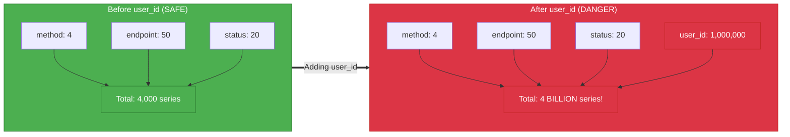
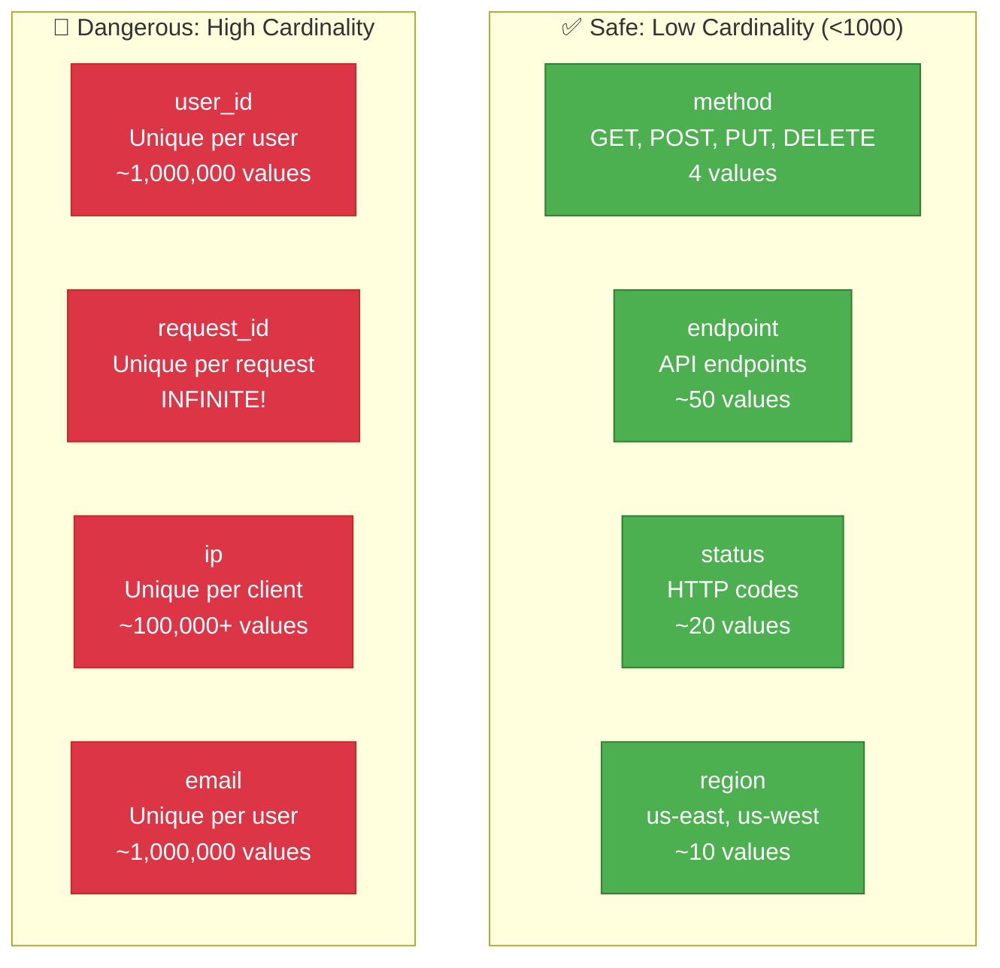

# Observability 101: Metrics Cardinality Explosion

---

## Tools & Prerequisites

To debug metrics cardinality issues:

### Metrics Analysis Tools

| Tool | Purpose | Quick Usage |
|------|---------|-------------|
| **promtool tsdb listChunks** | List Prometheus chunks | `promtool tsdb listChunks --series` |
| **promtool tsdb analyze** | Analyze TSDB stats | `promtool tsdb analyze /prometheus/data` |
| **curl /api/v1/label** | Query label values | `curl http://prometheus:9090/api/v1/label/__name__/values` |
| **prometheus_cardinality** | Exporter for cardinality | `curl http://exporter:9334/metrics` |
| **promgrep** | Grep Prometheus metrics | `promgrep 'http_requests_total'` |
| **grafana** | Visualize metrics | http://grafana:3000 |
| **victoriametrics** | Alternative high-scale TSDB | `vmctl` |

### Key Commands

```bash
# Check total number of time series
curl -s http://prometheus:9090/api/v1/label/__name__/values | jq '.data[]' | wc -l

# Check cardinality of specific metric
curl -s 'http://prometheus:9090/api/v1/query?query=count(http_requests_total) by (job)'

# Find highest cardinality metrics
curl -s 'http://prometheus:9090/api/v1/query?query=count({__name__=~".+"}) by (__name__)' | jq '.data.result[] | select(.value[1] | tonumber > 1000)'

# List all label values for a label
curl -s http://prometheus:9090/api/v1/label/user_id/values | jq '.data[]'

# Check TSDB stats
promtool tsdb analyze /var/lib/prometheus/

# Check memory usage of Prometheus
kubectl top pod prometheus-0

# Query Prometheus for series count
sum(prometheus_tsdb_head_series)

# Find metrics with high cardinality
topk(10, count by (__name__) ({__name__=~".+"}))

# Check scrape targets
curl -s http://prometheus:9090/api/v1/targets | jq '.data.activeTargets[] | {job, health, lastScrape}'

# Monitor Prometheus performance
curl -s http://prometheus:9090/api/v1/query?query=rate(prometheus_tsdb_head_samples_appended_total[5m])

# Check for label values with cardinality > threshold
count({__name__=~".+"}) by (__name__) > 1000

# Use promtool to check metrics file
promtool check metrics /path/to/metrics.txt

# Analyze which labels have highest cardinality
curl -s 'http://prometheus:9090/api/v1/query?query=count({__name__="http_requests_total"}) by (user_id)' | jq '.data.result | length'

# Check compaction status
curl -s http://prometheus:9090/api/v1/query?query(prometheus_tsdb_compactions_failed_total)

# Test query performance
time curl -s 'http://prometheus:9090/api/v1/query?query=http_requests_total'

# Check histogram bucket explosion
curl -s http://prometheus:9090/api/v1/label/le/values | jq '.data[]'
```

### Key Concepts

**Cardinality**: Number of unique time series for a metric; calculated as product of unique label values.

**Time Series**: Metric name + unique label combination; stored independently in Prometheus.

**High Cardinality**: Labels with many unique values (user_id, request_id); causes performance issues.

**Label**: Key-value pair dimensioning a metric (method="GET"); should have bounded unique values.

**Metric**: Named measurement (http_requests_total); can have multiple dimensions (labels).

**Prometheus Scraping**: Pulling metrics from /metrics endpoint at regular intervals.

**Compression**: Prometheus compresses time series; works better with repeating patterns.

**Querier**: Prometheus component executing PromQL queries.

**TSDB (Time Series Database)**: Storage engine for time series data.

**Chunk**: Time-based unit of storage in TSDB; contains multiple samples.

**Rollup**: Aggregating high-resolution data to lower resolution over time.

**Histogram**: Metric type for distribution data; has predefined buckets (bounded cardinality).

**Summary**: Metric type for distribution with custom quantiles; unbounded cardinality if labels added.

**Exemplar**: Sample trace linking metrics to traces; can increase cardinality.

**REPLICA Label**: pod instance label; cardinality = pod count (acceptable if bounded).

**USE Method**: Utilization, Saturation, Errors metrics framework.

**RED Method**: Rate, Errors, Duration metrics for services.

---

## The Situation

You've instrumented your API with Prometheus metrics. Everything works great... until you add a new dimension.

**Metric definition:**

```go
var httpRequestsTotal = prometheus.NewCounterVec(
    prometheus.CounterOpts{
        Name: "http_requests_total",
        Help: "Total number of HTTP requests",
    },
    []string{
        "method",      // GET, POST, PUT, DELETE
        "endpoint",    // /api/users, /api/posts, ...
        "status",      // 200, 201, 400, 404, 500, ...
        "user_id",     // ← NEW: Track per-user metrics!
        "request_id",  // ← NEW: Track per-request!
    },
)
```

**Your reasoning:** "We want to see which users are making the most requests!"

---

## The Incident

```
Day 1:     Deployed new metrics
Day 2:     Prometheus CPU at 80%
Day 3:     Alert: "Prometheus high memory usage"
Day 4:     Prometheus crashes: OOM killed
Day 5:     You investigate
```

**Root cause discovered:**

```bash
# Prometheus queries hang
$ curl http://prometheus:9090/api/v1/label/__name__/values
  (hangs forever)

# Check cardinality
$ promtool tsdb listChunks --series | wc -l
  50,000,000  ← 50 MILLON time series!

# Memory usage before crash
$ kubectl top pod prometheus-0
  NAME            CPU     MEMORY
  prometheus-0    800m    64Gi    ← OOM limit was 64Gi!
```

---

## The Jargon

| Term | Definition | Analogy |
|------|------------|---------|
| **Cardinality** | Number of unique values a metric can have | Number of unique rows in a spreadsheet |
| **Time series** | Metric + unique label values | A line on a graph |
| **High cardinality** | Labels with many unique values (user_id, request_id) | Spreadsheet with millions of rows |
| **Label** | Key-value pair dimension (method="GET") | Column header in spreadsheet |
| **Metric** | Named measurement (http_requests_total) | The spreadsheet itself |
| **Prometheus scrape** | Pulling metrics from /metrics endpoint | Copying data from spreadsheet |
| **Compression** | Reducing storage by finding patterns | ZIP file compression |
| **Query** | Asking Prometheus for data | SQL SELECT on spreadsheet |
| **Querier** | Component that executes queries | Database query engine |

---

## The Math of Cardinality

**Cardinality = product of unique label values:**

```
Before adding user_id:
  method: 4 values (GET, POST, PUT, DELETE)
  endpoint: 50 values
  status: 20 values (100, 200, 201, ..., 503)

  Total series = 4 × 50 × 20 = 4,000 series ✓

After adding user_id:
  method: 4 values
  endpoint: 50 values
  status: 20 values
  user_id: 1,000,000 values (1M users!)

  Total series = 4 × 50 × 20 × 1,000,000 = 4,000,000,000 series ✗
```

**The request_id label was even worse:**
```
request_id: Unique for EVERY request
  10,000 requests/second × 86400 seconds/day = 864M unique IDs/day

  Total series with request_id = INFINITE (every request adds new series!)
```

---

## Visual: Cardinality Explosion

### Series Growth Over Time

```mermaid
gantt
    title Prometheus Memory Usage Over 5 Days
    dateFormat  D
    axisFormat Day

    section Day 1-2
    Normal :active, 1, 2

    section Day 2-3
    High CPU :crit, 2, 3

    section Day 3-4
    Alert: High Memory :crit, 3, 4

    section Day 4-5
    OOM Crash :crit, 4, 5
```



### Cardinality Multiplication Effect



### Memory Explosion

**Prometheus Memory Usage (GB)**

| Day | Memory (GB) |
|-----|-------------|
| Day 1 | 2 |
| Day 2 | 16 |
| Day 3 | 32 |
| Day 4 (CRASH) | 65 |

Trend line shows steady growth from 2GB to 32GB before crash at 65GB.

### Time Series Storage Breakdown

**Cost Per Time Series**

| Component | Percentage |
|-----------|------------|
| Sample Data (~2-4 bytes) | 60% |
| Index Overhead | 20% |
| Chunk Header (~12 bytes) | 15% |
| Series Metadata (~100 bytes) | 5% |

### Safe vs Unsafe Labels



---

## Why This Breaks Prometheus

**Prometheus stores each time series separately:**

```
Memory usage per time series:
  - Series metadata: ~100 bytes
  - Data chunk header: ~12 bytes
  - Per-sample overhead: ~2-4 bytes

For 1 million series:
  - Metadata: 1M × 100 bytes = 100 MB
  - With samples (1 sample/minute, 24 hours): ~10-20 GB
  - Query processing: scans all series

For 4 billion series:
  - Metadata: 400 GB
  - Samples: petabytes
  - Query: NEVER completes
```

**Prometheus becomes slow:**
- Scraping takes longer (more data to process)
- Queries hang (must scan millions of series)
- Memory grows until OOM
- Compaction (background maintenance) never completes

---

## The Fix

**Remove high-cardinality labels:**

```go
var httpRequestsTotal = prometheus.NewCounterVec(
    prometheus.CounterOpts{
        Name: "http_requests_total",
        Help: "Total number of HTTP requests",
    },
    []string{
        "method",    // Low cardinality: 4 values
        "endpoint",  // Medium cardinality: 50 values
        "status",    // Low cardinality: ~20 values
        // REMOVE user_id and request_id!
    },
)
```

**Use histograms for high-cardinality data:**

```go
var httpRequestDuration = prometheus.NewHistogramVec(
    prometheus.HistogramOpts{
        Name:    "http_request_duration_seconds",
        Help:    "HTTP request latency",
        Buckets: prometheus.DefBuckets,
    },
    []string{"method", "endpoint"},  // Only low-cardinality labels
)

// Track per-user metrics in logs or traces, not metrics!
```

---

## Questions

1. **Why does Prometheus struggle with high-cardinality metrics?**

2. **How do you calculate the cardinality of a metric?**

3. **What's the difference between metrics and logs/traces for high-cardinality data?**

4. **How do you detect high cardinality before it causes problems?**

5. **As a Senior Engineer, what's your strategy for metrics design?**

---

**When you've thought about it, read `step-01.md`**
