# Observability 102: Distributed Tracing Gaps

---

## The Situation

You've implemented distributed tracing across your microservices. But when debugging a slow request, you see this:

```
Trace: GET /api/orders/12345
Duration: 5.2 seconds
├── [0ms] API Gateway
├── [5ms] Auth Service
├── [???] Order Service          ← SPAN MISSING!
├── [1200ms] Payment Service
├── [???] Inventory Service      ← SPAN MISSING!
└── [5200ms] Response sent

Problem: 4 seconds unaccounted for!
Where did the time go?
```

**Your instrumentation:**

```go
// API Gateway
func (h *Handler) HandleOrder(w http.ResponseWriter, r *http.Request) {
    ctx, span := tracer.Start(r.Context(), "HandleOrder")
    defer span.End()

    // Call auth
    h.authService.Validate(ctx, r)

    // Call order service
    // TODO: Add tracing
    resp, err := h.orderClient.GetOrder(ctx, orderID)  // ← No tracing!

    // Call payment
    h.paymentService.Process(ctx, resp)

    // Call inventory
    // TODO: Add tracing
    h.inventoryClient.Check(ctx, resp)  // ← No tracing!

    json.NewEncoder(w).Encode(resp)
}
```

---

## The Incident

```
Customer Complaint: "Order page takes 5 seconds to load"

Investigation:
1. Check APM dashboard: "Order API latency: P95 = 5.2s"
2. Open trace: See gaps in timeline
3. Check logs: No errors logged
4. Check metrics: No error spike
5. Conclusion: "Performance issue, unknown root cause"

Weeks of debugging:
- Profiled code: CPU looks fine
- Checked database queries: All fast
- Checked network: No congestion
- Blamed "network latency"

Real issue discovered months later:
- Order Client was using HTTP/1.1 with connection pooling exhaustion
- Requests were queuing, but no span recorded for the wait time
- The "gap" in trace was actually queue time!
```

---

## The Jargon

| Term | Definition | Analogy |
|------|------------|---------|
| **Span** | Single unit of work (one function call) | One task in a project plan |
| **Trace** | Tree of spans representing a request | Complete project plan with all tasks |
| **Trace ID** | Unique identifier for entire request | Project number |
| **Span ID** | Unique identifier for single span | Task number |
| **Parent Span ID** | Links child to parent span | Subtask → Parent task link |
| **Span Context** | Carries trace ID, span ID for propagation | Envelope carrying project paperwork |
| **Baggage** | Key-value data propagated across spans | Notes passed between teams |
| **Sampling** | Recording only percentage of traces | Audit: only review some projects |
| **Head-based sampling** | Sample at trace start | Decide to track at project start |
| **Tail-based sampling** | Sample after seeing full trace | Decide to track after project completes |

---

## Why Spans Were Missing

**Issue 1: Client not propagating context**

```go
// BAD: No context propagation
type OrderClient struct {
    client *http.Client
}

func (c *OrderClient) GetOrder(ctx context.Context, id string) (*Order, error) {
    req, _ := http.NewRequestWithContext(ctx, "GET", c.url+"/orders/"+id, nil)
    // Missing: Inject trace context into request!

    resp, err := c.client.Do(req)
    // ...
}

// The HTTP request has no trace headers
// Downstream service can't continue the trace!
```

**Issue 2: Downstream not extracting context**

```go
// BAD: Not extracting trace context
func (h *Handler) ServeHTTP(w http.ResponseWriter, r *http.Request) {
    // Missing: Extract trace context from incoming request!

    // Creates NEW trace instead of continuing existing one
    ctx, span := tracer.Start(context.Background(), "GetOrder")
    defer span.End()

    // This span is orphaned from the trace!
}
```

**Issue 3: Missing spans around blocking operations**

```go
// BAD: No span for HTTP client call
func (h *Handler) HandleOrder(w http.ResponseWriter, r *http.Request) {
    ctx, span := tracer.Start(r.Context(), "HandleOrder")
    defer span.End()

    // HTTP call happens, but no span recorded!
    resp, err := h.client.Do(req)

    // The time spent here is a "gap" in the trace
}
```

---

## Trace Context Propagation

**How it should work:**

```
Service A                          Service B                          Service C
    │                                  │                                  │
    │ Start(trace_id=X, span_id=A)     │                                  │
    │ ──────────────────────────────> │                                  │
    │    HTTP: traceparent: 00-X-A-01 │                                  │
    │                                  │ Extract(X, A)                   │
    │                                  │ Start(span_id=B, parent=A)      │
    │                                  │ ──────────────────────────────> │
    │                                  │    HTTP: traceparent: 00-X-B-01 │
    │                                                                  │
    │                                  │                                  │ Extract(X, B)
    │ <────────────────────────────── │ <───────────────────────────── │
    │    Response: includes trace      │    Response: includes trace      │
    │                                  │                                  │
Result: One continuous trace with three spans
```

---

## Visual: Distributed Trace with Missing Spans

### What You See (Broken Trace)


### What's Actually Happening


### Correct Trace Propagation

```mermaid
sequenceDiagram
    autonumber
    participant A as Service A<br/>trace_id=X
    participant B as Service B<br/>span_id=B
    participant C as Service C<br/>span_id=C

    A->>A: Start span A
    Note over A: traceparent: 00-TR-00-01

    A->>B: HTTP + traceparent header
    Note over B: Extract context from header
    B->>B: Start span B (parent=A)
    Note over B: traceparent: 00-TR-B-01

    B->>C: HTTP + traceparent header
    Note over C: Extract context from header
    C->>C: Start span C (parent=B)
    Note over C: traceparent: 00-TR-C-01

    C-->>B: Response
    B-->>A: Response

    Note over A,B,C: ✅ One complete trace tree!
```

### Span Tree Structure

```mermaid
graph TB
    Root["🌐 Root Span<br/>HandleOrder<br/>5220ms"]

    Auth["🔐 Auth<br/>ValidateToken<br/>5ms"]
    Payment["💳 Payment<br/>ProcessPayment<br/>1200ms"]

    Order["📦 Order Service<br/>GetOrder<br/>2000ms<br/>🚨 MISSING"]
    Inventory["📦 Inventory Service<br/>CheckStock<br/>2000ms<br/>🚨 MISSING"]

    Root --> Auth
    Root --> Payment
    Root -.Order.-> Order
    Root -.Inventory.-> Inventory

    classDef traced fill:#4caf50,stroke:#2e7d32,color:#fff
    classDef missing fill:#ffebee,stroke:#dc3545,color:#c62828

    class Root,Auth,Payment traced
    class Order,Inventory missing
```



---

## Questions

1. **Why were spans missing from the trace?**

2. **How does trace context propagation work across services?**

3. **What's the difference between traceparent and baggage?**

4. **How do you debug "missing spans" issues?**

5. **As a Senior Engineer, how do you ensure complete tracing coverage?**

---

**When you've thought about it, read `step-01.md`**
