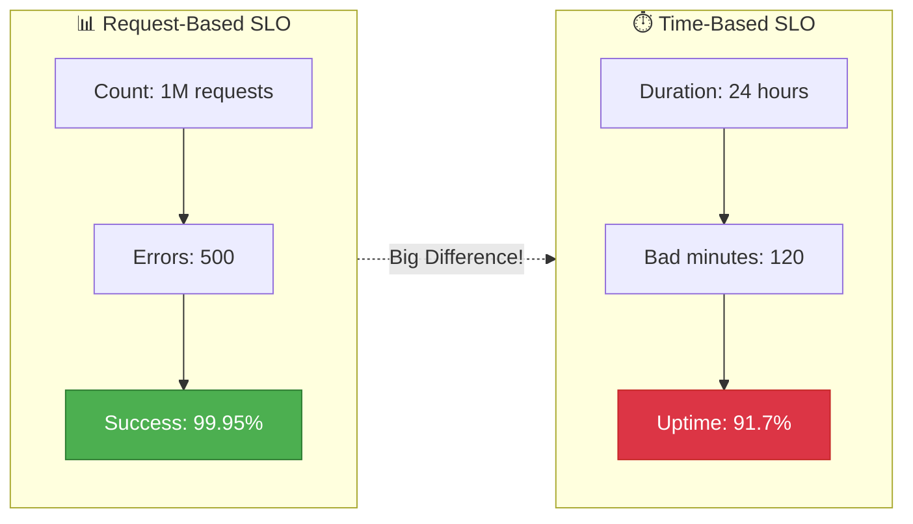

# Observability 103: SLO Calculation Error

---

## The Situation

You defined an SLO: "99.9% of requests succeed." Your dashboard shows compliance but customers are unhappy.

**Dashboard:**
```
SLO: 99.9% success rate
Today's result: 99.95% ✓
Status: WITHIN SLO
```

**Reality:**
```
2-hour outage: 50% error rate
Dashboard still showed "PASS"

Bug: Query used last 1 hour, extrapolated to full day
```

---

## Visual: The SLO Calculation Problem

### What the Dashboard Showed (Wrong!)

```mermaid
gantt
    title Dashboard View: Last 1 Hour Sample
    dateFormat  HH:mm
    axisFormat %H:%M

    section Day's Timeline
    Normal (99.99%) :00:00, 10:00
    OUTAGE (50% errors) :10:00, 12:00
    Normal (99.99%) :12:00, 24:00

    section What Dashboard Measured
    Only measured :crit, 14:00, 15:00
    Extrapolated to day :15:00, 24:00
```



### Error Budget Reality

**Error Budget: 0.1% Allowance (864 seconds/day)**

| Category | Percentage |
|----------|------------|
| Used in 2hr outage (50% error) | 72% |
| Remaining (incorrectly shown) | 20% |
| Actually Spent! | 8% |

### Request-Based vs Time-Based SLO



### Rolling Window vs Calendar Window

```mermaid
gantt
    title SLO Window Types
    dateFormat  D
    axisFormat Day

    section Rolling Window (30 days)
    Days 1-29 :active, 1, 29
    Day 30 (latest) :crit, 29, 30
    Day 1 (drops off) :done, 0, 1

    section Calendar Window (Month)
    Days 1-30 :active, 1, 30
    Month Boundary :milestone, 30, 0m
    Resets :30, 31
```



### The Math Behind the Error

```
🚨 INCORRECT (Dashboard):
├── Measured: 1 hour with 99.95% success
├── Assumed: Rest of day is the same
└── Calculated: 99.95% daily success rate

✅ CORRECT (Reality):
├── Hours 0-10: 99.99% success (36,000 good, 4 bad)
├── Hours 10-12: 50% success (3,600 good, 3,600 bad)  ← OUTAGE
├── Hours 12-24: 99.99% success (43,200 good, 4 bad)
├── Total: 82,799 good, 3,608 bad
└── Actual: 95.82% success rate ❌ SLO BREACH!
```

---

## The Jargon

| Term | Definition |
|------|------------|
| **SLO** | Service Level Objective - target reliability (99.9%) |
| **SLI** | Service Level Indicator - metric measuring SLO |
| **Error Budget** | Allowed failures = 100% - SLO (0.1%) |
| **Rolling Window** | Moving time period (last 30 days) |
| **Calendar Window** | Fixed period (month, quarter) |

---

## Questions

1. Why did dashboard show compliance during outage?
2. Request-based vs time-based SLOs?
3. How are error budgets consumed?
4. How to design meaningful SLOs?

**Read `step-01.md`**
