# Performance 101: Memory Fragmentation

---

## Tools & Prerequisites

To debug memory fragmentation issues:

### Memory Profiling Tools

| Tool | Purpose | Quick Usage |
|------|---------|-------------|
| **GODEBUG=gctrace=1** | Go GC trace output | `GODEBUG=gctrace=1 go run main.go` |
| **runtime.ReadMemStats** | In-code memory stats | `runtime.ReadMemStats(&m)` |
| **pprof** | Memory profiling | `go tool pprof http://localhost:6060/debug/pprof/heap` |
| **top** | Process memory usage | `top -p <pid>` |
| **smem** | Detailed memory stats | `smem -c "name rss pss"` |
| **valgrind** | Memory leak detection | `valgrind --leak-check=full` |
| **jemalloc stats** | Jemallocator stats | `MALLOC_CONF=stats_print:true` |

### Key Commands

```bash
# Enable Go GC trace
GODEBUG=gctrace=1 ./app

# Read heap profile
curl http://localhost:6060/debug/pprof/heap > heap.prof
go tool pprof -http=:8080 heap.prof

# Check fragmentation from runtime
curl http://localhost:6060/debug/pprof/heap?debug=1

# Live memory stats with pprof
go tool pprof -http=:8080 http://localhost:6060/debug/pprof/heap

# Check RSS vs VSZ
ps -o pid,rss,vsz,comm -p <pid>

# Monitor memory growth
watch -n 5 'ps -o pid,rss,vsz,comm -p <pid>'

# Check system memory fragmentation
cat /proc/buddyinfo
cat /proc/meminfo | grep -E "(Slab|MemFree|MemAvailable)"

# Go-specific memory stats
curl http://localhost:6060/debug/pprof/heap?debug=1 | grep -E "(HeapObjects|HeapInUse)"

# Check for large allocations
go tool pprof -sample_index=alloc_objects http://localhost:6060/debug/pprof/heap

# Force GC and check before/after
curl http://localhost:6060/debug/pprof/heap?gc=1

# Compare heap profiles
go tool pprof -base heap1.prof heap2.prof

# Check malloc stats
MALLOCSTATS=1 ./app

# Generate flame graph
go-torch http://localhost:6060
```

### Key Concepts

**RSS (Resident Set Size)**: Physical memory actually allocated to process; includes fragmentation overhead.

**VSZ (Virtual Memory Size)**: Total virtual memory allocated; may exceed physical memory.

**Heap**: Dynamic memory region used for runtime allocations.

**External Fragmentation**: Free memory exists but in non-contiguous blocks; can't satisfy large allocations.

**Internal Fragmentation**: Allocated block larger than needed; wasted space within allocated regions.

**Span**: Contiguous memory block managed by Go's allocator (typically 8KB to 512KB).

**Arena**: Memory region for allocations; Go uses multiple arenas for different size classes.

**Scavenger**: Go's background GC that finds and returns unused memory to OS.

**GOGC**: Garbage collection trigger percentage; heap grows by GOGC% before GC runs.

**Object Pooling**: Reusing objects instead of allocating new ones; reduces fragmentation.

**Memory Arena / Region**: Allocating from fixed-size region; freed all at once.

**madvise**: System call advising kernel about memory usage patterns (MADV_DONTNEED, etc.).

**Huge Pages**: Larger memory pages (2MB/1GB) reducing TLB misses but increasing fragmentation.

**Cgo Allocate Memory**: Memory allocated by C code; not managed by Go's GC.

**Finalizers**: Functions run when object is garbage collected; can delay memory reclamation.

---

## The Situation

Your Go service allocates many objects of varying sizes. Memory usage grows over time despite GC running.

**Your code:**
```go
func ProcessRequest(data []byte) Response {
    // Allocate buffer
    buf := make([]byte, 1024)

    // Sometimes need larger
    if len(data) > 1024 {
        buf = make([]byte, len(data))
    }

    // Process...
    return Response{Data: buf}
}
```

---

## The Symptoms

```
Hour 0:   RSS: 100MB, Heap: 50MB
Hour 1:   RSS: 150MB, Heap: 60MB
Hour 2:   RSS: 200MB, Heap: 65MB
Hour 24:  RSS: 2GB, Heap: 100MB

Problem: RSS growing much faster than heap
GODEBUG=gctrace=1 shows:
  GC forced: mark phase taking 50ms+
  Next GC at 200MB, but RSS is 2GB!

Profile: Memory fragmentation
  Free memory: 1.9GB (but in fragments)
  Largest free block: 50MB
  Need 100MB allocation → must grow heap!
```

---

## The Jargon

| Term | Definition |
|------|------------|
| **RSS** | Resident Set Size - physical memory used |
| **Heap** | Dynamic memory region |
| **Fragmentation** | Free memory broken into small pieces |
| **Arena** | Memory region for allocations |
| **Span** | Contiguous memory block |
| **Scavenger** | Low-latency GC for small objects |
| **GOGC** | GC trigger: heap grows by this % before GC |

---

## The Problem

```
Memory layout over time:

Initial: [==== 100MB ====]  Contiguous

After allocs/frees:
[=10=][==20==][=5=][======40======][=10=][=15=]

Total free: 100MB
But: Need 50MB allocation → doesn't fit in any fragment!
Result: Grow heap (request more from OS)

This is external fragmentation.
```

---

## Visual: Memory Fragmentation Over Time

### Heap Evolution Timeline

```mermaid
gantt
    title Memory Fragmentation Over 24 Hours
    dateFormat X
    axisFormat Hour

    section RSS vs Heap
    RSS Usage    :0, 24
    Heap Usage   :0, 24

    section Critical Events
    Normal       :milestone, 0, 0h
    Fragmented   :milestone, 6, 6h
    Severe       :milestone, 18, 18h
```



### RSS Growth vs Heap

**RSS Growing Faster Than Heap (External Fragmentation)**

| Time | RSS (MB) | Heap (MB) |
|------|----------|-----------|
| Hour 0 | 100 | 50 |
| Hour 1 | 150 | 60 |
| Hour 2 | 200 | 65 |
| Hour 24 | 2000 | 100 |

RSS (bar) grows from 100MB to 2000MB while Heap (line) only grows from 50MB to 100MB.

### Memory Layout Evolution

**T0: Clean Heap (8 blocks)**
```
[████████]  All free (green)
```

**T1: Allocations (8 blocks)**
```
[██][   ][█][   ]  Used=3, Free=5
```

**T2: Fragmented (8 blocks)**
```
[█][   ][█][   ][█][   ][██]
```

**T3: Critical Fragmentation (8 blocks)**
```
[█][   ][█][██][   ][█][   ][█]
Used: 5, Free: 3 (but can't fit 4+ block!)
```

### The Problem

```
Hour 24 Statistics:
├── Heap: 100MB (actually in use)
├── RSS: 2GB (allocated from OS)
├── Free: 1.9GB (but fragmented!)
└── Largest free block: 50MB

Allocation Request: 100MB
Result: ❌ FAIL - Must grow heap!
Despite having 1.9GB "free"!
```

### Fragmentation Metrics

**Memory at Hour 24**

| Category | Amount | Percentage |
|----------|--------|------------|
| Fragmented Free | 1.9GB | 76% |
| Overhead/Other | 500MB | 20% |
| Actually Used | 100MB | 4% |

---

## Questions

1. **Why does RSS grow faster than heap?**

2. **What's external vs internal fragmentation?**

3. **How do object pools help?**

4. **What's the impact of varying allocation sizes?**

5. **As a Senior Engineer, how do you reduce fragmentation?**

---

**Read `step-01.md`**
