# Performance 102: GC Pauses

---

## Tools & Prerequisites

To debug GC-related latency issues:

### GC Profiling Tools

| Tool | Purpose | Quick Usage |
|------|---------|-------------|
| **GODEBUG=gctrace=1** | Go GC tracing | `GODEBUG=gctrace=1 ./app` |
| **go tool pprof** | CPU/Memory profiling | `go tool pprof http://localhost:6060/debug/pprof/heap` |
| **go tool trace** | Execution tracing | `go test -trace=trace.out` |
| **runtime.ReadMemStats()** | In-code memory stats | Log every N seconds |
| **GC stats viewer** | Visualize GC logs | `gcviewer` for JVM |
| **JVisualVM / JConsole** | JVM monitoring | Connect to running JVM |
| **async-profiler** | Java/C++ profiling | `profiler.sh -d 30 -f cpu.flamegraph pid` |

### Key Commands

```bash
# Go GC tracing
GODEBUG=gctrace=1 ./app
# Output: gc 1 @0.001s 2%: 0.016+0.46+0.054 ms clock, 0.13+3.6+0.43 ms cpu

# Go memory profiling
curl http://localhost:6060/debug/pprof/heap > heap.prof
go tool pprof heap.prof

# Go execution tracing
go test -trace=trace.out
go tool trace trace.out

# JVM GC monitoring
jstat -gcutil <pid> 1000 10
# Output: S0C S1C S0U S1U EC EU OC OU MC MU CCSC CCSU YGC YGCT FGC FGCT GCT

# JVM GC logging
java -Xlog:gc*:file=gc.log -jar app.jar

# View JVM GC details
jmap -heap <pid>
```

### Key Concepts

**Stop-The-World (STW)**: GC pauses all application threads while performing collection.

**Mark Phase**: GC finds all reachable (live) objects from root references.

**Sweep Phase**: GC reclaims memory from unreachable (dead) objects.

**Concurrent GC**: GC runs concurrently with application execution, reducing STW time.

**Parallel GC**: Multiple GC threads work in parallel during STW phase.

**GOGC**: Go's GC trigger; runs when heap grows by GOGC% since last GC (default 100).

**Generational GC**: Divides heap into young/old generations; collects young more frequently.

**Object Pooling**: Reuse objects instead of allocating new ones; reduces GC pressure.

**Escape Analysis**: Compiler determines if object can be stack-allocated (no GC overhead).

**Card Table**: Data structure tracking generational references (old gen → young gen).

---

## Visual: GC Pauses

### Stop-The-World GC Impact

```mermaid
sequenceDiagram
    autonumber
    participant App as Application
    participant GC as Garbage Collector

    Note over App,GC: Normal execution
    App->>App: Processing requests...

    Note over App,GC: Heap reaches threshold!
    App->>GC: Trigger GC
    GC->>App: ⏸️ STOP THE WORLD
    App->>App: (paused)

    GC->>GC: Mark phase (find live objects)
    GC->>GC: Sweep phase (reclaim memory)

    GC->>App: ▶️ RESUME
    App->>App: Processing requests...

    Note over App: Latency spike during pause!
```



### Generational GC


### GC Pause Over Time

**GC Pause Duration vs Heap Size**

| Heap Size | Pause Time (ms) |
|-----------|-----------------|
| 10MB | 1 |
| 100MB | 5 |
| 500MB | 25 |
| 1GB | 50 |
| 2GB | 100 |
| 4GB | 180 |

### Concurrent vs Parallel GC


### Object Pooling Impact

**GC Frequency: With vs Without Object Pooling**

| Time (seconds) | Without Pooling (MB) | With Pooling (MB) |
|----------------|---------------------|-------------------|
| 0 | 100 | 50 |
| 1 | 200 | 80 |
| 2 | 300 | 100 |
| 3 | 400 | 120 |
| 4 | 500 | 140 |
| 5 | 100 | 50 |
| 6 | 200 | 80 |
| 7 | 300 | 100 |

Without pooling: Heap grows to 500MB before GC. With pooling: Max 140MB.

### Escape Analysis Example

```mermaid
flowchart TB
    subgraph NoEscape ["No Escape (Stack Allocated)"]
        NE1["func foo() int {<br/>  x := 100<br/>  return x<br/>}"]
        NE2["✅ Stack allocated"]
        NE3["✅ No GC overhead"]
        NE4["✅ Auto cleanup on return"]

        NE1 --> NE2 --> NE3 --> NE4
    end

    subgraph Escapes ["Escapes to Heap"]
        E1["func foo() *int {<br/>  x := 100<br/>  return &x<br/>}"]
        E2["❌ Heap allocated"]
        E3["❌ GC must track"]
        E4["❌ Cleanup via GC"]

        E1 --> E2 --> E3 --> E4
    end

    style NoEscape fill:#c8e6c9
    style Escapes fill:#ffcdd2
```



### GOGC Tuning


### GC Optimization Strategies

```mermaid
graph TB
    subgraph Strategies ["GC Optimization Strategies"]
        S1["🎯 Object Pooling<br/>Reuse buffers/objects"]
        S2["📊 Pre-allocate capacity<br/>make([]T, 0, size)"]
        S3["🔍 Escape Analysis<br/>Avoid pointers in hot paths"]
        S4["📦 Value types over references<br/>struct vs pointer"]
        S5["⏱️ Tune GOGC<br/>(or disable for short bursts)"]
        S6["🧵 Use workers<br/>(sync.Pool)"]
    end

    style Strategies fill:#e8f5e9
```



### Sync.Pool Usage Pattern

```mermaid
sequenceDiagram
    autonumber
    participant App as Application
    participant Pool as sync.Pool

    Note over App,Pool: Without Pool (allocates every time)
    App->>App: New buffer
    App->>App: Use buffer
    App->>App: Buffer discarded → GC work

    Note over App,Pool: With Pool (reuses buffers)
    App->>Pool: Get() from pool
    Pool-->>App: Reused buffer
    App->>App: Use buffer
    App->>Pool: Put(buffer) back
    Note over Pool: Buffer reused, no allocation!
```



---

## The Incident

Your low-latency trading system has P99 latency of 10ms... except for occasional 100ms spikes.

```
Latency profile:
P50: 1ms
P90: 3ms
P95: 5ms
P99: 8ms
P99.9: 150ms  ← SPIKES!

Analysis: Spikes correlate with GC "stop the world" pauses
```

---

## The Jargon

| Term | Definition |
|------|------------|
| **STW** | Stop-the-world - all goroutines paused during GC |
| **Mark** | Finding reachable objects |
| **Sweep** | Reclaiming unused memory |
| **Concurrent GC** | GC runs alongside application |
| **GOGC** | Percentage of heap growth before GC triggers |
| **Generational** | Heap divided into young/old generations |
| **Object Pool** | Reuse objects to reduce allocations |
| **Escape Analysis** | Compiler optimization for stack allocation |

---

## Questions

1. **What causes GC pauses?** (Mark/sweep phases, heap size)

2. **How does GOGC affect pause frequency?** (Higher = less frequent but larger pauses)

3. **What's the difference between concurrent and parallel GC?** (Concurrent runs with app, parallel uses threads)

4. **How do you reduce GC pressure?** (Object pooling, escape analysis, value types)

5. **As a Senior Engineer, what's your GC optimization strategy?**

---

**Read `step-01.md`
