# Performance 104: NUMA Effects

---

## Tools & Prerequisites

To debug NUMA-related performance issues:

### NUMA Analysis Tools

| Tool | Purpose | Quick Usage |
|------|---------|-------------|
| **numactl** | Control NUMA policy | `numactl --cpunodebind=0 --membind=0 ./app` |
| **numastat** | NUMA statistics | `numastat -m` |
| **lscpu** | CPU topology | `lscpu --extended` |
| **hwloc-ls** | Hardware topology | `hwloc-ls --of console` |
| **perf** | Performance counters | `perf stat -e cache-misses ./app` |
| **numad** | NUMA daemon | `systemctl status numad` |
| **tuna** | CPU/thread tuning | `tuna -C 0-15 -c` |

### Key Commands

```bash
# Check NUMA topology
lscpu | grep NUMA
numactl --hardware

# Show memory allocation by node
numastat -m

# Check current NUMA policy
numactl --show

# Run process on specific NUMA node
numactl --cpunodebind=0 --membind=0 ./app

# Run with interleaved memory (spread across nodes)
numactl --interleave=all ./app

# Check which NUMA node a process is using
numastat -p <pid>

# Show NUMA hit/miss statistics
watch -n 1 'numastat -m'

# Check memory locality
numastat

# View hardware topology
hwloc-ls --of console
hwloc-info

# Check CPU affinity
taskset -cp <pid>

# Set CPU affinity (bind to specific cores)
taskset -c 0-15 ./app

# Check memory placement
cat /proc/<pid>/numa_maps

# Profile cache misses by NUMA node
perf stat -e cache-references,cache-misses,instructions,cycles ./app

# Check NUMA memory usage per node
cat /sys/devices/system/node/node*/meminfo

# Check CPU topology
cat /proc/cpuinfo | grep "physical id\|core id"

# Monitor NUMA balancing
echo 1 > /proc/sys/kernel/numa_balancing

# Check zoneinfo for memory fragmentation
cat /proc/zoneinfo

# Run with specific memory policy
numactl --preferred=0 ./app

# Check process memory node allocation
ps -eo pid,comm,user,policy,psr | grep <pid>

# Use perf to record NUMA events
perf record -e cstate_migrations ./app
perf report
```

### Key Concepts

**NUMA (Non-Uniform Memory Access)**: Multi-socket architecture where each CPU has local memory; access to remote memory is slower.

**UMA (Uniform Memory Access)**: Traditional architecture where all CPUs access memory at same speed.

**Socket**: Physical CPU package containing cores and memory controller.

**NUMA Node**: Socket with its local CPUs and memory; Node 0, Node 1, etc.

**QPI (Intel) / UPI (Ultra Path Interconnect)**: High-speed interconnect between Intel sockets.

**HyperTransport / Infinity Fabric**: AMD's interconnect between sockets.

**Local Memory Access**: Memory on same socket as requesting CPU; fast (~80ns).

**Remote Memory Access**: Memory on different socket; slower (~120ns, +50% latency).

**Memory Locality**: Keeping memory accesses local to the socket where allocated.

**First-Touch Policy**: Memory allocated on node where thread first writes to it.

**Interleaving**: Distributing memory across NUMA nodes; balances but reduces locality.

**GOMAXPROCS**: Number of OS threads Go can use; should be ≤ cores per socket for NUMA.

**CPU Affinity**: Binding process to specific CPU cores; prevents cross-node migration.

**NUMA Balancing**: Kernel feature automatically migrating pages to improve locality.

---

## The Situation

Your high-performance application runs on a 2-socket server. Performance is 50% worse than expected.

**Server:**
```
2x Intel Xeon (each with local memory)
Socket 0: 16 cores, 64GB RAM (local)
Socket 1: 16 cores, 64GB RAM (local)
Total: 32 cores, 128GB RAM
```

**Your application:**
```
Single process, 32 goroutines
GOMAXPROCS=32
Runs on all cores

Problem: Memory access times vary wildly
Some goroutines are fast, some are slow
```

---

## The Problem

```
NUMA = Non-Uniform Memory Access

Socket 0           Socket 1
[CPU0-15]          [CPU16-31]
    |                   |
[64GB RAM]         [64GB RAM]
    |                   |
    └──── QPI/UPI ──────┘

Access pattern:
- CPU0 accesses Socket 0 RAM: ~80ns (fast)
- CPU0 accesses Socket 1 RAM: ~120ns (slow + 50%)

Go's GC and scheduler are NUMA-unaware!
Goroutine on CPU0 allocates → memory on Socket 0
Goroutine migrates to CPU16 → accesses Socket 0 memory remotely
```

---

## Visual: NUMA Architecture & The Problem

### NUMA Server Architecture


### The NUMA Problem: Cross-Node Memory Access

```mermaid
sequenceDiagram
    autonumber
    participant G as 🔄 Goroutine
    participant N0 as Node 0<br/>CPU 0-15
    participant M0 as RAM 0<br/>(Local)
    participant QPI as ⚡ QPI/UPI
    participant M1 as RAM 1<br/>(Remote)
    participant N1 as Node 1<br/>CPU 16-31

    Note over G: Starts on CPU 0 (Node 0)
    G->>M0: Allocate memory (80ns ✅)
    Note over G: Migrates to CPU 16 (Node 1)
    G->>QPI: Access RAM 0 from Node 1
    QPI->>M0: Remote memory access (120ns ⚠️)
    M0-->>QPI: Data returns
    QPI-->>G: +50% latency penalty!
```



### Memory Access Latency Comparison

**Memory Access Latency by NUMA Node**

| Location | Latency (ns) |
|----------|--------------|
| Local (Node 0) | 80 |
| Remote (Node 1) | 120 |

### Go Scheduler NUMA Problem

```mermaid
flowchart TB
    subgraph Problem ["🚨 The Problem: NUMA-Unaware Scheduler"]
        G1["Goroutine G1<br/>on CPU 0"]
        G2["Goroutine G2<br/>on CPU 16"]
        ALLOC1["Allocates in RAM 0"]
        ACCESS1["Accesses RAM 0<br/>LOCAL: 80ns ✅"]
        ACCESS2["Accesses RAM 0<br/>REMOTE: 120ns ⚠️"]

        G1 --> ALLOC1
        G1 --> ACCESS1
        G2 --> ACCESS2
    end

    subgraph Result ["📊 Performance Impact"]
        PERF["Some goroutines: FAST<br/>Some goroutines: SLOW<br/>Overall: UNPREDICTABLE"]
        GC["GC scans cross-node memory<br/>Cache misses increase"]
    end

    Problem --> Result

    classDef bad fill:#ffebee,stroke:#dc3545
    class Problem,Result bad
```



---

## The Jargon

| Term | Definition |
|------|------------|
| **NUMA** | Non-Uniform Memory Access |
| **UMA** | Uniform Memory Access |
| **Socket** | Physical CPU package |
| **Node** | NUMA node (CPU + local memory) |
| **QPI/UPI** | Interconnect between sockets |
| **Local Access** | Memory on same socket |
| **Remote Access** | Memory on different socket |
| **Migration** | Process moving between sockets |

---

## Questions

1. **Why is NUMA performance worse than expected?**

2. **How does Go's scheduler interact with NUMA?**

3. **What's memory locality?**

4. **How do you optimize for NUMA?**

5. **As a Principal Engineer, how do you design NUMA-aware applications?**

---

**Read `step-01.md`
