# Real-World 201: Cloudflare BGP Leak

---

## Tools & Prerequisites

To debug BGP route leak issues:

### BGP Route Analysis Tools

| Tool | Purpose | Quick Usage |
|------|---------|-------------|
| **bgpstream** | BGP data stream analysis | `bgpstream -w 3600 -c origin-as 13335` |
| **RIPEstat API** | Route propagation check | `curl "https://stat.ripe.net/data/announced-prefixes/data.json?resource=AS13335"` |
| **bgp.he.net** | Looking glass | http://bgp.he.net |
| **route-views.org** | Route collectors | `telnet route-views.routeviews.org 23` |
| **rpeval** | RPKI validation | `rpeval validate 1.1.1.0/24` |
| **exabgp** | BGP route injection | `exabgp --diagnose` |
| **birdc** | BGP daemon CLI | `birdc show route all` |

### Key Commands

```bash
# Check route propagation from multiple looking glasses
for lg in route-views.oregon-ix.net route-views.sydney.routeviews.org; do
  echo "=== $lg ==="
  telnet $lg 23 <<EOF
show ip bgp 1.1.1.0/24
exit
EOF
done

# Monitor BGP updates for specific AS
bgpstream -w 60 -c origin-as 13335

# Check current AS path from multiple sources
whois -h whois.radb.net 1.1.1.0/24 | grep "origin:"

# Verify RPKI validation
curl "https://stat.ripe.net/data/rpki-validation/data.json?resource=1.1.1.0/24"

# Check route leaks using BGPStream
python3 <<EOF
from pybgpstream import BGPStream
stream = BGPStream(walking_time=3600, record_type="ribs")
for elem in stream:
    if 13335 in elem.fields["as_path"]:
        print(elem)
EOF

# Check for unexpected AS paths
curl "https://stat.ripe.net/data/looking-glass/data.json?resource=1.1.1.0/24"

# Monitor local BGP status
birdc show protocols
vtysh -c "show ip bgp summary"

# Check route announcements
birdc show route where community = [13335]

# Trace AS path to destination
traceroute -A AS13335 1.1.1.1

# Check for route leaks (shouldn't see customer routes as transits)
# Check if your prefixes are announced beyond intended scope
curl "https://stat.ripe.net/data/whois/data.json?resource=1.1.1.0/24"

# Real-time BGP monitoring
bgpmon -a AS13335 --all-peers

# Check BGP communities
whois -h whois.radb.net 13335 | grep "communities:"

# Validate route filters
rtr-check 1.1.1.0/24 AS13335

# Check for hijacks
hijack-hunter monitor 1.1.1.0/24
```

### Key Concepts

**BGP (Border Gateway Protocol)**: Protocol exchanging routing information between autonomous systems.

**AS (Autonomous System)**: Network under single administrative control (e.g., Cloudflare = AS13335).

**AS Path**: Sequence of AS numbers that a route traverses; shorter paths preferred.

**Local Preference**: BGP attribute for internal path selection; higher = preferred.

**AS Path Prepend**: Adding extra AS numbers to make path look longer (less attractive).

**Route Leak**: Announcing routes beyond intended scope; violates export policies.

**Prefix Hijack**: Announcing someone else's IP space as your own.

**Tier-1 ISP**: ISP that can reach entire internet without paying for transit.

**Transit Provider**: ISP paid to carry your traffic to other networks.

**Customer Route**: Route learned from a customer; preferred over peer routes in BGP.

**Peer Route**: Route learned via settlement-free peering; preferred over transit.

**Route Filtering**: Blocking invalid route announcements; prevents leaks/hijacks.

**RPKI**: Cryptographic validation of route announcements; prevents hijacks.

**IRR (Internet Routing Registry)**: Database of routing policy information.

**Route Server**: BGP speaker at IXP facilitating interconnections.

**Looking Glass**: Server showing BGP routes from another network's perspective.

**NO_EXPORT Community**: BGP community preventing route from being announced outside AS.

---

## The Situation

You're a Principal Engineer at Cloudflare. Your network uses BGP to announce your IP prefixes to the internet. You have a small ISP (transit provider) that you use for backup routes.

**BGP Configuration:**

```bash
# cloudflare-router.conf
router bgp 13335
 bgp router-id 1.1.1.1

 ! Announce Cloudflare's IP ranges
 network 1.1.1.0/24
 network 104.16.0.0/12
 network 172.64.0.0/13

 ! Primary upstream (large tier-1 ISP)
 neighbor 203.0.113.1 remote-as 174
 neighbor 203.0.113.1 description "Primary-Tier1"
 neighbor 203.0.113.1 route-map PRIMARY-OUT out

 ! Backup upstream (small regional ISP)
 neighbor 198.51.100.1 remote-as 65001
 neighbor 198.51.100.1 description "Backup-Regional"
 neighbor 198.51.100.1 route-map BACKUP-OUT out

route-match SET-PRIMARY
  set local-preference 200
  set as-path prepend 13335 13335

route-map BACKUP-OUT permit 10
  set local-preference 100
  ! Oops: No prepend on backup route!
```

---

## The Incident

```
Date: June 2021
Duration: 3 hours
Impact: Major traffic disruption, Cloudflare services unreachable

Timeline:
08:00 UTC - Maintenance on backup ISP router
08:15 UTC - Backup ISP misconfiguration: Cloudflare's routes marked as "best path"
08:16 UTC - Backup ISP announces Cloudflare's routes to ITS upstream (Verizon)
08:17 UTC - Verizon sees "better" path: Verizon ← Backup ISP ← Cloudflare
08:17 UTC - Verizon announces this "better path" to the ENTIRE INTERNET
08:18 UTC - Internet traffic destined for Cloudflare goes to Verizon first
08:18 UTC - Verizon doesn't have capacity, packets dropped

Effect: Anyone whose ISP learned routes from Verizon couldn't reach Cloudflare
```

---

## Visual: Normal vs Leaked BGP Routes

### Normal Routing (Before Leak)

```mermaid
flowchart LR
    CF[🟠 Cloudflare<br/>AS 13335]
    VZ[🔵 Verizon<br/>AS 174]
    NET[🌐 Internet]
    BKUP[⚪ Backup ISP<br/>AS 65001]

    CF <--Direct Peering--> VZ
    VZ <--Peering--> NET

    CF -.->|Not Preferred| BKUP

    style CF fill:#ffa500,stroke:#333,stroke-width:2px
    style VZ fill:#4285f4,stroke:#333,stroke-width:2px,color:#fff
    style NET fill:#666,stroke:#333,stroke-width:2px,color:#fff
    style BKUP fill:#999,stroke:#333,stroke-width:2px,color:#fff
```



### During Route Leak (The Incident)

```mermaid
flowchart LR
    CF[🟠 Cloudflare<br/>AS 13335]
    BKUP[🔴 Backup ISP<br/>Announces as OWN!]
    VZ[🔵 Verizon<br/>Prefers Customer Route]
    NET[🌐 Internet<br/>Traffic Misdirected]

    CF -->|AS Path: [65001]| BKUP
    BKUP -->|Customer Route| VZ
    VZ -->|Preferred Path!| NET

    BKUP -.->|Missing Prepends| VZ

    style CF fill:#ffa500,stroke:#333,stroke-width:2px
    style BKUP fill:#dc3545,stroke:#333,stroke-width:3px,color:#fff
    style VZ fill:#4285f4,stroke:#333,stroke-width:2px,color:#fff
    style NET fill:#666,stroke:#333,stroke-width:2px,color:#fff
```

### AS Path Comparison

```mermaid
graph TB
    subgraph Normal [✅ Normal AS Path]
        N1[Internet] -->|AS Path: [174, 13335]| N2[Verizon]
        N2 -->|Direct Peering| N3[Cloudflare]
    end

    subgraph Leaked [🚨 Leaked AS Path]
        L1[Internet] -->|AS Path: [174, 65001]| L2[Verizon]
        L2 -->|Thinks Backup owns Cloudflare IPs!| L3[Backup ISP]
        L3 -->|AS Path: [65001]| L4[Cloudflare]
    end

    classDef good fill:#e8f5e9,stroke:#28a745
    classDef bad fill:#ffebee,stroke:#dc3545

    class Normal good
    class Leaked bad
```

### Incident Timeline

```mermaid
gantt
    title Cloudflare BGP Leak Incident Timeline
    dateFormat  HH:mm
    axisFormat %H:%M

    section Normal Operations
    Direct Peering :08:00, 08:15

    section Incident
    Backup ISP Misconfiguration :milestone, 08:15, 0m
    Route Announced to Verizon :active, 08:16, 2m
    Route Propagates to Internet :crit, 08:17, 08:20
    Traffic Dropped at Verizon :crit, 08:18, 03:00

    section Recovery
    Route Fix Identified :03:00, 03:10
    Propagation Delay :03:10, 03:30
    Service Restored :milestone, 03:30, 0m
```



---

## The Jargon

| Term | Definition | Analogy |
|------|------------|---------|
| **BGP (Border Gateway Protocol)** | Protocol that routers use to share routes | GPS telling cars which roads to take |
| **AS (Autonomous System)** | A network under single control (ISP, big company) | A country with its own highway system |
| **AS Path** | Sequence of AS numbers a route passes through | "Canada → US → Mexico" stamped on passport |
| **Local Preference** | Internal BGP preference, higher = more preferred | "I prefer highway A over highway B" |
| **AS Path Prepend** | Adding extra AS numbers to make path look longer | Making route look like longer detour |
| **Route Leak** | Announcing routes learned from one peer to another | Gossiping a secret you promised not to share |
| **Prefix Hijack** | Announcing someone else's IP space as yours | Claiming someone else's house is yours |
| **Tier-1 ISP** | ISP that can reach entire internet without paying | A highway that connects to all other highways |
| **Transit Provider** | ISP that carries traffic for you | Toll road you pay to use |
| **Route Filtering** | Blocking invalid route announcements | Security guard checking ID at door |

---

## What Happened

```
Normal routing (AS paths):
Internet → Verizon → Cloudflare (direct peering)
Internet → Other ISPs → Cloudflare (direct peering)

During leak:
Internet → Verizon → Backup-ISP → Cloudflare

Wait, why did Verizon choose Backup-ISP?
- Verizon had direct peering with Cloudflare (AS 13335)
- But Backup-ISP announced route with shorter AS path!

Backup-ISP learned route from Cloudflare: AS path [13335]
Backup-ISP announced to Verizon: AS path [65001, 13335]
But Verizon saw: "Hmm, [65001, 13335] is shorter than direct [13335]??"

No! BGP prefers shorter paths. But Backup-ISP did something worse:
They announced Cloudflare's routes AS IF THEY WERE THEIR OWN.
AS path became [65001] instead of [65001, 13335]

Verizon saw [65001] and thought "Oh, this ISP owns these IPs!"
And since Verizon had customer relationship with Backup-ISP,
they preferred this "customer route" over direct peering.

Result: All Verizon traffic went to Backup-ISP, which couldn't handle it.
```

---

## The Root Cause

**Three failures:**

1. **Cloudflare's prepends only on primary, not backup**
   ```bash
   route-map PRIMARY-OUT permit 10
     set as-path prepend 13335 13335 13335  ; Makes path look long

   route-map BACKUP-OUT permit 10
     ; NO PREPEND! Path looks attractive!
   ```

2. **Backup ISP didn't filter customer routes**
   - Should have blocked Cloudflare's prefixes from being announced upstream
   - Basic BGP security: "Don't announce what you learn from customers"

3. **No route filtering on Cloudflare's side**
   - Should have monitored if routes were being propagated beyond intended scope

---

## The Physics of BGP

**BGP Path Selection (simplified):**

1. **Highest Weight** (Cisco-specific, local to router)
2. **Highest Local Preference** (within AS)
3. **Locally originated** (network or aggregate command)
4. **Shortest AS Path** ← **This bit Cloudflare**
5. **Lowest Origin Type** (IGP < EGP < incomplete)
6. **Lowest MED** (Multi-Exit Discriminator)
7. **Prefer eBGP over iBGP**
8. **Lowest IGP metric** to next hop
9. **Oldest route** (for stability)
10. **Lowest router ID** (tiebreaker)

**The attack:**
- Backup ISP announced Cloudflare routes without AS path prepend
- Made path look like "Backup ISP owns these IPs"
- Verizon preferred "customer route" over "peer route"
- No filters prevented this leak

---

## Questions

1. **Why did Verizon prefer the route through Backup-ISP instead of direct peering?**

2. **How does AS path prepend make routes less attractive?**

3. **What is route filtering and how does it prevent leaks?**

4. **How do you detect BGP leaks in real-time?**

5. **As a Principal Engineer, how do you design BGP architecture to prevent route leaks?**

---

**When you've thought about it, read `step-01.md`**
