# Real-World 205: Amazon CQRS Cassandra Outage

---

## Tools & Prerequisites

To debug CAP-related outages:

### Distributed System Debugging Tools

| Tool | Purpose | Quick Usage |
|------|---------|-------------|
| **nodetool** | Cassandra cluster management | `nodetool status` |
| **cqlsh** | Cassandra query interface | `cqlsh --consistency-level QUORUM` |
| **tcpdump** | Network packet capture | `tcpdump -i any -s 0 port 7000` |
| **etcdctl** | Check cluster health | `etcdctl endpoint status` |
| **consul members** | List cluster members | `consul members -wan` |
| **curl -w** | Measure latency | `curl -w "@format.txt" -o /dev/null -s "http://api/"` |
| **iptables** | Simulate partition | `iptables -A INPUT -s <ip> -j DROP` |
| **tcping** | TCP ping for connectivity | `tcping google.com 443` |

### Key Commands

```bash
# Cassandra: Check cluster status
nodetool status
nodetool ring
nodetool describecluster
nodetool netstats

# Cassandra: Check replication and consistency
cqlsh -e "DESCRIBE KEYSPACE mykeyspace;"
cqlsh -e "SELECT * FROM system.local;"

# Check compaction state
nodetool compactionstats

# View pending tasks
nodetool tpstats

# Check streaming (repair/bootstrap)
nodetool netstats | grep Stream

# Check gossip state
nodetool gossipinfo

# Run repair
nodetool repair -pr

# Check write latency
nodetool tablestats | table_name

# Test with different consistency levels
cqlsh --consistency-level QUORUM
cqlsh --consistency-level ONE
cqlsh --consistency-level ALL

# Monitor dropped messages
nodetool -h localhost netstats

# Check sstable counts
nodetool cfstats

# View tombstones
cqlsh -e "SELECT key, tombstone FROM system.compaction_history;"

# Trace a query
TRACING ON;
SELECT * FROM table WHERE key = 'value';

# Check for schema disagreement
nodetool describering

# AWS-specific: check AZ health
aws ec2 describe-instance-status --instance-ids i-12345

# Network: test connectivity between AZs
ping -c 100 10.0.1.5
mtr -r -c 100 10.0.2.5
```

### Key Concepts

**Network Partition**: Communication failure between nodes or data centers.

**Gossip Protocol**: Cassandra's peer-to-peer communication for cluster state discovery.

**Seed Nodes**: Entry points for new nodes joining the cluster.

**Replication Factor (RF)**: Number of copies of each data across the cluster.

**Consistency Level (CL)**: Number of replicas that must acknowledge read/write.

**QUORUM**: RF/2 + 1 nodes must respond (majority).

**LOCAL_QUORUM**: Quorum within local data center only.

**EACH_QUORUM**: Quorum in each data center.

**Hinted Handoff**: Temporary write storage for unavailable nodes.

**Read Repair**: Background process reconciling divergent replicas during reads.

**Anti-Entropy Repair**: Manual process (nodetool repair) to sync replicas.

**Tombstone**: Marker for deleted data; removed during compaction after GC grace period.

**CQRS**: Command Query Responsibility Segregation - separate read/write models.

**Event Sourcing**: Storing events instead of current state.

**Materialized View**: Pre-computed view for query optimization.

**Write Path**: Commit log → MemTable → SSTable (flushed when MemTable full).

**Read Path**: Key cache → Row cache → SSTable access (Bloom filter → Partition key → Data).

**Snitch**: Determines network topology for replication (SimpleSnitch, Ec2Snitch, etc.).

**Data Center (DC)**: Logical grouping of nodes; usually separate AZs or regions.

**Rack**: Logical grouping within DC for fault tolerance.

**Last-Write-Wins (LWW)**: Conflict resolution using timestamps.

**Paxos**: Cassandra's lightweight transactions for linearizable consistency.

**Dropped Mutations**: Writes lost during overload or network issues.

---

## The Situation

You're a Principal Engineer at Amazon (this is a real incident from 2012, anecdotally reported by engineers). Your team runs a CQRS-based order system:

```
Architecture:
- Write Side: PostgreSQL (master-standby)
- Read Side: Cassandra (3 AZs, RF=3, CL=QUORUM)
- Event Queue: Kinesis
- Regions: us-east-1 only (3 AZs)

Cassandra Config:
- Keyspace: orders
- Replication: {'class': 'NetworkTopologyStrategy', 'us-east-1': 3}
- Consistency: LOCAL_QUORUM for writes, QUORUM for reads
- Compaction: SizeTieredCompactionStrategy
```

**CQRS Pattern:**
```
Order Placed → PostgreSQL (source of truth)
              ↓
            Kinesis Event
              ↓
            Lambda Processor
              ↓
            Cassandra (read cache)
```

---

## The Incident

```
Date: Holiday shopping season (Black Friday equivalent)
Duration: 47 minutes
Impact: Orders appearing in "My Orders" with delay, some missing entirely

Timeline:
14:00 UTC - Normal traffic (5,000 orders/minute)
14:15 UTC - Flash sale starts, traffic spikes to 50,000 orders/minute
14:17 UTC - Alarm: Cassandra write latency increasing
14:19 UTC - Network issue between AZ-A and other AZs (partial partition)
14:20 UTC - Cassandra begins dropping hints
14:22 UTC - Read queries returning stale/missing data
14:25 UTC - Ops team notices CL=QUORUM reads failing with timeout
14:27 UTC - Decision: Change CL from QUORUM to ONE
14:28 UTC - Reads return faster but VERY stale data
14:30 UTC - Customers complain: "I just ordered, where is it?"
14:35 UTC - Network stabilizes
14:45 UTC - Hint replay begins (massive backlog)
15:07 UTC - System fully recovered

Customer Impact:
- 200,000 orders affected
- ~10,000 customers couldn't see recent orders for 20+ minutes
- Support tickets spiked 5x
```

---

## The Root Cause

**Multiple failures converged:**

**1. Network Partition (Partial):**
```
Normal: AZ-A ↔ AZ-B ↔ AZ-C (full mesh)
Incident: AZ-A ← X → AZ-B, AZ-A ← X → AZ-C
         AZ-B ↔ AZ-C still connected

Effect: 1/3 of nodes partially isolated
```

**2. Hot Partition + Compaction Paused:**
```
- User IDs sharded by first character (a-z)
- Users with last names A-M: heavy load
- Node in AZ-A handling A-M became hotspot
- Compaction couldn't keep up
- SSTable count: 800+ (normal: <50)
```

**3. Hinted Handoff Overflow:**
```
- Hints accumulated for AZ-A node
- Hint storage: 500MB per node (full!)
- New hints being dropped
- Result: Data loss!
```

**4. Read Repair Race:**
```
- Queries with CL=QUORUM timing out
- Some replicas haven't received data
- Read repair triggered but overloaded
- Cascading failure
```

---

## Visual: The Incident

### Normal Operation

```mermaid
flowchart TB
    subgraph Normal ["Normal CQRS Flow"]
        PG["PostgreSQL
        (Write Side)
        ─────────────
        Order Created
        Source of Truth"]

        Kinesis["Kinesis
        ────────
        Event Stream
        OrderCreated Event"]

        Lambda["Lambda
        ───────
        Processor
        Transform
        + Persist"]

        Cassandra["Cassandra Cluster
        ────────────────────
        AZ-A: Replica 1
        AZ-B: Replica 2
        AZ-C: Replica 3
        RF=3, CL=QUORUM"]

        API["API Gateway
        ─────────────
        GET /orders/:id
        Query Cassandra"]

        PG -->|"OrderCreated"| Kinesis
        Kinesis --> Lambda
        Lambda -->|"Write"| Cassandra
        API -->|"Read CL=QUORUM"| Cassandra
    end

    classDef good fill:#4caf50,stroke:#2e7d32,color:#fff
    class PG,Cassandra,API,Kinesis,Lambda good
```



### During Incident (Partition)

```mermaid
flowchart TB
    subgraph Incident ["During Network Partition"]
        PG["PostgreSQL
        (Write Side)
        ─────────────
        Order Created
        ✓ Still Working!"]

        Kinesis["Kinesis
        ────────
        Event Stream
        ✓ Still Working!"]

        Lambda["Lambda
        ───────
        Processor
        ✗ Backpressure!"]

        AZA["AZ-A Node
        ──────────
        ✗ Isolated!
        ✗ Overloaded!
        ✗ Hints Full!
        ✗ Dropping Writes!"]

        AZB["AZ-B Node
        ──────────
        ✓ Connected
        ✓ Partial Data"]

        AZC["AZ-C Node
        ──────────
        ✓ Connected
        ✓ Partial Data"]

        Client["Client App
        ────────────
        GET /orders/:id
        CL=QUORUM Fails!"]

        PG --> Kinesis
        Kinesis -.->|"Backpressure"| Lambda
        Lambda -.->|"Write Timeout"| AZA
        Lambda -->|"Partial"| AZB
        Lambda -->|"Partial"| AZC
        Client -->|"QUORUM: 2 of 3
        Only 2 responsive
        BUT AZA stale!"| AZB
        Client --> AZC

        style AZA fill:#dc3545,stroke:#c62828,color:#fff
        style AZB fill:#ffc107,stroke:#f57c00
        style AZC fill:#ffc107,stroke:#f57c00
    end
```



### Timeline


### CAP Failure Mode

```mermaid
stateDiagram-v2
    [*] --> Normal: System Healthy

    Normal --> PartitionDetected: Network Link Fails

    state PartitionDetected {
        [*] --> QuorumLoss: CL=QUORUM requires 2 of 3
        QuorumLoss --> Timeout: AZ-A not responding
        Timeout --> Degraded: CL changed to ONE
        Degraded --> StaleData: Reads return old data
        StaleData --> HintsFull: Hint storage exhausted
        HintsFull --> DroppedWrites: Data loss begins
    }

    DroppedWrites --> Recovering: Network Restored
    Recovering --> HintReplay: Processing backlog
    HintReplay --> Normal: Caught up

    note right of DroppedWrites
        🚨 AP CHOICE CONSEQUENCE:
        Available but Inconsistent!
        Lost data during partition
    end note
```



### Hinted Handoff Failure

```mermaid
flowchart TB
    subgraph HintFailure ["Hinted Handoff Overflow"]
        Write["Incoming Writes
        50,000/minute"]

        NormalNode["Normal Path:
        Write to AZ-B
        Write to AZ-C
        (✓ Success)"]

        HintPath["Hint Path:
        Store for AZ-A
        (in AZ-B, AZ-C)"]

        HintStorage["Hint Storage
        ───────────────
        Capacity: 500MB
        Per node
        FIFO eviction"]

        AZA_Backlog["AZ-A Backlog
        ─────────────────
        Accumulated during
        15 min partition
        ~750,000 hints"]

        Result["Result:
        ──────
        Storage full
        New hints dropped
        Data loss!"]

        Write --> NormalNode
        Write --> HintPath
        HintPath --> HintStorage
        HintStorage -->|"Full!"| AZA_Backlog
        AZA_Backlog --> Result

        style Result fill:#dc3545,stroke:#c62828,color:#fff
        style HintStorage fill:#ffc107,stroke:#f57c00
    end
```



### Compaction Problem

**SSTable Count During Incident:**

| Time | SSTable Count | Status |
|------|---------------|--------|
| 14:00 | 45 | Normal |
| 14:15 | 47 | Normal |
| 14:30 | 820 | Critical! |
| 14:45 | 650 | Recovering |
| 15:00 | 80 | Recovered |

---

## The Analysis

### What Went Wrong

**1. Misunderstood CAP Implications:**
```
Design Assumption: CL=QUORUM is "strongly consistent"
Reality: With RF=3, QUORUM=2. During partition:
  - AZ-B + AZ-C formed quorum
  - AZ-A was isolated
  - AZ-A had stale data
  - Reads could hit AZ-A + one other
  - Result: Stale or missing data!

This is eventual consistency disguised as strong consistency!
```

**2. Hot Spot Design:**
```
Sharding: first character of user ID
Problem: English surnames skewed
  - A-M: ~65% of users
  - N-Z: ~35% of users

Node for A-M: 2x load, overwhelmed first
Should have used: consistent hashing or random sharding
```

**3. Hinted Handoff Limits:**
```
Assumption: Hints will always be replayed
Reality: Hint storage is finite!
- 500MB per node
- At 50KB per hint = 10,000 hints
- At 50K orders/min with 30% to AZ-A = 15K hints/min
- Storage exhausted in ~40 seconds!

After that: Silent data loss
```

**4. No Dead Letter Queue:**
```
Failed writes to Cassandra were just... dropped
No DLQ to recover from
No monitoring for dropped mutations
No alert on hint overflow
```

**5. Panic Response:**
```
CL=QUORUM → CL=ONE made reads faster
But also made reads MORE stale!
Users saw even older data
Complaints increased
```

---

### CAP Tradeoff Analysis

```mermaid
flowchart TB
    subgraph CAPAnalysis ["CAP Analysis of This Incident"]
        Question["During Partition:
        Choose Consistency or Availability?"]

        CP["CP Choice (What they thought they had)
        ────────────────────────────────────
        Reject reads if can't reach quorum
        Return 503 to client
        Preserve consistency
        Impact: Service appears down"]

        AP["AP Choice (What actually happened)
        ────────────────────────────────────
        Accept reads with stale data
        Return 200 to client
        Preserve availability
        Impact: Wrong data shown"]

        Reality["The Reality:
        ─────────────
        CL=QUORUM doesn't guarantee
        strong consistency!
        It guarantees majority
        But majority can be stale
        if one replica is behind!"]

        Hybrid["Better Choice:
        ──────────
        CL=LOCAL_QUORUM
        + Detect partition
        + Circuit breaker
        + Fail fast to PostgreSQL
        + Temporary degradation
        + No data loss"]
    end

    Question --> CP
    Question --> AP
    Question --> Reality
    Reality --> Hybrid

    classDef bad fill:#dc3545,stroke:#c62828,color:#fff
    classDef warn fill:#ffc107,stroke:#f57c00
    classDef good fill:#4caf50,stroke:#2e7d32,color:#fff

    class AP,Reality bad
    class CP warn
    class Hybrid good
```



---

## The Fixes

### Immediate Actions

```bash
# 1. Emergency: Stop write loss
# Change CL to ALL (fail if can't write to all replicas)
ALTER KEYSPACE orders WITH replication = {'class': 'NetworkTopologyStrategy', 'us-east-1': 3};
# In code: Use CL=ALL for writes

# 2. Emergency: Add monitoring
# Alert on dropped mutations
nodetool tpstats | grep Dropped

# 3. Emergency: Increase hint storage
# In cassandra.yaml
max_hints_delivery_threads: 8
hinted_handoff_enabled: true
max_hints_per_thread: 2048  # Increase from default
```

### Long-term Fixes

**1. Fix the Hot Spot:**
```python
# Before: Sharded by first char (BAD!)
shard = user_id[0]  # 'a' through 'z'

# After: Consistent hashing
shard = consistent_hash(user_id) % num_shards

# Or: Random sharding with lookup table
shard = hash(user_id) % num_shards
store_shard_mapping(user_id, shard)
```

**2. Implement Fallback:**
```python
def get_order(order_id):
    try:
        # Try Cassandra first
        result = cassandra.read(order_id, CL=QUORUM)
        return result
    except (Timeout, Unavailable):
        # Fallback to PostgreSQL
        log.warning(f"Cassandra unavailable, falling back to PG for {order_id}")
        return postgres.read(order_id)
```

**3. Add DLQ:**
```python
def write_to_cassandra(order):
    try:
        cassandra.insert(order, CL=ALL)
    except (Timeout, Unavailable) as e:
        # Write to DLQ instead of dropping!
        dlq.publish({
            'order': order,
            'error': str(e),
            'timestamp': time.time()
        })
        metrics.increment('cassandra.dlq')
```

**4. Better Monitoring:**
```python
# Alert conditions:
alert if nodetool tpstats shows Dropped > 0
alert if nodetool compactionstats shows pending > 100
alert if write_latency_p99 > 100ms
alert if read_latency_p99 > 50ms
alert if hint_storage > 80% full
```

**5. Event Sourcing + Read Rebuild:**
```
Instead of Cassandra cache:
- Store all events permanently in Kinesis → S3
- Read side is "view" that can be rebuilt
- If Cassandra fails: rebuild from event log
- No data loss, only delay
```

---

## Questions

1. **Why did CL=QUORUM not prevent stale reads during the partition?**

2. **Is CQRS with a separate read cache inherently AP? Why or why not?**

3. **How could the system have detected the partition and failed fast instead of serving stale data?**

4. **What's the correct use case for hinted handoff, and when does it become dangerous?**

5. **As a Principal Engineer, redesign this system to handle partitions correctly while maintaining good user experience.**

---

**When you've thought about it, read `step-01.md`**
