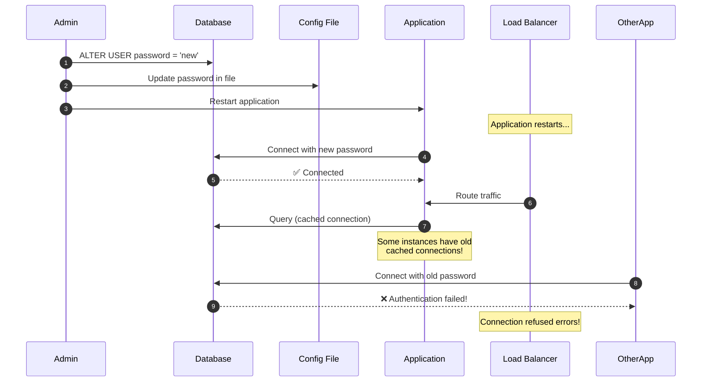
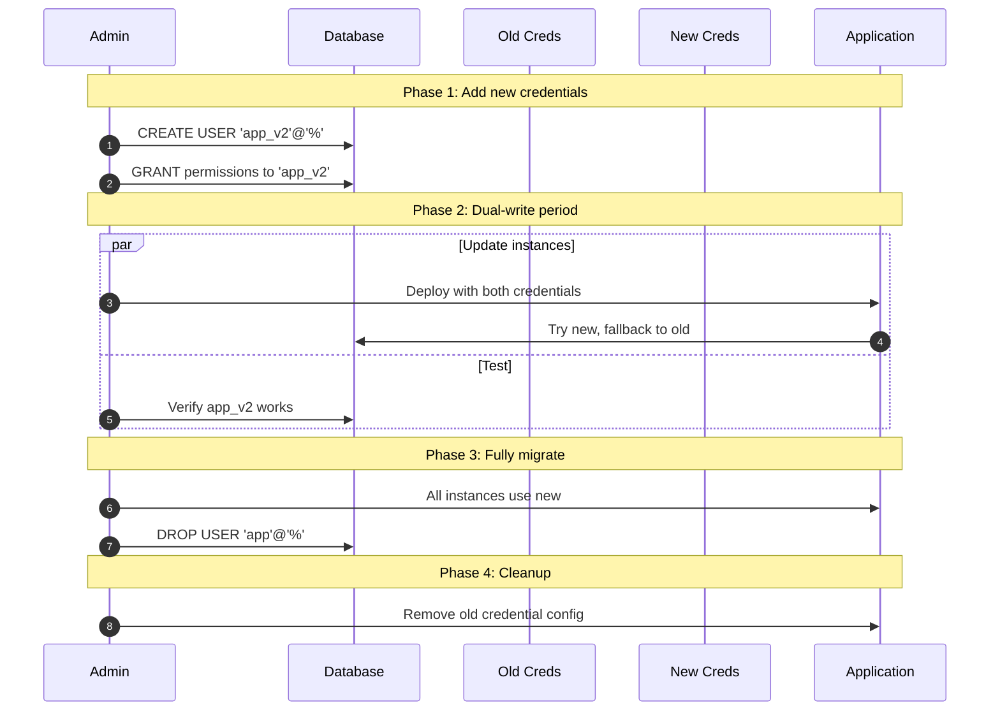
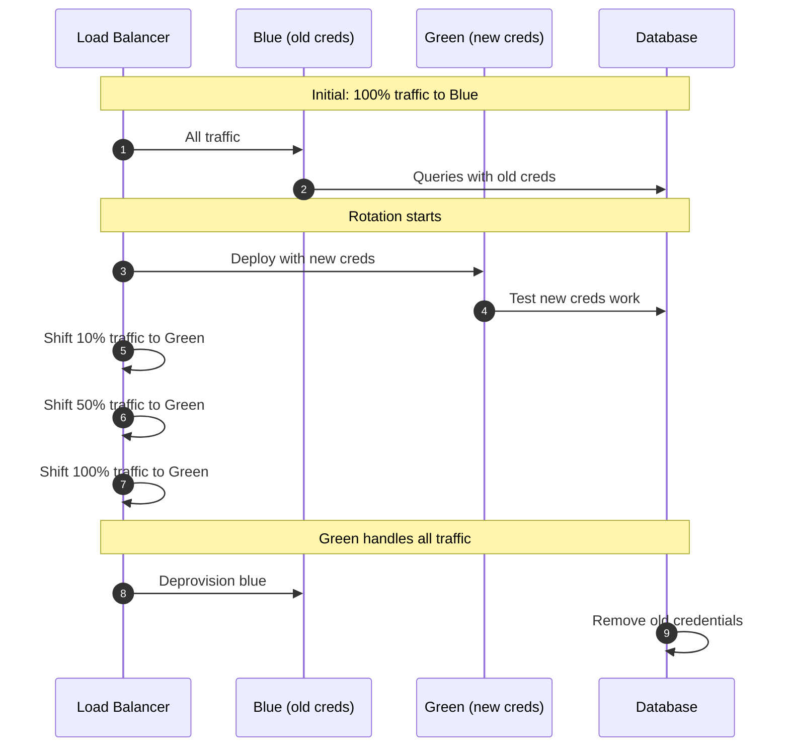
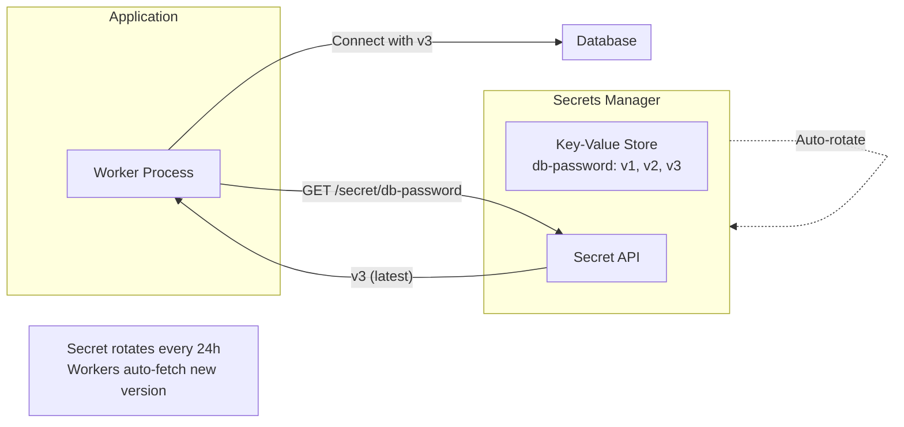
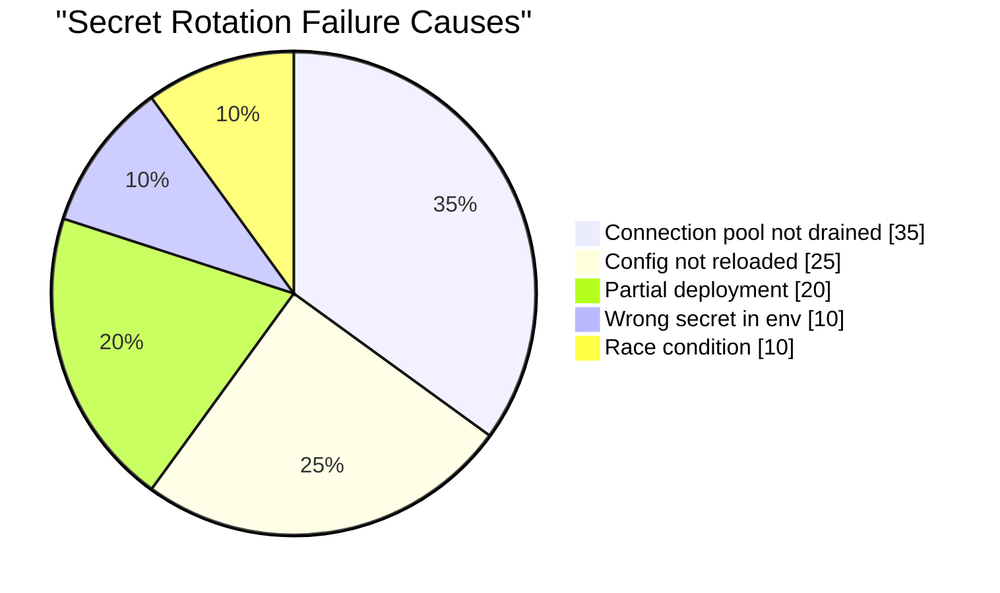
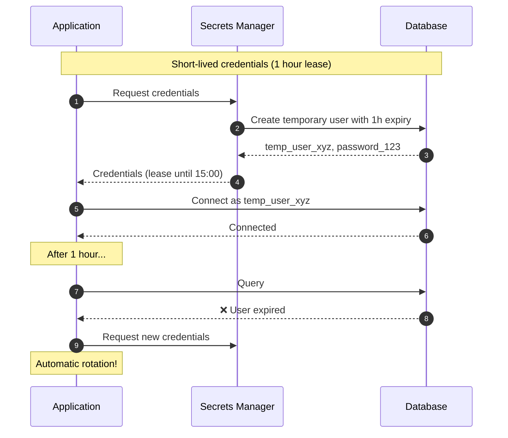

# Security 101: Secret Rotation Failure

---

## Tools & Prerequisites

To debug and implement secret rotation:

### Secrets Management Tools

| Tool | Purpose | Quick Usage |
|------|---------|-------------|
| **AWS Secrets Manager** | Store & rotate secrets | `aws secretsmanager get-secret-value --secret-id db-cred` |
| **HashiCorp Vault** | Secrets management | `vault kv get secret/db-creds` |
| **Azure Key Vault** | Azure secrets | `az keyvault secret show --vault-name mykv --name db-pass` |
| **kubectl create secret** | Kubernetes secrets | `kubectl create secret generic db-pass --from-literal=password=xxx` |
| **envsubst** | Template-based config | `envsubst < config.template > config.env` |

### Key Commands

```bash
# AWS Secrets Manager - Rotate secret
aws secretsmanager rotate-secret --secret-id db-creds

# HashiCorp Vault - Dynamic database credentials
vault read database/creds/app-role

# Kubernetes - Check secret version
kubectl get secrets -o jsonpath='{.items[*].data.password}' | base64 -d

# Monitor connection pool errors
netstat -an | grep ESTABLISHED | grep :5432 | wc -l

# Check which processes have old credentials open
lsof | grep database | grep ESTABLISHED

# Test new credentials before rotation
PGPASSWORD=$NEW_PASS psql -h db-host -U app -c "SELECT 1"
```

### Key Concepts

**Secret Rotation**: Periodically changing credentials to limit exposure window.

**Connection Pooling**: Reusing database connections for performance; complicates rotation.

**Graceful Drain**: Process stops accepting new work while finishing existing requests.

**Zero-Downtime Rotation**: No service interruption during credential change.

**Blue-Green Deployment**: Maintain two environments with different secrets; switch traffic.

**Dual-Write Period**: Time when both old and new credentials are valid.

**Lease**: Time-limited secret access; auto-expires, forcing renewal.

**Dynamic Secrets**: On-demand credentials with short TTL (e.g., Vault database roles).

**Secret Versioning**: Tracking multiple versions of secrets for rollback capability.

---

## Visual: Secret Rotation

### Broken Rotation (Causes Downtime)



### Zero-Downtime Rotation (Dual-Write)



### Connection Pool Refresh Strategy

```mermaid
flowchart TB
    subgraph Problem ["❌ Direct Password Change"]
        P1["DB password changed"]
        P2["Connection pool still has<br/>connections with old password"]
        P3["Next request: use pooled connection"]
        P4["❌ Auth error"]

        P1 --> P2 --> P3 --> P4
    end

    subgraph Solution ["✅ Graceful Pool Refresh"]
        S1["Signal app: refresh coming"]
        S2["App: drain connection pool"]
        S3["App: close all existing connections"]
        S4["DB: change password"]
        S5["App: create pool with new password"]

        S1 --> S2 --> S3 --> S4 --> S5
    end

    style Problem fill:#ffcdd2
    style Solution fill:#c8e6c9
```



### Dynamic Secrets vs Static Secrets

```mermaid
flowchart TB
    subgraph Static ["Static Secrets (Manual Rotation)"]
        ST1["Password stored in config"]
        ST2["Rotated quarterly (manual)"]
        ST3["If leaked: valid until next rotation"]
        ST4["Same password used by all instances"]

        ST1 --> ST2 --> ST3 --> ST4
    end

    subgraph Dynamic ["Dynamic Secrets (Auto Rotation)"]
        DY1["Credentials from Vault/Secrets Manager"]
        DY2["Short TTL (hours)"]
        DY3["Auto-rotate before expiry"]
        DY4["Unique per app instance"]

        DY1 --> DY2 --> DY3 --> DY4
    end

    style Static fill:#ffcdd2
    style Dynamic fill:#c8e6c9
```



### Blue-Green Rotation



### Secrets Manager Integration



### Rotation Failures



### Lease-Based Credentials



---

## The Situation

You rotate database credentials quarterly. After rotation, production goes down.

**Your rotation process:**

```bash
# 1. Generate new password
NEW_PASS=$(openssl rand -base64 32)

# 2. Update database
mysql -e "ALTER USER 'app'@'%' IDENTIFIED BY '$NEW_PASS'"

# 3. Update config file
sed -i "s/DB_PASSWORD=.*/DB_PASSWORD=$NEW_PASS/" .env

# 4. Restart application
systemctl restart app
```

---

## The Incident

```
14:00 UTC - Start credential rotation
14:05 UTC - Database password updated
14:06 UTC - Config file updated
14:07 UTC - Application restart

14:08 UTC - "Connection refused" errors flood logs
14:10 UTC - Rollback to old password
14:15 UTC - Service recovers

Root cause: Load balancer had cached connections with old password
          New instances couldn't connect
          Old instances still worked until connections drained
```

---

## The Jargon

| Term | Definition |
|------|------------|
| **Secret Rotation** | Periodically changing credentials to limit exposure |
| **Connection Pooling** | Reusing database connections; caches credentials |
| **Graceful Drain** | Stop accepting new work while finishing existing requests |
| **Zero-Downtime** | No service interruption during change |
| **Blue-Green** | Two environments, switch traffic between them |
| **Dual-Write Period** | Time when both old and new credentials are valid |
| **Dynamic Secrets** | On-demand credentials with short TTL |
| **Lease** | Time-limited secret access; auto-expires |
| **Secret Versioning** | Tracking multiple versions for rollback |

---

## Questions

1. **Why did rotation cause downtime?** (Connection pool cache)

2. **How do you rotate secrets without downtime?** (Dual-write, drain pools)

3. **What's the difference between password rotation and key rotation?** (Keys can be versioned, passwords typically not)

4. **How should applications handle credential updates?** (Watch for changes, fetch from manager)

5. **As a Senior Engineer, what's your rotation strategy?**

---

**Read `step-01.md`**
