# Security 103: Rate Limit Bypass

---

## The Situation

You rate limit your API: 100 requests/minute per user.

**Your implementation:**
```go
var rateLimiter = make(map[string]*rate.Limiter)

func RateLimitMiddleware(next http.Handler) http.Handler {
    return http.HandlerFunc(func(w http.ResponseWriter, r *http.Request) {
        userID := r.Header.Get("X-User-ID")

        limiter := rateLimiter[userID]
        if limiter == nil {
            limiter = rate.NewLimiter(100, time.Minute)
            rateLimiter[userID] = limiter
        }

        if !limiter.Allow() {
            http.Error(w, "Rate limit exceeded", 429)
            return
        }

        next.ServeHTTP(w, r)
    })
}
```

---

## The Attack

```
Attacker discovers bypasses:

1. Rotate X-User-ID header
   "user1" hits limit → switch to "user2" → unlimited requests!

2. Use multiple IP addresses
   Rate limit per IP → use proxy network → bypass

3. HTTP/2 multiplexing
   Single connection carries unlimited streams
   Rate limit per request, not per connection

4. Cache hit bypass
   CDN caches responses, doesn't count toward rate limit
   Attacker bypasses rate limit by hitting cache

5. Distributed attack
   Botnet with 10,000 IPs
   Each IP under limit, combined traffic = DoS
```

---

## Visual: Rate Limit Bypass Techniques

### Bypass #1: Header Rotation


### Bypass #2: IP Rotation (Proxy Network)

```mermaid
flowchart LR
    Attacker[👿 Attacker]

    subgraph Proxies ["🌐 Proxy Network"]
        P1[IP: 10.0.1.1]
        P2[IP: 10.0.2.1]
        P3[IP: 10.0.3.1]
        P4[IP: 10.0.4.1]
    end

    API[🛡️ API<br/>Rate Limit: 100/min per IP]

    Attacker --> P1
    Attacker --> P2
    Attacker --> P3
    Attacker --> P4

    P1 -->|100 requests| API
    P2 -->|100 requests| API
    P3 -->|100 requests| API
    P4 -->|100 requests| API

    Total[📊 Total: 400 requests/min<br/>Limit bypassed!]

    API --> Total

    style Attacker fill:#dc3545,color:#fff
    style API fill:#ffc107
    style Total fill:#dc3545,color:#fff
```



### Bypass #3: Distributed Attack (Botnet)

**Requests to API**

| Source | Requests | Percentage |
|--------|----------|------------|
| Bot 1 (100 req/min) | 100 | 10% |
| Bot 2 (100 req/min) | 100 | 10% |
| Bot 3 (100 req/min) | 100 | 10% |
| Bot 4 (100 req/min) | 100 | 10% |
| Bot 5 (100 req/min) | 100 | 10% |
| ...95 more bots (9,500 req/min) | 9,500 | 50% |
| **Total** | **10,000** | **100%** |

```mermaid
flowchart TB
    subgraph Botnet ["🤖 Botnet (10,000 bots)"]
        B1["Bot 1<br/>100 req/min"]
        B2["Bot 2<br/>100 req/min"]
        B3["Bot 3<br/>100 req/min"]
        Bn["Bot 10,000<br/>100 req/min"]
    end

    API[🛡️ API Server<br/>Rate Limit: 100/min per IP]

    Result["💥 TOTAL: 1,000,000 req/min<br/>= DoS Attack!"]

    Botnet --> API
    API --> Result

    classDef bad fill:#dc3545,stroke:#c62828,color:#fff
    classDef good fill:#4caf50,stroke:#2e7d32,color:#fff

    class Botnet,Result bad
    class API good
```



### Token Bucket vs Leaky Bucket


### Rate Limiting Strategies Comparison


---

## Questions

1. **How were rate limits bypassed?**

2. **What's the difference between per-IP and per-user rate limiting?**

3. **How do you rate limit authenticated vs anonymous users?**

4. **What's token bucket vs leaky bucket?**

5. **As a Senior Engineer, how do you design effective rate limiting?**

---

**Read `step-01.md`**
